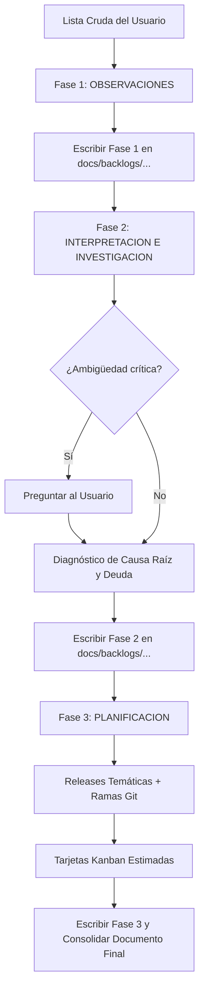

# Backlog Planner Skill

Esta skill automatiza la transformación de listas crudas y desordenadas de requerimientos, errores y mejoras en un plan de trabajo estructurado, ejecutable y priorizado.

Sigue la filosofía estricta de tres fases secuenciales:

`OBSERVACIONES` > `INTERPRETACION E INVESTIGACION` > `PLANIFICACION`

El proceso está orientado a que los desarrolladores y usuarios puedan leerlo y organizarse con facilidad, con la máxima concisión técnica, sin decoraciones innecesarias y con cero emojis.

---

## 1. Principios Operativos y Reglas Críticas

### 1.1. Filosofía de Alcance (Scope Rule)
* Al realizar el análisis e identificar problemas de fondo (fallas estructurales, deuda técnica, ausencia de tests, etc.), **NO crear tarjetas ni tareas adicionales** para esos problemas macro.
* Su función en este paso es **explicativa**: resumir al usuario qué fallas de fondo existen y cómo dan lugar directamente a los síntomas o problemas observados.
* Las tarjetas Kanban pertenecerán única y exclusivamente a los requerimientos y bugs observados/solicitados por el usuario.

### 1.2. Persistencia Iterativa en Archivo
* El agente **no realiza un volcado masivo al final**.
* Debe inicializar de inmediato un archivo en `docs/backlogs/YYYY-MM-DD_<nombre_descriptivo>.md` (creando la carpeta si no existe).
* Tras completar cada una de las tres fases, el agente **escribe o actualiza el archivo en disco** antes de continuar, y utiliza ese archivo como contexto persistente para la siguiente fase. De esta manera, si la sesión se interrumpe, el progreso queda guardado y recuperable.

### 1.3. Criterio de Interacción con el Usuario
* **Investigación autónoma**: Para resolver nombres de archivos, rutas, componentes, eventos y bugs evidentes en el código, el agente investiga de forma autónoma sin preguntar.
* **Preguntas de clarificación**: Solo si existe una ambigüedad crítica de negocio o una bifurcación arquitectónica con múltiples caminos válidos, el agente debe formular preguntas interactivas directas y concisas antes de cerrar la planificación.
* **Aviso de correcciones**: Si durante la investigación se detecta que el usuario cometió imprecisiones en su reporte (rutas desactualizadas, nombres de props incorrectos, suposiciones erradas de la causa), el agente debe señalar la corrección de forma explícita y profesional.

### 1.4. Estilo y Formato
* **Estrictamente sin emojis**: Ni en encabezados, ni en viñetas, ni en estados.
* **Máxima concisión**: Frases directas, densidad informativa alta para evitar fatiga cognitiva.
* **Formato C Expandido**: Estructura compatible tanto con visores Markdown como con herramientas de texto plano o trackers externos.

---

## 2. Calibración de Estimación (5 Niveles Fibonacci)

Toda tarjeta Kanban debe clasificarse en uno de los siguientes 5 niveles de esfuerzo y riesgo:

* `1 pt`: Cambio cosmético, ajuste de texto/copy, modificación menor de CSS, binding simple o corrección de un único listener/evento.
* `2 pts`: Ajuste de lógica interna dentro de un único componente, ordenación de colecciones simples, o validación de estado local.
* `3 pts`: Flujo reactivo cruzado (múltiples componentes, sincronización de estado, mutación Inertia con preservación de scroll/estado, acordeón interactivo o manipulación del historial del navegador).
* `5 pts`: Funcionalidad compleja que cruza frontend y backend (nuevos endpoints o modificaciones de DTO/Resource, hoja de estilos de impresión avanzada, refactor de modales multi-paso).
* `8 pts`: Reestructuración mayor de un subsistema crítico end-to-end con múltiples capas afectadas (usar con moderación; preferir dividir la tarea si excede este umbral).

---

## 3. Flujo de Trabajo en 3 Fases



---

### Fase 1: OBSERVACIONES (Inspección Empírica, Enriquecimiento y Corrección)

1. Crear el archivo de destino:
   * Ruta: `docs/backlogs/YYYY-MM-DD_<tema_principal>.md`.
2. Leer la lista no estructurada del usuario.
3. **Inspección empírica directa del código**:
   * Usar herramientas de búsqueda (`grep_search`, `find_by_name`, `view_file`) para contrastar cada síntoma reportado contra la realidad del sistema: rutas exactas, archivos, componentes, props, eventos y causas inmediatas.
4. **Corrección explícita de imprecisiones**:
   * Si el usuario cometió imprecisiones en su reporte (nombres de componentes erróneos, rutas cambiadas, causas supuestas que son distintas en el código), documentar la corrección explícitamente:
     * *"Nota de corrección: El usuario indicó [X], pero en el código corresponde a [Y] debido a [Z]"*.
5. Parsear, enriquecer y unificar cada punto bajo el formato estándar de observación empírica:

```markdown
### [Módulo / Sección]
* **Elemento / Contexto**: Ruta o pantalla donde ocurre.
* **Problema reportado**: Descripción fiel pero ordenada del síntoma.
* **Evidencia en código**: Archivo, componente o función exacta identificada.
```

6. Escribir la sección `## 1. Observaciones` en el archivo de planificación.

---

### Fase 2: INTERPRETACION E INVESTIGACION (La Vista Amplia: Lo que "No Se Vio")

1. **Salto de lo particular a lo general**:
   * Analizar el cuadro completo más allá de los síntomas aislados observados en la Fase 1.
2. **Diagnóstico de lo que no es evidente a simple vista ("Lo que no se vio")**:
   * Identificar fallas estructurales, deuda técnica oculta, patrones y antipatrones de diseño sistémicos (ej. fallas de diseño en el ciclo de vida reactivo, desacople de overlays respecto a las APIs del navegador, ausencia de DTOs de presentación, inconsistencia de affordance en el design system).
   * **Explicar cómo este panorama de fondo es el que principalmente da lugar y alimenta los problemas observados**.
3. **Clarificación interactiva (si aplica)**:
   * Formular preguntas concisas solo si existen decisiones de diseño abiertas o bifurcaciones arquitectónicas válidas.
4. **Regla estricta de alcance (Scope Rule)**:
   * **NO crear tarjetas ni tareas para estas fallas estructurales o deuda técnica macro**. Su valor en esta fase es iluminar la raíz del problema para el usuario sin desbordar el sprint.
5. Actualizar el archivo de planificación en disco agregando la sección `## 2. Interpretación e Investigación`.

---

### Fase 3: PLANIFICACION (Releases y Tarjetas Kanban)

1. **Estructurar Releases Temáticas**:
   * Agrupar las tareas en fases lógicas (ej. R1: Estabilidad Crítica y Bugs Bloqueantes; R2: Consistencia de UI y Dominio; R3: Navegación y Exportación).
   * Consultar la rama base actual mediante `git status` o `git branch`.
   * Proponer para cada release la rama Git recomendada según su alcance temático:
     ```bash
     git checkout <rama_base>
     git pull origin <rama_base>
     git checkout -b feature/<tema-de-release>
     ```

2. **Generar Tarjetas Kanban en Formato C Expandido**:
   * Cada tarea debe redactarse siguiendo estrictamente la siguiente plantilla:

```markdown
* ### `[TIPO-ID]` [X pts] [Release] [Prioridad] Título Descriptivo
  * **Ruta**: /ruta/de/la/pantalla
  * **Archivos**:
    * ruta/al/archivo1.ext
    * ruta/al/archivo2.ext
  * **Problema & Causa**: Explicación técnica concisa del defecto o requerimiento y su causa verificada en el código.
  * **Criterios de Aceptación (DoD)**:
    * [ ] Criterio verificable 1.
    * [ ] Criterio verificable 2.
```

   * Nomenclatura de tipos:
     * `BUG`: Error de funcionamiento, loop, fuga de memoria o salto visual.
     * `UI`: Mejora visual, densidad, contraste, tamaño o affordance de controles.
     * `FEAT`: Funcionalidad nueva o campo faltante.
     * `NAV`: Navegación, historial, modales o routing.
     * `SEC`: Permisos, protecciones defensivas o accesos indebidos.
     * `DOC`: Documentación, estilos de impresión o reportes.

3. **Métricas de Planificación**:
   * Incluir al pie del documento:
     * Total de tarjetas.
     * Puntos por release.
     * Total de puntos de historia estimados.

4. Actualizar el archivo de planificación en disco agregando la sección `## 3. Planificación (Releases y Tablero Kanban)`.
5. Presentar un resumen final conciso en la respuesta del chat apuntando al archivo persistido y sugerir al usuario la ejecución de la skill `backlog-refiner` para la validación y refinamiento interactivo una a una de las tarjetas generadas.
