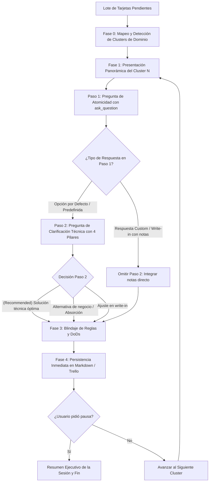

# Backlog Refiner Skill

Esta skill ejecuta el proceso de **Refinamiento Interactivo de Requerimientos Asistido por Código**. Transforma borradores técnicos preliminares (provenientes de `backlog-planner`, notas de reunión o tableros externos) en especificaciones de producto consensuadas, blindadas y con Criterios de Aceptación (DoD) verificables.

Opera mediante un **Flujo en Dos Tiempos Condicional por Clusters Temáticos**: agrupa tareas estrechamente relacionadas para que el usuario y el agente resuelvan primero la estructura de **atomicidad**, y solo si la respuesta fue por defecto, pasen a clarificar la **solución técnica y reglas de negocio** mediante opciones estructuradas y opinadas.

---

## 1. Principios Operativos y Reglas Críticas

### 1.1. Regla de Cero Re-investigación Redundante (Zero Re-investigation Rule)
* La skill **NO debe re-escanear el repositorio desde cero** si el contexto proviene de `backlog-planner` o de un archivo existente en `docs/backlogs/*.md`.
* Consume directamente los campos estructurados preexistentes: `Ruta`, `Archivos` y `Problema & Causa`.
* Solo realiza inspecciones puntuales de código para contrastar reglas de negocio nuevas surgidas durante la conversación.

### 1.2. Revisión por Clusters Temáticos (Prevención de Backtracking)
* En lugar de revisar ciegamente en orden numérico estricto (ej. T01 → T02 → T03...), el agente realiza un **mapeo previo del lote**:
  * Identifica tareas que tocan la misma pantalla, componente, modelo o regla de negocio (ej. *Cluster Dashboard: T02, T04, T05, T06*; *Cluster Perfil: T10, T11, T12, T13*).
  * Agrupa las tareas relacionadas en un **Cluster Temático** (típicamente 2 a 4 tarjetas).
  * Las tareas huérfanas o independientes (ej. T01) se procesan como clusters unitarios.
* Al presentar el cluster, se analiza el subsistema en su totalidad, evitando tener que retroceder o "backtrackear" cuando una tarjeta posterior hace referencia a algo discutido antes.

### 1.3. Paso 1: Evaluación y Pregunta de Atomicidad
* Para cada cluster presentado, el agente propone y consulta explícitamente la estructura del conjunto:
  * **Mantener**: Tarjetas con alcance independiente y bien delimitado.
  * **Absorber / Unificar**: Micro-reglas o tareas accesorias que deben fusionarse en una tarjeta principal para desinflar el backlog.
  * **Separar / Desglosar**: Tarjetas que exceden el tamaño manejable o tocan múltiples flujos inconexos.

### 1.4. Regla Condicional de Salto (Omisión de Segunda Pregunta)
* **Caso A — Respuesta Custom / Write-in en Paso 1**: Si el usuario responde escribiendo en el cuadro de texto libre (*write-in*) o entrega aclaraciones específicas junto con su decisión de atomicidad, se asume que las observaciones y matices de contenido ya fueron provistos. **SE OMITE LA SEGUNDA PREGUNTA** y se procede de inmediato al blindaje de DoDs y persistencia.
* **Caso B — Respuesta por Defecto en Paso 1**: Únicamente si el usuario seleccionó una de las opciones predefinidas estándar (ej. la opción recomendada o cualquier botón estándar sin texto adicional), **SE DISPARA OBLIGATORIAMENTE EL PASO 2**.

### 1.5. Paso 2: Los 4 Pilares de la Pregunta de Clarificación Técnica
Cuando se ejecuta el Paso 2 sobre las tarjetas resultantes del cluster, el agente formula una pregunta interactiva estructurada con los siguientes 4 pilares:
1. **Opción recomendada `(Recommended)`**: El agente propone la solución técnica óptima ya digerida, justificada por la inspección del código. En el 90% de los casos, el usuario solo necesita hacer clic en esta opción para validar.
2. **Caminos alternativos de negocio**: Si hay una bifurcación (ej. ¿dejar comentado o eliminar?, ¿abrir modal directo o nueva pestaña?), se ofrecen como opciones explícitas.
3. **Mecánica de absorción**: Si una tarea queda resuelta o absorbida por otra, se propone archivarse o unificarse inmediatamente para desinflar el backlog de tarjetas innecesarias.
4. **Caja abierta de texto (*Write-in*)**: Si el usuario tiene una sutileza adicional en mente, la escribe directamente en el campo de texto libre.

### 1.6. Captura Inmediata de Reglas Colaterales y Blindaje de DoD
* Durante la discusión del cluster emergen reglas críticas del dominio (ej. *"entre alumnos no se pueden ver las redes"*, *"filtro implícito sin exponer los días"*, *"no almacenar binarios en disco local"*).
* El agente **blinda de inmediato estas reglas** incorporándolas en la descripción de las tarjetas sobrevivientes y en sus Checklists de Criterios de Aceptación (DoD).

### 1.7. Persistencia Inmediata en Caliente
* Tras la decisión del usuario sobre el cluster:
  * Las tarjetas absorbidas se archivan (`closed: true`) o marcan como unificadas.
  * Las tarjetas activas se actualizan con su DoD refinado y se mueven de `Por definir` a `Pendiente`.
  * Los cambios se impactan de inmediato en el medio activo (**Markdown local** y/o **Trello / Tracker externo**).

---

## 2. Flujo de Trabajo por Clusters



---

## 3. Plantilla de Presentación y Preguntas Interactivas

Para cada cluster a revisar, el agente genera la salida con la siguiente estructura:

```markdown
### Revisión de Cluster Temático (Cluster N / Total Clusters)
[Breve confirmación del cluster anterior procesado, si aplica]

---

### Cluster: [Nombre del Subsistema o Pantalla] (ej. Dashboard Estudiante - Entregas y Notas)
* **Tarjetas involucradas**: `[T02]`, `[T04]`, `[T05]`, `[T06]`
* **Ruta / Pantalla**: `/estudiante/dashboard`
* **Archivos clave**: [`file:///ruta/al/componente.svelte`](...)

#### 1. Visión Panorámica del Subsistema (El Problema de Fondo)
[Explicación de cómo interactúan estas necesidades en la experiencia de usuario y en la arquitectura de datos.]

#### 2. Desglose y Propuesta de Atomicidad
* **`[T02]` Título A**: [Propuesta: Mantener como tarjeta principal de entregas con fecha límite calculada].
* **`[T06]` Título B**: [Propuesta: **Absorber en T02** y archivar, ya que solo especifica el filtro semanal de T02].
* **`[T04]` Título C**: [Propuesta: Mantener como tarjeta de notas, generalizando a formativas y sumativas].
* **`[T05]` Título D**: [Propuesta: Mantener como tarjeta de interacción de navegación directa a la agenda].
```

### Paso 1: Invocación de Pregunta de Atomicidad

Inmediatamente después de la presentación, el agente invoca `ask_question`:

```json
{
  "questions": [
    {
      "question": "Sobre el Cluster [Nombre] ([Tarjetas]): ¿Cómo estructuramos la atomicidad de este conjunto?",
      "options": [
        "(Recommended) Aprobar estructura: [ej. Absorber T06 en T02; mantener T04 y T05 independientes]",
        "Mantener todas como tarjetas separadas con su nivel de atomicidad actual",
        "Absorber todo el cluster en una única macro-tarjeta integral"
      ],
      "is_multi_select": false
    }
  ]
}
```

### Condición de Paso 2: Clarificación Técnica con los 4 Pilares

* **Si el usuario usó write-in o respuesta custom**: Omitir este paso y avanzar a Persistencia.
* **Si el usuario seleccionó una opción por defecto**: Invocar la segunda pregunta aplicando estrictamente los 4 pilares:

```json
{
  "questions": [
    {
      "question": "Para las tarjetas activas de este cluster ([Tarjetas]): ¿Cómo orientamos la solución técnica y los criterios de aceptación?",
      "options": [
        "(Recommended) [Solución técnica óptima ya digerida, justificada por el código y DoDs concretos]",
        "[Camino alternativo de negocio: bifurcación explícita de UX o arquitectura]",
        "[Mecánica de absorción: unificar/archivar tareas accesorias residuales para desinflar el backlog]"
      ],
      "is_multi_select": false
    }
  ]
}
```
*(Nota: El 4to pilar, la Caja abierta de texto Write-in, queda siempre disponible por defecto en la interfaz interactiva).*

---

## 4. Adaptadores de Persistencia

### 4.1. Adaptador Markdown (`docs/backlogs/`)
* Si hubo absorción: documenta en la tarjeta principal las notas absorbidas y elimina/archiva las secundarias.
* Actualiza los Criterios de Aceptación (DoD) de cada tarjeta activa con casillas `[ ]`.

### 4.2. Adaptador Trello / Tracker Externo
* Mueve las tarjetas clarificadas de `Por definir` a `Pendiente`.
* Archiva las tarjetas absorbidas (`closed: true`).
* Crea o actualiza Checklists nativas (`Criterios de Aceptación (DoD)`) con las reglas y pruebas verificables.

---

## 5. Manejo de Pausas y Resumen de Sesión

Si el usuario indica *"pausemos"*, *"hasta aquí por hoy"* o similar:
1. El agente persiste el cluster activo.
2. Detiene el bucle interactivo.
3. Entrega una **Tabla de Resumen Ejecutivo** con:
   * Clusters revisados.
   * Tarjetas procesadas, mantenidas y absorbidas/archivadas.
   * Próximo cluster temático pendiente para retomar.
