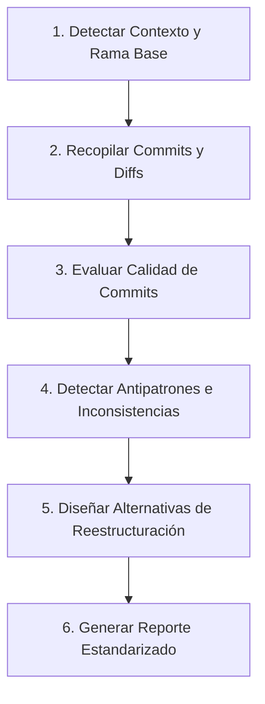

# Branch Review Skill (Revisión y Reestructuración de Ramas)

Esta skill guía al agente en la auditoría exhaustiva de una rama de desarrollo antes de abrir un Pull Request o fusionarla a ramas principales. Su objetivo es garantizar un historial de Git limpio, atómico, comprensible y fácil de revisar, ofreciendo propuestas concretas de reestructuración cuando la rama sea caótica, excesivamente grande o mezcle múltiples propósitos.

---

## 📋 Flujo de Trabajo Paso a Paso



### Paso 1: Identificación del Contexto y Rama Base

1. **Obtener la rama actual**:
   ```powershell
   git branch --show-current
   ```
2. **Determinar la rama base de comparación**:
   - Si el usuario no la especifica, inferir en este orden de prioridad:
     1. `origin/main` o `main`
     2. `origin/master` o `master`
     3. `origin/develop` o `develop`
   - Identificar el punto de divergencia (`merge-base`):
     ```powershell
     $base = "main" # o la rama base identificada
     git merge-base $base HEAD
     ```
   - Verificar si la rama está desactualizada respecto a la base (necesidad de rebase o merge previo):
     ```powershell
     git rev-list --left-right --count $base...HEAD
     ```

---

### Paso 2: Recopilación de Métricas y Commits

Ejecutar las siguientes inspecciones para obtener una visión completa:

1. **Lista de commits con estadísticas resumidas**:
   ```powershell
   git log --oneline --reverse "$base..HEAD"
   git log "$base..HEAD" --stat
   ```
2. **Diff global y resumen de archivos impactados**:
   ```powershell
   git diff "$base...HEAD" --stat
   git diff "$base...HEAD" --shortstat
   ```
3. *(Opcional)* Ejecutar el script auxiliar de análisis automatizado:
   ```powershell
   powershell -File .agents/skills/branch-review/scripts/analyze-branch.ps1 -BaseBranch $base
   ```

---

### Paso 3: Evaluación de Calidad de los Commits

Evaluar cada commit según los **4 Pilares de Calidad de Commits**:

Consulte la rúbrica detallada en [`quality-rubric.md`](./references/quality-rubric.md).

| Pilar | Criterio de Evaluación | Puntos de Alerta (Red Flags) |
| :--- | :--- | :--- |
| **1. Atomicidad** | ¿El commit resuelve una sola responsabilidad lógica o propósito bien definido? | Mezclar refactorización de código existente con nuevas funcionalidades; mezclar cambios de estilo/formato (Prettier/Pint) con lógica de negocio. |
| **2. Mensajes** | ¿Sigue el estándar [Conventional Commits](https://www.conventionalcommits.org/) (`feat:`, `fix:`, `refactor:`, `test:`, `docs:`, `chore:`)? ¿Es claro el título (< 72 caracteres) y explica el *por qué* en el cuerpo si es complejo? | Mensajes vagos (`wip`, `cambios`, `fixes`, `update`, `test`), mensajes en infinitivo o sin contexto del componente afectado. |
| **3. Tamaño / Largo** | ¿El commit tiene un tamaño manejable que un revisor humano pueda auditar en minutos? | Commits monstruo (+500 líneas en múltiples dominios sin subdivisión lógica) o micro-commits excesivos con arreglos de 1 línea de errores introducidos 2 commits atrás. |
| **4. Pertinencia** | ¿Todos los cambios en el commit pertenecen al alcance de la tarea? | Archivos temporales, logs de depuración (`console.log`, `dd()`, `dump()`, `var_dump`), configuraciones locales no ignoradas (`.env`, certificados), dependencias modificadas accidentalmente. |

---

### Paso 4: Análisis y Propuestas de Reestructuración

Siempre formula **entre 2 y 3 alternativas concretas** adaptadas a la situación de la rama:

#### Alternativa A: Optimización Lineal (Rebase Interactivo & Squash)
*Ideal para*: Ramas que tienen un único objetivo coherente pero cuyo historial está sucio con commits "fix", "wip", o de prueba.
*Acciones*:
- Agrupar (squash/fixup) commits de correcciones en el commit original que introdujo el cambio.
- Reordenar commits cronológica y lógicamente (ej: 1º Migraciones/Modelos -> 2º Lógica de negocio/Servicios -> 3º Controladores/Rutas -> 4º UI -> 5º Tests).
- Reescribir mensajes para adoptar Conventional Commits claros y descriptivos.

#### Alternativa B: División en Múltiples Ramas / PRs Temáticos
*Ideal para*: Ramas sobrecargadas que abarcan múltiples módulos, refactorizaciones previas + feature nueva, o cambios backend + frontend desacoplables.
*Acciones*:
- Dividir la rama en ramas especializadas más pequeñas (ej: `feat/modulo-db-schema`, `feat/modulo-backend-api`, `feat/modulo-frontend-ui`).
- Facilitar revisiones de código paralelas y merge gradual.
- Proveer los comandos de `git cherry-pick` o `git checkout -b` para materializar la división.

#### Alternativa C: Stacked PRs / Ramas Encadenadas
*Ideal para*: Features grandes con dependencias secuenciales estrictas que no pueden fusionarse todas de golpe pero deben revisarse paso a paso.
*Acciones*:
- Rama base 1 -> PR 1 (Fundaciones/Contratos).
- Rama 2 basada en Rama 1 -> PR 2 (Implementación de negocio).
- Rama 3 basada en Rama 2 -> PR 3 (Integración UI/E2E).

---

### Paso 5: Generación del Reporte Estandarizado

El agente **DEBE** redactar el resultado utilizando el formato estandarizado definido en [`report-template.md`](./resources/report-template.md).

El reporte incluye:
1. **Encabezado & Ficha Técnica de la Rama** (Rama, Base, Commits, Archivos, Líneas +/-).
2. **Diagnóstico General de Salud de la Rama** (Semáforo: 🟢 Excelente / 🟡 Aceptable con sugerencias / 🔴 Requiere reestructuración).
3. **Tabla de Auditoría de Commits** (Hash, Mensaje, Atomicidad, Claridad, Pertinencia, Dictamen).
4. **Hallazgos Críticos & Antipatrones Detectados**.
5. **Alternativas de Reestructuración** (con explicaciones y bloques de código de comandos Git ejecutables).
6. **Plan de Acción Recomendado Paso a Paso** (incluyendo creación de rama de respaldo para seguridad).

---

## 🛡️ Reglas de Seguridad para Reestructuraciones

1. **Siempre crear rama de respaldo antes de rebasing**:
   ```powershell
   git branch backup/<nombre-de-rama>-$(Get-Date -Format 'yyyyMMdd-HHmm')
   ```
2. **Nunca hacer `git push --force` a ciegas**: Recomendar siempre `--force-with-lease`:
   ```powershell
   git push origin <rama> --force-with-lease
   ```
3. **Verificar estado de compilación / tests** después de cualquier rebase o reestructuración.
