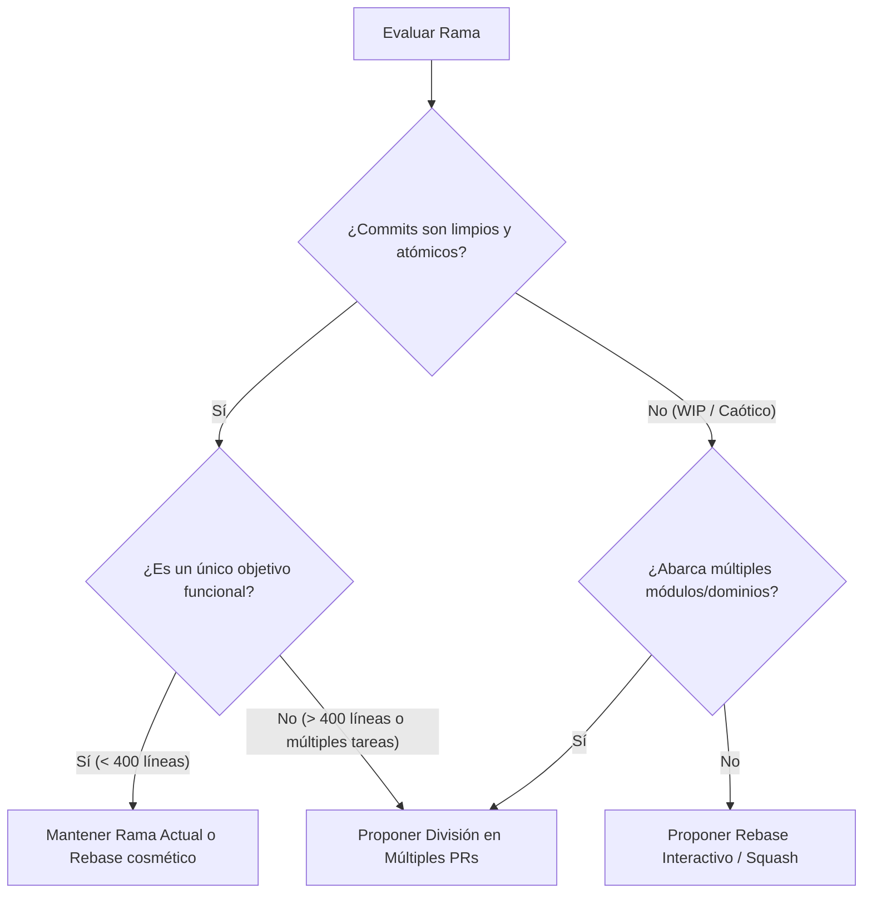

# 📐 Rúbrica de Evaluación de Calidad de Commits y Ramas

Esta guía establece los criterios de evaluación utilizados por la skill `branch-review` para calificar commits, determinar la higiene de una rama de Git y formular recomendaciones precisas.

---

## 1. Los 4 Pilares de Calidad

### Pilar 1: Atomicidad (Atomicity)
Un commit es **atómico** si representa una única unidad lógica e indivisible de cambio.
- **Principio**: Si necesitas usar la palabra "y" / "and" en la descripción principal del commit para explicar dos propósitos no relacionados, no es atómico.
- **Regla de Compilabilidad**: Cada commit individual en el historial debería dejar el proyecto en un estado funcional (que compila y pasa pruebas unitarias).
- **Infracciones Comunes**:
  - Mezclar refactorización de código legado con la implementación de una nueva característica.
  - Aplicar formateo general de código (Prettier, Pint, ESLint) junto con cambios de lógica.
  - Añadir migraciones de base de datos no relacionadas en el mismo commit que arreglos de UI.

---

### Pilar 2: Claridad y Formato del Mensaje (Message Quality)
Se evalúa la adhesión al estándar **Conventional Commits** y la claridad expositiva:

```
<tipo>(<alcance opcional>): <descripción imperativa corta>

[cuerpo explicativo opcional: explica el POR QUÉ, no solo el qué]

[pie de página opcional: referencias a tickets, Breaking Changes]
```

#### Tipos Permitidos y su Significado:
- `feat`: Nueva funcionalidad para el usuario/sistema.
- `fix`: Corrección de un bug.
- `refactor`: Cambio de código que no altera el comportamiento externo ni añade características ni arregla bugs.
- `perf`: Mejora de rendimiento.
- `test`: Adición o corrección de tests sin cambios en código productivo.
- `docs`: Modificaciones exclusivas de documentación.
- `style`: Cambios de formato, espacios en blanco, comas que no afectan el significado del código.
- `chore`: Mantenimiento de build, dependencias, scripts de tooling.

#### Criterios de Calificación:
- 🟢 **Excelente**: `feat(inscripcion): validar solapamiento de horarios en inscripciones activas`
- 🟡 **Mejorable**: `inscripcion: agrega validaciones` (Falta tipo estándar, descripción vaga).
- 🔴 **Inaceptable**: `wip`, `fix`, `changes`, `subiendo cambios`, `arreglos finales`, `fix error test 2`.

---

### Pilar 3: Tamaño y Extensión (Size & Diff Scope)

| Tamaño | Archivos | Líneas (+/-) | Evaluación | Recomendación |
| :--- | :--- | :--- | :--- | :--- |
| **Micro (WIP)** | 1 | 1 - 5 | ⚠️ Riesgo de ruido | Fusionar (`fixup`/`squash`) con el commit principal. |
| **Óptimo** | 1 - 8 | 10 - 250 | 🟢 Ideal | Tamaño perfecto para code review minucioso. |
| **Grande** | 9 - 20 | 250 - 500 | 🟡 Revisar atomicidad | Evaluar si puede separarse en 2 commits lógicos. |
| **Monstruo** | 20+ | > 500 | 🔴 Alto Riesgo | **Reestructurar**: Dividir en múltiples ramas/PRs o commits atómicos. |

---

### Pilar 4: Pertinencia y Limpieza (Hygiene & Scope)

El agente debe verificar que la rama no contenga:
1. **Logs y herramientas de depuración abandonadas**:
   - PHP: `dd()`, `dump()`, `var_dump()`, `print_r()`, `exit;`
   - JS/TS: `console.log()`, `debugger;`
   - Python: `print()`, `breakpoint()`, `import pdb`
2. **Archivos de entorno o secretos**: `.env`, `.env.local`, claves privadas, tokens.
3. **Archivos temporales o del sistema operativo**: `.DS_Store`, `Thumbs.db`, carpetas `.idea`, `.vscode/settings.json` accidentales.
4. **Dependencias compiladas o locks modificados innecesariamente**: Cambios gigantes no explicados en `package-lock.json` o `composer.lock`.

---

## 2. Rúbrica de Decisión para Reestructuración de Ramas



### Cuándo recomendar cada alternativa:

1. **Reorganización Lineal (Interactive Rebase)**:
   - Número de commits > 5 para una tarea pequeña.
   - Presencia de commits correctivos inmediatos ("fix typo", "arreglo anterior").
   - La rama tiene una única meta de negocio.

2. **División en Múltiples Ramas / PRs**:
   - La rama toca Backend, Frontend, y Migraciones de base de datos complejas simultáneamente.
   - El diff total supera las 500-600 líneas.
   - Existen cambios preparatorios (refactoring) que podrían mergearse de forma independiente antes del feature.

3. **Stacked PRs**:
   - Una funcionalidad grande con etapas bien delimitadas donde el frontend depende de endpoints nuevos del backend que están en la misma rama.
