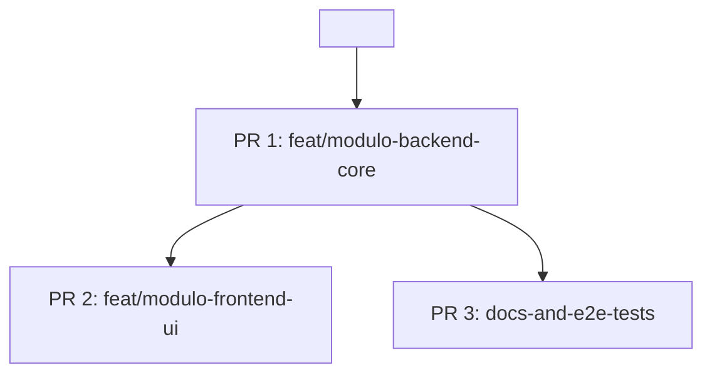

# 🌿 Reporte de Revisión de Rama: `<nombre-de-rama>`

> **Fecha de Análisis**: `YYYY-MM-DD HH:mm`  
> **Rama Analizada**: `<nombre-de-rama>`  
> **Rama Base de Comparación**: `<rama-base>` (Punto de divergencia: `<merge-base-hash>`)  
> **Diagnóstico Global**: `🟢 EXCELENTE` | `🟡 MEJORABLE / SUGERENCIAS` | `🔴 REQUIERE REESTRUCTURACIÓN`

---

## 📊 1. Ficha Técnica y Métricas

| Métrica | Valor | Evaluación Rápida |
| :--- | :--- | :--- |
| **Total de Commits** | `N` | `🟢 Adecuado` / `🟡 Alto` / `🔴 Excesivo` |
| **Archivos Modificados** | `N` archivos | `🟢 Focalizado` / `🟡 Disperso` / `🔴 Muy extenso` |
| **Líneas Añadidas / Eliminadas** | `+A / -D` (Total: `T`) | `🟢 Tamaño digerible` / `🔴 Requiere división` |
| **Estado vs Base** | `X ahead, Y behind` | `🟢 Al día` / `⚠️ Requiere rebase previo de <base>` |
| **Commits Fixup / WIP Detectados** | `N` commits | `🟢 Ninguno` / `🔴 N detectados` |

---

## 🔬 2. Matriz de Calidad de Commits

> **Convención de Dictamen**:  
> - `✅ Aprobado`: Cumple con atomicidad, mensaje claro y alcance pertinente.  
> - `⚠️ Mejorable`: Mensaje poco descriptivo o leves mejoras posibles sin romper atomicidad.  
> - `❌ Acción Requerida`: Commit WIP, rompe atomicidad, contiene archivos no deseados o debe fusionarse con otro.

| Hash | Mensaje Original | Atomicidad | Calidad Mensaje | Pertinencia / Scope | Dictamen | Acción Sugerida |
| :--- | :--- | :---: | :---: | :---: | :---: | :--- |
| `a1b2c3d` | `feat(auth): add sso login` | `🟢 Alta` | `🟢 Conventional` | `🟢 Pertinente` | `✅ Aprobado` | Mantener intacto |
| `e4f5g6h` | `fix bug` | `🔴 Baja` | `🔴 Vago` | `🟡 Dudoso` | `❌ Acción Requerida` | Squash con `a1b2c3d` |
| `i7j8k9l` | `refactor and update readme and fix ui` | `🔴 Múltiple` | `🟡 Poco claro` | `🟢 Pertinente` | `❌ Acción Requerida` | Separar en 3 commits |

---

## ⚠️ 3. Hallazgos Clave y Antipatrones Detectados

> [!WARNING]
> **Antipatrones y Deuda Detectada**:
> - **Commits WIP / De paso**: (ej: `fix test`, `wip 2`, `ajustes`).
> - **Mezcla de responsabilidades**: (ej: cambios de formateador o refactor general mezclados con una nueva funcionalidad).
> - **Archivos o código fuera de alcance / Depuración**: (ej: llamadas `console.log`, `dd()`, `dump()`, archivos `.env`, `.DS_Store`, etc.).
> - **Divergencia con Rama Base**: (ej: la rama está `Y` commits por detrás de `main`).

---

## 🛠️ 4. Alternativas de Reestructuración

A continuación se presentan las estrategias viables para optimizar esta rama:

### 🔹 Alternativa 1: Reorganización Lineal y Limpieza (Rebase Interactivo)
*Recomendado si: La rama aborda un único objetivo funcional pero el historial tiene commits sucios o desordenados.*

**Estructura propuesta de commits (Limpia y Atómica):**
1. `commit 1`: `refactor(modulo): preparar interfaces previas`
2. `commit 2`: `feat(modulo): implementar logica del servicio`
3. `commit 3`: `test(modulo): agregar pruebas unitarias e integracion`

**Receta de comandos Git:**
```bash
# 1. Crear respaldo de seguridad
git branch backup/<nombre-de-rama>-pre-rebase

# 2. Iniciar rebase interactivo contra la base
git rebase -i <rama-base>

# En el editor interactivo:
# - Marcar 'squash' o 'fixup' para los commits de corrección
# - Marcar 'reword' para corregir mensajes a Conventional Commits
# - Reordenar líneas si es necesario para mantener coherencia lógica

# 3. Validar que los tests sigan pasando
npm test # o php artisan test / pytest / cargo test

# 4. Actualizar remoto de forma segura
git push origin <nombre-de-rama> --force-with-lease
```

---

### 🔹 Alternativa 2: División en Múltiples Ramas / PRs Temáticos
*Recomendado si: La rama contiene más de 1 responsabilidad grande o es demasiado extensa (+500 líneas) para una sola revisión.*

**Propuesta de desglose en sub-ramas:**



1. **Rama 1 (`feat/<nombre>-core` / Backend & DB)**:
   - Alcance: Modelos, migraciones, endpoints base.
   - Commits sugeridos: `c1`, `c2`.
2. **Rama 2 (`feat/<nombre>-ui` / Frontend Interface)**:
   - Alcance: Componentes visuales, vistas, integración de API.
   - Commits sugeridos: `c3`, `c4`.

**Receta de comandos Git:**
```bash
# Rama 1: Core / Backend
git checkout -b feat/<nombre>-core <rama-base>
git cherry-pick <hash-commit-1> <hash-commit-2>
git push origin feat/<nombre>-core

# Rama 2: UI (basada en Rama 1 o Base)
git checkout -b feat/<nombre>-ui feat/<nombre>-core
git cherry-pick <hash-commit-3> <hash-commit-4>
git push origin feat/<nombre>-ui
```

---

### 🔹 Alternativa 3: Enfoque Stacked PRs (Ramas Encadenadas)
*Recomendado si: Cada etapa depende de la anterior pero el equipo prefiere revisiones y merges incrementales.*

**Receta de comandos Git:**
```bash
# Paso 1: Configurar Rama Base Fase 1
git checkout -b feat/<nombre>-fase-1 <rama-base>
git cherry-pick <hash-fase-1>
git push origin feat/<nombre>-fase-1

# Paso 2: Configurar Rama Fase 2 sobre Fase 1
git checkout -b feat/<nombre>-fase-2 feat/<nombre>-fase-1
git cherry-pick <hash-fase-2>
git push origin feat/<nombre>-fase-2
```

---

## 🎯 5. Recomendación y Plan de Acción

> **Opción recomendada por el agente**: `Alternativa X`  
> **Motivo**: `[Justificación técnica basada en el tamaño del equipo, complejidad del cambio y claridad para revisión de código]`.

### Checklist de Ejecución:
- [ ] 1. Crear rama de respaldo: `git branch backup/<nombre-de-rama>`
- [ ] 2. Ejecutar la alternativa seleccionada (ej: `git rebase -i` o `git cherry-pick`)
- [ ] 3. Ejecutar suite de pruebas / linter: `composer test` / `npm run check`
- [ ] 4. Publicar rama con `git push origin <rama> --force-with-lease`
- [ ] 5. Abrir Pull Request con el resumen limpio de commits
