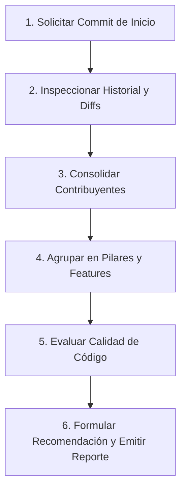

# Commit Summary & Review Skill

Esta skill permite realizar una revisión profunda y estructurada de un rango de commits en la rama de trabajo activa. Su propósito es consolidar el entendimiento técnico y funcional del código introducido, clasificar las contribuciones por autor, agrupar commits iterativos o WIPs en funcionalidades coherentes, y emitir una evaluación de calidad con recomendaciones accionables.

---

## Flujo de Trabajo Paso a Paso



---

### Paso 1: Identificación Interactiva del Rango

1. **Obtener la rama actual**:
   ```bash
   git branch --show-current
   ```

2. **Solicitar el punto de inicio**:
   Si el usuario no indicó explícitamente el commit de partida en su mensaje, el agente **DEBE** pausar y preguntar:
   > *«¿Desde qué commit (hash, tag o rama base) deseas iniciar el análisis?»*

   **Valores aceptados**:
   - Hash corto o largo: ej. `d74929c`, `a1b2c3d4e5f6`
   - Rama base: ej. `main`, `origin/main`, `develop`
   - Referencia relativa: ej. `HEAD~10`
   - Tag: ej. `v1.4.0`

3. **Verificar validez del rango**:
   ```bash
   git rev-parse --verify "<commit-inicio>"
   git log --oneline "<commit-inicio>..HEAD"
   ```

---

### Paso 2: Recopilación de Metadatos y Diffs

Ejecutar las consultas necesarias para reconstruir la cronología y el impacto:

1. **Listado cronológico de commits con autor y fecha**:
   ```bash
   git log --reverse --format="%h|%an|%ae|%ad|%s" --date=format:"%Y-%m-%d %H:%M" "<commit-inicio>..HEAD"
   ```

2. **Estadísticas de impacto por archivo**:
   ```bash
   git diff --stat "<commit-inicio>..HEAD"
   ```

3. **Inspección de diffs específicos**:
   Para los commits clave o grupos de commits, inspeccionar los cambios reales (`git show <hash>` o `git diff <hash>^!<hash>`) para identificar:
   - Reglas de validación, lógica de negocio y modificaciones en modelos.
   - Endpoints, middlewares, servicios y migraciones (Backend).
   - Componentes, interfaces, estados y eventos de usuario (Frontend).

---

### Paso 3: Consolidación de Contribuyentes y Agrupación de Commits

1. **Tabla de Contribuyentes**:
   - Totalizar commits por autor.
   - Sintetizar los módulos o capas principales que cada autor modificó.

2. **Agrupación Inteligente de Commits**:
   - **Regla para WIPs e iteraciones**: Si existen múltiples commits que atienden la misma tarea (ej: `feat: add login`, `fix test`, `wip styles`, `fix button`), **no listarlos por separado**. Agruparlos bajo un único bloque funcional y colocar todos los hashes asociados entre paréntesis:  
     `#### Nombre de la Funcionalidad (hash1, hash2, hash3)`  
     `*(Commits iterativos y WIPs agrupados)*`
   - **Estructura por Pilar**:
     Organizar las funcionalidades en pilares temáticos de alto nivel (ej: `A. Políticas de Seguridad, Autenticación y RBAC`, `B. Módulo de Facturación`).
   - **Estructura por Funcionalidad**:
     Cada funcionalidad dentro de un pilar debe detallar:
     - `* **Regla de negocio:**` Qué problema resuelve y qué regla impone en el dominio.
     - `* **Backend:**` Middlewares, modelos, endpoints, migraciones o lógica de servidor.
     - `* **Frontend:**` Componentes, vistas, reactividad y experiencia de usuario.
     - `*Por <Autor>*` al final de la descripción.

---

### Paso 4: Evaluación de Calidad de Código

Evaluar el conjunto de cambios en base a cuatro dimensiones clave:

1. **Separación de Responsabilidades**: ¿La lógica de negocio está donde corresponde (servicios/modelos/middlewares) o invadió controladores y componentes UI?
2. **Manejo de Errores y Validaciones**: ¿Existen validaciones robustas en backend (Form Requests, esquemas) y feedback claro al usuario en frontend?
3. **Atomicidad del Historial**: ¿Existen commits sucios, WIPs o cambios inconexos que ameriten un rebase previo a merge?
4. **Riesgos y Casos Borde**: ¿Se detectaron llamadas costosas, consultas N+1, problemas de concurrencia, excepciones no capturadas o bloqueos accidentales?

---

### Paso 5: Resumen General y Recomendación de Acción

- **Resumen Ejecutivo**: Párrafo técnico de balance general sobre el trabajo realizado en el rango.
- **Recomendaciones de Acción**:
  - Propuesta clara de rebase interactivo (`squash`/`fixup`) indicando qué commits consolidar.
  - Pruebas faltantes requeridas antes del merge.
  - Dictamen: `Aprobado`, `Aprobado condicionado` o `Requiere cambios`.

---

### Paso 6: Emisión del Reporte Estandarizado

El agente **DEBE** redactar el informe final siguiendo rigurosamente la plantilla de [`resources/report-template.md`](./resources/report-template.md):
- Sin emojis decorativos en títulos o tablas.
- Uso consistente de títulos Markdown (`#`, `##`, `###`, `####`).
- Estados expresados como texto (`Conforme`, `Requiere Atención`, `Advertencia`).
