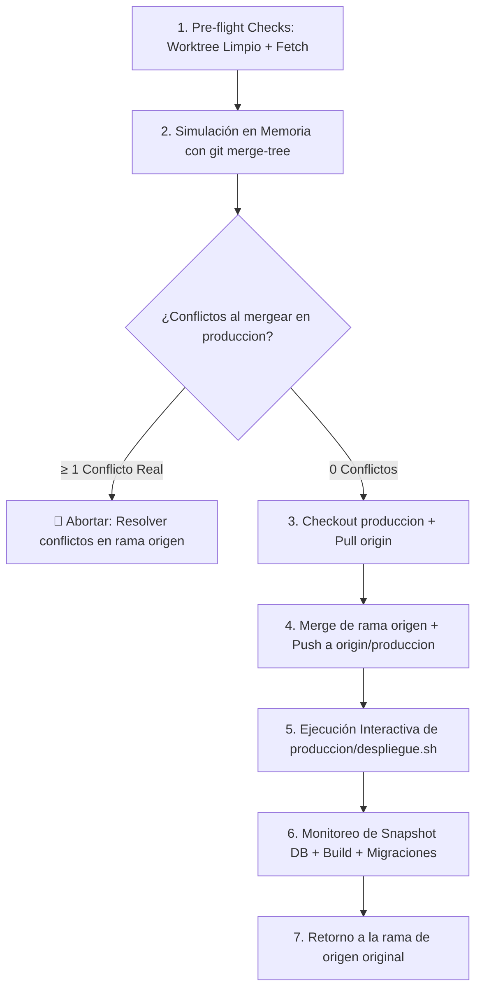

# Deploy Prod Skill (Merge y Despliegue Seguro a Producción)

Esta skill guía y ejecuta el protocolo estándar para llevar cambios validados desde cualquier rama de trabajo (ej. `integracion/rediseno-sobre-main`, `feature/*`, `fix/*`) hacia la rama oficial de **`produccion`**, publicarlos en `origin/produccion` y disparar el pipeline de despliegue automatizado en el servidor mediante **`produccion/despliegue.sh`**.

---

## 📋 Flujo de Despliegue



---

## 🛡️ Protocolo de Ejecución Paso a Paso

### Paso 1: Verificaciones Previas (Pre-flight Checks)

Antes de alterar ramas, se comprueba que el estado local sea completamente consistente:

```powershell
# 1. Comprobar que no hayan cambios pendientes sin commitear
git status --short

# 2. Actualizar referencias remotas
git fetch -p origin
```

> [!IMPORTANT]
> El árbol de trabajo **debe estar limpio** (`nothing to commit, working tree clean`). Si hay cambios en curso, deben consolidarse con un commit previo o guardarse temporalmente con `git stash`.

---

### Paso 2: Diagnóstico Cuantitativo en Memoria

Para garantizar que el merge hacia `produccion` no generará conflictos que interrumpan el proceso, se ejecuta la herramienta de diagnóstico:

```powershell
powershell -File .agents/skills/deploy-prod/scripts/prepare-prod-merge.ps1
```

Este script:
1. Identifica la rama origen actual.
2. Compara contra `origin/produccion`.
3. Ejecuta `git merge-tree` en memoria sin tocar ningún archivo ni alterar el índice.
4. Reporta si la integración es 100% limpia (0 colisiones).

---

### Paso 3: Integración y Publicación en Producción

Si el diagnóstico confirma **0 conflictos reales**, se procede a integrar los cambios en la rama `produccion` local y remota:

```bash
# 1. Guardar nombre de la rama actual para retornar luego
ORIGIN_BRANCH=$(git branch --show-current)

# 2. Posicionarse en produccion y actualizarla
git checkout produccion
git pull --rebase origin produccion

# 3. Integrar la rama origen
git merge "$ORIGIN_BRANCH" --no-ff -m "merge: integrar $ORIGIN_BRANCH en produccion"

# 4. Publicar la rama produccion al remoto
git push origin produccion
```

---

### Paso 4: Ejecución del Script de Despliegue

Con la rama `produccion` actualizada en GitHub, el servidor remoto puede descargar los cambios y reconstruir los artefactos.

Se lanza el script de despliegue interactivo:

```bash
# En Windows (Bash / WSL / Git Bash) o Linux / macOS:
bash produccion/despliegue.sh
```

#### Pipeline de 9 Fases Ejecutado en el Servidor:
1. `[1/9]` Conexión SSH y verificación de credenciales SUDO.
2. `[2/9]` Acceso al repositorio fuente remoto (`/home/utamed/utamed`).
3. `[3/9]` Actualización de la rama `produccion` (`git checkout produccion && git pull`).
4. `[4/9]` Instalación y optimización de dependencias PHP (`composer install --no-dev`).
5. `[5/9]` Instalación de dependencias Node (`npm ci`).
6. `[6/9]` Compilación de frontend Vite / Svelte (`npm run build`).
7. `[7/9]` Sincronización limpia con `rsync` hacia `/var/www/prod_utamed`.
8. `[8/9]` Enlaces simbólicos de storage compartido y asignación de permisos `www-data`.
9. `[9/9]` **Tareas de base de datos y caché en producción**:
   - 📸 **Snapshot Preventivo de PostgreSQL**: Se genera automáticamente una copia completa de seguridad (`pre_deploy_*.dump`) con retención de los últimos 10 respaldos.
   - 🗄️ **Migraciones de esquema**: `php artisan migrate --force`.
   - ⚡ **Optimización Laravel**: `php artisan optimize` y verificación `php artisan about`.

---

### Paso 5: Retorno a la Rama de Trabajo

Una vez confirmado el mensaje `Despliegue completado correctamente.`, se regresa a la rama de desarrollo original:

```bash
git checkout "$ORIGIN_BRANCH"
```

---

## 🚨 Plan de Contingencia y Rollback

Si durante o después del despliegue se detecta algún error crítico en producción (error 500, inconsistencia de datos o caída de servicios), se debe invocar inmediatamente el script interactivo de contingencia:

```bash
bash produccion/rollback.sh
```

El asistente ofrece 4 modalidades de recuperación rápida:
1. **Rollback Completo**: Revierte el código al commit anterior y restaura el último snapshot de PostgreSQL.
2. **Rollback Solo Código**: Revierte el código sin tocar la base de datos.
3. **Rollback Solo Base de Datos**: Restaura el último volcado de PostgreSQL en el puerto 5432.
4. **Purgar Cachés y Permisos**: Resuelve problemas de pantalla en blanco o errores de permisos en `bootstrap/cache` y `storage`.
