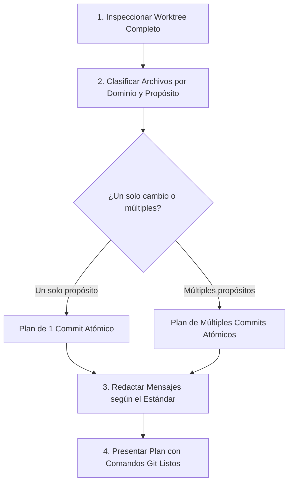

# Make Commits Skill (Generador y Organizador de Commits Atómicos)

Esta skill analiza los archivos modificados, en staging y no rastreados en el árbol de trabajo de Git, evalúa si deben agruparse en un solo commit o separarse en múltiples commits atómicos, y redacta mensajes de commit profesionales siguiendo la convención estandarizada del proyecto.

---

## 📋 Flujo de Trabajo



---

## 🔍 Paso 1: Inspección del Worktree

El agente debe ejecutar los comandos necesarios para tener visibilidad total de los cambios:

```powershell
# 1. Estado resumido incluyendo todos los archivos no rastreados individuales
git status -uall --short

# 2. Resumen de líneas modificadas
git diff --stat

# 3. (Opcional) Ejecutar script auxiliar de inspección
powershell -File .agents/skills/make-commits/scripts/inspect-worktree.ps1
```

---

## 🧩 Paso 2: Análisis de Atomicidad y Agrupación

El agente evalúa los archivos modificados y los agrupa según su responsabilidad:

1. **Capa de Base de Datos / Modelos**: Migraciones, seeders, factories, modelos base/externos.
2. **Capa de Lógica / Servicios**: Servicios de aplicación, acciones, handlers, eventos, jobs.
3. **Capa de Controladores / Endpoints / Rutas**: APIs, controladores HTTP, middleware, rutas.
4. **Capa de Interfaz / Frontend**: Vistas, componentes Svelte/Vue/React, estilos, assets.
5. **Capa de Comandos y Herramientas**: Comandos Artisan/CLI, scripts de utilidad, tooling.
6. **Capa de Pruebas**: Tests unitarios, integración, feature, factories/helpers de test.
7. **Capa de Configuración y Documentación**: Archivos `.env.example`, `config/*`, guías en `docs/`.

> **Criterio de Separación**: Si los cambios abarcan más de un dominio lógico independiente (ej: refactor de modelos + nuevos comandos CLI + tests nuevos), se deben proponer **commits separados**. Si todos los cambios corresponden a una misma funcionalidad indivisible, se propone **un solo commit**.

---

## ✍️ Paso 3: Estándar y Formato de Mensajes de Commit

### Formato Obligatorio

```text
<tipo>(<alcance>): <resumen imperativo y conciso>

- <detalle de impacto 1>
- <detalle de impacto 2>
```

Al ejecutar en Git mediante CLI, se utilizan dos argumentos `-m` (lo que inserta automáticamente la línea en blanco entre el título y el cuerpo):
```bash
git commit -m "<tipo>(<alcance>): <resumen>" -m "- <detalle 1>
- <detalle 2>"
```

### Tipos Permitidos (`<tipo>`)
- `feat`: Nueva funcionalidad, endpoint, comando o capacidad para el usuario/sistema.
- `fix`: Corrección de un error o comportamiento inesperado.
- `refactor`: Reestructuración de código sin alterar comportamiento externo.
- `perf`: Optimización de rendimiento.
- `test`: Creación, actualización o reorganización de pruebas.
- `docs`: Modificaciones exclusivas en documentación o comentarios guía.
- `chore`: Mantenimiento, dependencias, tooling o configuración.
- `style`: Formateo de código, estilos visuales sin impacto lógico.

---

## 🎯 Reglas Críticas para los Detalles (Cuerpo del Commit)

Consulte la guía completa en [`commit-conventions.md`](./references/commit-conventions.md).

> [!IMPORTANT]
> **Los detalles (`- <detalle>`) son TOTALMENTE OPCIONALES y deben usarse con moderación.**  
> Si el resumen del título ya explica con claridad el cambio, **NO** se deben agregar detalles redundantes.

### 🚫 Lo que NUNCA debe ir en los detalles:
- **NO** describir mecánicamente el código ("se agregó un if", "se cambió la variable $x", "se creó la función foo").
- **NO** repetir lo que ya se entiende del título.

### ✅ Lo que SÍ debe incluirse en los detalles (sin orden particular):
1. **Nuevas habilidades disponibles para el desarrollador**:
   - Comandos de consola nuevos (ej: `nuevo comando artisan intranet:inspect para auditar registros`).
   - Nuevos seeders, scripts de automatización o helpers globales.
2. **Nuevos requerimientos de configuración**:
   - Variables de entorno requeridas en `.env`, cambios en `config/*.php`, permisos requeridos.
3. **Cambios de filosofía o arquitectura**:
   - Cambio de enfoque en un servicio, desacoplamiento de capas, adopción de nuevos contratos/interfaces.
4. **Resumen de cambios de alto volumen**:
   - Cuando son muchos archivos del mismo tipo (ej: `7 servicios agregados para módulos de administración`).
5. **Cambios en el stack tecnológico o dependencias**:
   - Nuevas librerías, actualización de paquetes o dependencias externas.
6. **EXCLUSIVO EN FIXES (qué se corrigió)**:
   - Causa raíz o comportamiento anómalo corregido (puede ser técnico pero breve).
7. **Nuevos tests**:
   - Mención de suites de prueba unitarias/integración añadidas.
8. **Cambios en documentación**:
   - Guías, diagramas o manuales agregados o actualizados.
9. **Cambios en archivos parcialmente estáticos**:
   - Modelos, esquemas, enumeraciones o constantes de dominio.

---

## 🚀 Paso 4: Presentación de la Propuesta al Usuario

El agente debe estructurar su respuesta presentando:
1. **Resumen de Archivos Detectados** clasificados por categoría.
2. **Propuesta de Commits**: Para cada commit sugerido:
   - Número y Nombre del Commit.
   - Lista explícita de archivos a incluir (`git add <archivos>`).
   - Comando exacto `git commit -m "..." -m "..."`.
   - Justificación del alcance.
3. **Bloque de Ejecución Rápida**: Todos los comandos concatenados o listos para ejecutar paso a paso.
