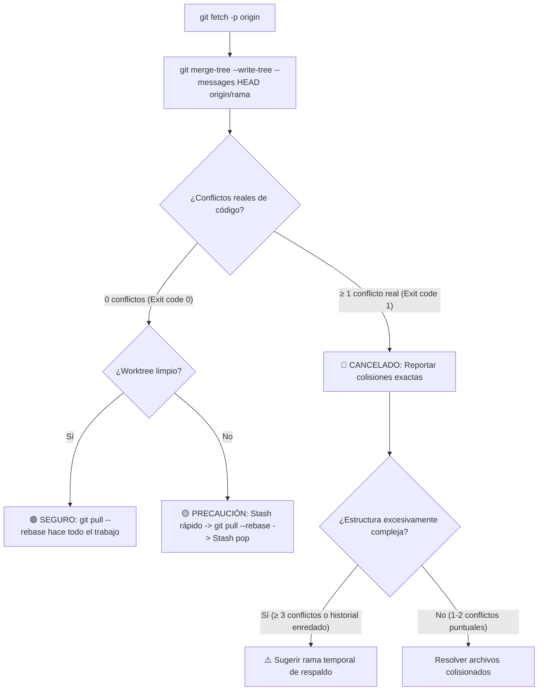

# Safe Pull Rebase Skill (Actualización y Rebase Cuantitativo)

Esta skill analiza la seguridad de traer cambios del repositorio remoto (`git pull --rebase` o `git rebase origin/<branch>`) simulando la integración en memoria mediante **`git merge-tree`**.

---

## 🔬 Algoritmo de Medición Cuantitativa de Colisiones



---

## 📋 Flujo de Trabajo Paso a Paso

### Paso 1: Actualización de Referencias Remotas
```powershell
git fetch --prune origin
```

---

### Paso 2: Medición de Colisiones en Memoria (`git merge-tree`)

Se ejecuta la simulación en memoria sin tocar ningún archivo ni alterar el índice:

```powershell
powershell -File .agents/skills/safe-pull-rebase/scripts/safe-pull-check.ps1
```

#### Métricas Cuantitativas Obtenidas:
1. **Archivos Compartidos**: Archivos modificados simultáneamente en local y remoto.
2. **Archivos Auto-Fusionables**: Archivos compartidos donde Git resuelve las diferencias automáticamente (`Auto-merging`, 0 colisiones de líneas).
3. **Conflictos Reales de Código**: Ocurrencias de `CONFLICT (content)` donde las mismas líneas colisionan.

---

### Paso 3: Protocolo según el Veredicto

Consulte la guía completa en [`risk-assessment.md`](./references/risk-assessment.md).

#### 🟢 CASO 1: SEGURO (0 Conflictos Reales de Código)
`git pull --rebase` **hace todo el trabajo directamente**:
```bash
git pull --rebase origin <rama>
```
*No requiere ramas temporales ni pasos manuales extras; Git reubica tus commits locales de forma transparente sobre la punta del remoto.*

#### 🟡 CASO 2: PRECAUCIÓN (0 Conflictos pero Worktree Sucio)
Tus commits son compatibles, pero tienes archivos sin commitear en el worktree:
```bash
git stash push -u -m "pre-pull-stash"
git pull --rebase origin <rama>
git stash pop
```

#### 🔴 CASO 3: CANCELADO POR COLISIÓN REAL (≥ 1 Conflicto Real)
**Acción del Agente**:
1. **Detener inmediatamente** el intento de rebase.
2. Reportar la cantidad exacta de colisiones y listar los archivos en conflicto.
3. **Solo si la estructura es muy compleja** (múltiples branches cruzados o ≥ 3 conflictos severos), sugerir rama temporal de respaldo antes de intervenir.

---

## 🛡️ Formato del Reporte de Diagnóstico

```text
# 🛡️ Diagnóstico Cuantitativo: Pull & Rebase

- Rama actual: `<rama>`
- Rama remota: `origin/<rama>`
- Commits locales (ahead): `X` | Commits remotos (behind): `Y`
- Archivos compartidos en ambos lados: `N`
- Archivos auto-fusionables (sin colisión de líneas): `N`
- Conflictos reales de código detectados: `0` (o lista de archivos)

> **Veredicto**: 🟢 SEGURO | 🟡 PRECAUCIÓN | 🔴 CANCELADO POR COLISIÓN REAL

[Comandos de ejecución recomendados]
```
