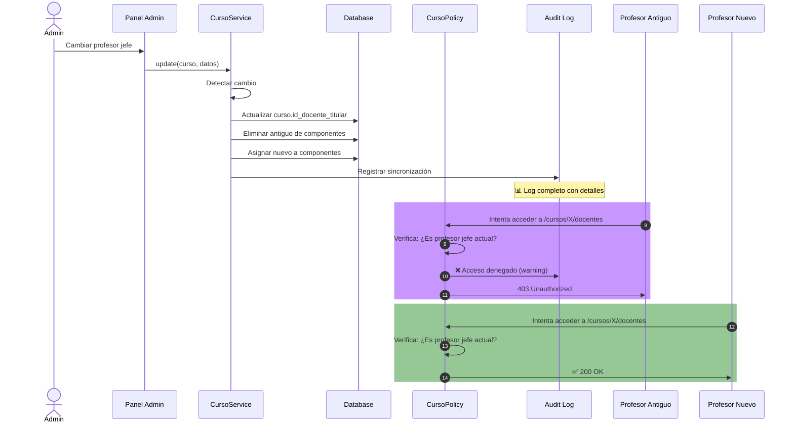

# Sincronización de Profesor Jefe de Curso

**Fecha:** 9 de Abril de 2026  
**Tipo:** Security Fix - Revocación automática de acceso

## 🎯 Problema Resuelto

Cuando se cambia el profesor jefe de un curso, el usuario que fue reemplazado seguía teniendo acceso al:
- Panel de gestión de equipo (`/cursos/{id}/docentes`)
- Visualización y edición del programa (`/cursos/{id}/programa`)
- Componentes/secciones del curso

Esto es una **violación de seguridad tipo IDOR** (Insecure Direct Object Reference).

## ✅ Solución Implementada

### 1. **Sincronización Automática en CursoService**

**Archivo:** `app/Services/CursoService.php`

#### Método: `update(Curso $curso, array $data)`
- Detecta cambio en `id_docente_sugerido`
- Almacena el ID del profesor anterior
- Dispara sincronización si hay cambio

#### Nuevo método privado: `syncDocenteTitularInComponents()`
```php
private function syncDocenteTitularInComponents(
    Curso $curso, 
    int $oldDocenteId, 
    int $newDocenteId
): void
```

**Comportamiento:**
- Obtiene todos los componentes del curso
- Para cada componente:
  - **Elimina** registros de `docente_componente` donde el antiguo profesor es titular
  - **Asigna** al nuevo profesor como titular (crea o actualiza)
- Registra cada acción en audit log con nivel `warning`

**Log de auditoría completo:**
```json
{
  "evento": "CAMBIO_PROFESOR_JEFE",
  "id_curso": 123,
  "cod_curso": "001-101",
  "id_docente_anterior": 456,
  "id_docente_nuevo": 789,
  "total_componentes": 2,
  "timestamp": "2026-04-09T14:30:00+00:00",
  "detalles": [
    {
      "id_componente": 1,
      "tipo_componente": "Cátedra",
      "acciones": [
        "REMOVIDO: Docente 456 como titular (registros eliminados: 1)",
        "ASIGNADO: Docente 789 como titular (registro creado)"
      ]
    }
  ]
}
```

### 2. **Políticas de Autorización Reforzadas**

**Archivo:** `app/Policies/CursoPolicy.php`

#### Métodos: `manageTeam()` y `viewPrograma()`

**Cambios:**
- ✅ Verificación explícita: `$curso->id_docente_titular === $user->docente->id_docente`
- ✅ Comparación directa (no `->exists()` query)
- ✅ Audit logging de TODOS los intentos denegados

**Log de acceso denegado:**
```json
{
  "evento": "ACCESO_DENEGADO_MANAGEAM_TEAM",
  "id_usuario": 123,
  "email_usuario": "exprofesor@example.com",
  "id_docente": 456,
  "id_curso": 789,
  "cod_curso": "001-101",
  "profesor_jefe_actual": 999,
  "timestamp": "2026-04-09T14:31:00+00:00",
  "ip": "192.168.1.1",
  "user_agent": "Mozilla/5.0..."
}
```

## 🧪 Pruebas Incluidas

**Archivo:** `tests/Feature/CursoProfesorJefeTest.php`

### 6 test cases:

1. ✅ `test_current_profesor_jefe_can_manage_team()`
   - Verifica que profesor jefe actual SÍ tiene acceso

2. ✅ `test_profesor_jefe_loses_access_after_replacement()`
   - Verifica que acceso se revoca al ser reemplazado
   - Verifica que nuevo jefe SÍ tiene acceso

3. ✅ `test_old_profesor_removed_from_component_titular_roles()`
   - Verifica eliminación de registros en `docente_componente`

4. ✅ `test_new_profesor_assigned_to_all_components()`
   - Verifica que nuevo profesor se asigna a TODOS los componentes

5. ✅ `test_new_profesor_marked_titular_if_already_in_component()`
   - Edge case: Si nuevo profesor ya estaba como no-titular, pasa a titular

6. ✅ `test_admin_always_has_access_to_manage_team()`
   - Verificación que admins no pierden acceso

## 🔒 Flujo de Seguridad



## 📋 Cambios en Archivos

| Archivo | Cambios | Líneas |
|---------|---------|--------|
| `CursoService.php` | +1 nuevo método, +logging | 70 |
| `CursoPolicy.php` | +2 audit logs, clarificación | 45 |
| `CursoProfesorJefeTest.php` | +6 test methods | 250 |

## 🚀 Verificación en Producción

### Checklist de testing:
- [ ] Cambiar profesor jefe de un curso
- [ ] Verificar que antiguo profesor recibe 403 en `/cursos/{id}/docentes`
- [ ] Verificar que nuevo profesor accede correctamente
- [ ] Revisar logs en `storage/logs/seguridad-*.log`
- [ ] Ejecutar tests: `php artisan test tests/Feature/CursoProfesorJefeTest.php`

### Monitoreo:
```bash
# Ver intentos de acceso denegado
tail -f storage/logs/seguridad-*.log | grep "ACCESO_DENEGADO"

# Ver cambios de profesor jefe
tail -f storage/logs/seguridad-*.log | grep "CAMBIO_PROFESOR_JEFE"
```

## 🔗 Referencias

- [ANÁLISIS_SEGURIDAD_IDOR.md](../../ANÁLISIS_SEGURIDAD_IDOR.md) - Contexto de vulnerabilidad
- [CursoPolicy.php](../../app/Policies/CursoPolicy.php) - Policies con audit
- [CursoService.php](../../app/Services/CursoService.php) - Lógica de sincronización
