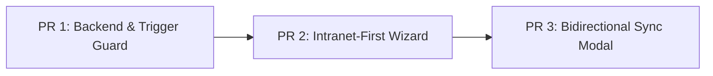

# Roadmap Técnico: Guardarraíles para la Prevención de Componentes Espurias y Sincronización Segura con Intranet

* **Fecha de Creación**: 2026-09-24
* **Rama de Trabajo**: `fix/guardarrailes-componentes-intranet`
* **Estado**: Pendiente de Implementación (TODO)
* **Origen de la Incidencia**: Discrepancia detectada y saneada en producción en *Taller Profesional IV* (`DM095`, Año 2026, Semestre 2, Grupos A y B).

---

## 1. Contexto y Diagnóstico Raíz

### 1.1 El Caso de Estudio (Taller Profesional IV)
Durante la auditoría sobre la sincronización con la Intranet institucional (Oracle), se descubrió que:
* **En Intranet (Oracle)**: La asignatura `DM095` en 2026 Semestre 2 contaba exclusivamente con componentes de tipo **Taller (`T`)**:
  * Grupo A (Acta `202620003449`): 19 estudiantes inscritos.
  * Grupo B (Acta `202620003450`): 19 estudiantes inscritos.
* **En UTAMED (Producción PostgreSQL)**: Los cursos `id = 2` (Grupo A) e `id = 5` (Grupo B) tenían registradas **dos** componentes cada uno:
  * Componente `Taller` (IDs 11 y 12): Oficiales, con código de acta UTA.
  * Componente `Laboratorio` (IDs 3 y 8): **Espurias**, sin código de acta (`cod_uta = NULL`), en una asignatura cuyo plan de estudios contempla **0 horas de laboratorio**.
* **El Efecto Cascada**:
  Al haberse creado la componente espuria de Laboratorio, el trigger de PostgreSQL `tr_inscribir_componente_curso_automaticamente` ejecutó automáticamente la inscripción de los 19 estudiantes en dicho Laboratorio con `cod_inscripcion_curso_uta = NULL`.
  Posteriormente, al copiar el Curso 2 para dar vida al Curso 5 (Grupo B) mediante `CursoService@copiar`, la componente espuria fue duplicada de forma ciega.
  El saneamiento en producción requirió la eliminación atómica de 44 registros (`inscripcion_componente`, `docente_componente`, `componente`, `contexto`).

### 1.2 Vulnerabilidades Sistémicas Identificadas
```mermaid
flowchart TD
    A[Trigger PostgreSQL tr_inscribir_componente] -->|Inscribe a todas las componentes sin validar acta| E[Inscripciones Fantasmas con cod_uta = NULL]
    B[Wizard CursoWizardModal / StoreCursoRequest] -->|Permite selección manual de componentes con 0 horas| F[Creación de Componentes Espurias]
    C[CursoService@copiar] -->|Clona componentes sin revalidar oferta de Intranet del grupo destino| G[Propagación de Errores entre Grupos]
    D[Modal cursoSincronizarIntranetModal] -->|Solo busca faltantes, ignora sobrantes locales| H[Ceguera ante Discrepancias Existentes]
```

---

## 2. Matriz de Tareas Pendientes (TODO)

| ID | Componente / Capa | Severidad | Descripción del Guardarraíl | Archivos Afectados |
| :--- | :--- | :--- | :--- | :--- |
| **G-01** | Base de Datos (PostgreSQL) | **Alta** | Condicionar o circunscribir el trigger `tr_inscribir_componente_curso_automaticamente` para evitar inscripciones ciegas en componentes sin respaldo en Intranet. | `database/migrations/*`, DDL Triggers |
| **G-02** | Backend (Requests / Validaciones) | **Alta** | Validación de coherencia en `StoreCursoRequest`: rechazar componentes con 0 horas en el plan de estudios a menos que Intranet las certifique explícitamente. | `app/Http/Requests/Admin/StoreCursoRequest.php` |
| **G-03** | Frontend (Wizard de Curso) | **Media** | Adopción de flujo Intranet-First en `CursoWizardModal.svelte`: previsualizar y autoseleccionar componentes según Oracle; bloquear adición de componentes incompatibles. | `resources/js/modules/resources/curso/components/cursoWizardModal.svelte` |
| **G-04** | Backend (IntranetService) | **Alta** | Detección bidireccional de componentes en `IntranetService`: reportar `componentes_sobrantes` locales frente a la oferta oficial de Intranet. | `app/Services/IntranetService.php`, `app/DTOs/External/*` |
| **G-05** | Frontend (Modal Sincronización) | **Media** | Alertas visuales de componentes locales no reconocidas en Intranet dentro de `cursoSincronizarIntranetModal.svelte` con opciones de resolución. | `resources/js/modules/resources/curso/components/cursoSincronizarIntranetModal.svelte` |
| **G-06** | Backend (CursoService) | **Media** | Revalidación de componentes al ejecutar `CursoService@copiar` para grupos paralelos (evitar clonación ciega). | `app/Services/CursoService.php` |
| **G-07** | Testing & Fixtures | **Baja** | Corregir desfases en seeders locales (`agno_plan` y semestres) y agregar tests de integración con respuestas simuladas de Oracle. | `database/seeders/*`, `tests/Feature/*`, `tests/Unit/*` |

---

## 3. Especificación Detallada de Tareas

### Tarea G-01: Desacoplamiento y Control del Trigger de Inscripción Automática
* **Problema**: La función `fn_inscribir_componente_curso_automaticamente()` ligada al trigger `AFTER INSERT ON curso.inscripcion_curso` realiza un bucle sobre todas las tuplas de `curso.componente` donde `id_curso = NEW.id_curso`. Si el curso tiene componentes espurias, inscribe al alumno sin validar si su inscripción de Intranet contemplaba dicha componente.
* **Solución Técnica Propuesta**:
  1. Modificar la función PL/pgSQL para evaluar el origen de la inscripción.
  2. Si `NEW.cod_inscripcion_uta IS NOT NULL` (inscripción federada desde Intranet), **no** ejecutar la autoinscripción genérica del trigger, delegando la responsabilidad a `IntranetService::inscribirAutomaticamente()`, el cual conoce exactamente las actas y componentes asignadas en Oracle.
  3. Si la inscripción es puramente interna/manual (`cod_inscripcion_uta IS NULL`), restringir la autoinscripción únicamente a componentes principales o válidas según el plan.

### Tarea G-02 y G-03: Flujo Intranet-First y Guardarraíles en Creación de Cursos
* **Problema**: El formulario permite marcar manualmente checkboxes de componentes ("Cátedra", "Taller", "Laboratorio") sin importar si la asignatura tiene 0 horas de esa tipología o si la Intranet no ofrece esa componente.
* **Solución Técnica Propuesta**:
  1. En `CursoWizardModal.svelte`, una vez seleccionada la Asignatura, Año, Semestre y Letra de Grupo, consultar el endpoint de previsualización de Intranet.
  2. Si Oracle retorna oferta oficial, bloquear la selección manual y desplegar únicamente las componentes retornadas con sus badges de acta oficial.
  3. Si Oracle está inaccesible o la oferta aún no se publica, permitir selección manual **exclusivamente** de aquellas componentes que posean `horas > 0` en `asignatura`.
  4. En `StoreCursoRequest.php`, implementar regla de validación personalizada:
     ```php
     // Rechazar componentes con 0 horas en la asignatura salvo excepción validada
     if ($asignatura->{"horas_" . $tipoComponente} <= 0 && !$existeEnIntranet) {
         $fail("La componente {$tipoComponente} no pertenece al plan de estudios ni a la oferta de Intranet.");
     }
     ```

### Tarea G-04 y G-05: Conciliación Bidireccional en Sincronización de Intranet
* **Problema**: El modal de sincronización actual (`cursoSincronizarIntranetModal.svelte`) solo busca componentes en Oracle que falten en UTAMED para agregarlas. Si UTAMED tiene una componente que en Oracle ya no existe o nunca existió, permanece invisible e inalterada.
* **Solución Técnica Propuesta**:
  1. En `IntranetService@resolverComponentesIntranet`, generar una estructura comparativa:
     * `componentes_coincidentes`: Existen en ambos extremos.
     * `componentes_faltantes`: Existen en Intranet pero no en UTAMED.
     * `componentes_sobrantes_locales`: Existen en UTAMED pero no figuran en las actas de Intranet.
  2. Enriquecer `ResultadoSincronizacionComponentes`:
     ```php
     public array $componentesSobrantes = []; // IDs y nombres de componentes locales sin acta
     ```
  3. En `cursoSincronizarIntranetModal.svelte`, mostrar un bloque de advertencia si existen componentes sobrantes:
     > ⚠️ **Advertencia de Componente Huérfana**: El curso posee componentes locales (ej. Laboratorio) que no figuran en la oferta de Intranet para este período y grupo.

### Tarea G-06: Blindaje en Copia de Cursos (`CursoService@copiar`)
* **Problema**: Al duplicar un curso de Grupo A para generar Grupo B, se iteran las componentes de A y se replican íntegramente en B, duplicando cualquier error de configuración previo.
* **Solución Técnica Propuesta**:
  1. Al invocar `copiar()`, consultar la oferta de Intranet para el nuevo paralelo/grupo (`letra_grupo_destino`).
  2. Si Intranet responde para el grupo destino, sincronizar las componentes oficiales de dicho grupo en vez de duplicar ciegamente las del grupo origen.
  3. Si no hay conexión con Intranet, copiar solo las componentes válidas de acuerdo con la carga horaria de la asignatura.

### Tarea G-07: Consistencia en Seeders y Entorno Local
* **Problema**: En el entorno local, `plan.agno_plan = 2026` provocaba que las consultas de simulación fallaran porque en Oracle la carrera `23` se rige bajo el plan `2016`.
* **Solución Técnica Propuesta**:
  1. Revisar `database/seeders/` para asegurar que las asignaturas de prueba utilicen años de plan consistentes con los registros históricos y actuales de Intranet.
  2. Crear suite de tests con mocks HTTP/DB de Intranet que evalúen los escenarios:
     * Curso regular (Cátedra + Taller).
     * Curso monocomponente (Solo Taller).
     * Detección y bloqueo de componentes espurias.

---

## 4. Estrategia de Entrega (Pull Requests Sugeridos)



1. **PR 1: `fix(backend): proteccion de trigger y validacion de componentes en curso`**
   * Migración de función PL/pgSQL para `tr_inscribir_componente_curso_automaticamente`.
   * Validación en `StoreCursoRequest`.
   * Blindaje en `CursoService@copiar`.
2. **PR 2: `feat(wizard): seleccion asistida intranet-first de componentes de curso`**
   * Integración de preview de componentes en `CursoWizardModal.svelte`.
   * Bloqueo reactivo de componentes sin horas en el plan.
3. **PR 3: `feat(intranet): conciliacion bidireccional y reporte de componentes sobrantes`**
   * Detección de discrepancias en `IntranetService`.
   * Advertencias interactivas en `cursoSincronizarIntranetModal.svelte`.
