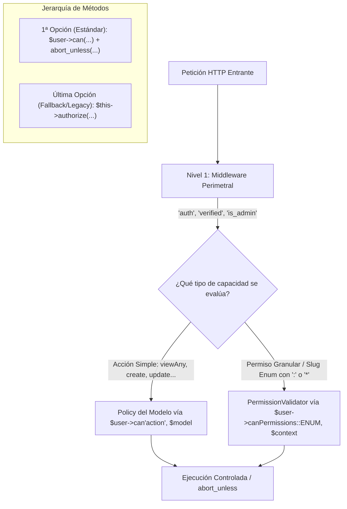

# Auditoría de Seguridad de Endpoints: Cobertura de Policies, Permisos Granulares y Verificaciones Redundantes

## 1. Definición y Formalización del Estándar de Autorización

Para garantizar una arquitectura de control de acceso consistente, auditable y centralizada en UTAMED, se define el siguiente **Estándar de Autorización Unificado**, basado en el método centralizado **`$user->can('action', $thing)`**:



### 1.1. Capacidad Bivalente de `$user->can()` en UTAMED
En el modelo [`Usuario`](file:///c:/Users/dyri0n/Code/utamed/app/Models/Usuario/Usuario.php#L490), el método `can($ability, $arguments)` está sobreescrito para unificar el control de acceso en un único punto de entrada:
1. **Acciones Simples sobre Modelos (CRUD / Dominio)**:
   - Al recibir una acción sin dos puntos (ej. `'viewAny'`, `'view'`, `'create'`, `'update'`, `'delete'`, `'manageTeam'`, `'approve'`), delega automáticamente a la **Policy** registrada para el modelo.
2. **Permisos Individuales y Granulares (Slugs del Enum `Permissions`)**:
   - Al recibir un slug con `:` o wildcard `*` (o una instancia tipada del enum [`Permissions`](file:///c:/Users/dyri0n/Code/utamed/app/Support/Permissions.php)), detecta el slug y delega directamente a [`PermissionValidator`](file:///c:/Users/dyri0n/Code/utamed/app/Services/Authorization/PermissionValidator.php) y a `hasPermissionFor($permission, $contextResource)`. Esto permite validar permisos individuales en la jerarquía contextual institucional (Facultad $\rightarrow$ Departamento $\rightarrow$ Carrera $\rightarrow$ Plan $\rightarrow$ Curso).

### 1.2. Reglas del Estándar y Jerarquía de Invocación
- **Resolución Automática de Contexto vs `context_id` Manual (Regla Fundamental)**:
  - **Estándar Primario (Por Defecto)**: Toda llamada a `$user->can(...)` DEBE recibir la instancia del modelo Eloquent (`$curso`), la clase (`Curso::class`), o la tupla con padre (`[Programa::class, $curso]`). Al implementar `HasContext`, el sistema infiere automáticamente el `id_contexto` y la jerarquía de ancestros.
  - **Último Recurso (*Last Resort*)**: Pasar manualmente `context_id` (enteros en bruto) o invocar `PermissionValidator::validate($user, $slug, null, $contextId)` directamente está desaconsejado y solo se permite cuando no existe ningún modelo de dominio representativo en el contexto operativo.
- **1ª Opción (Estándar Obligatorio Recomendado)**:
  - Validar explícitamente en el controlador o servicio usando `$user->can(...)` junto con `abort_unless`:
    ```php
    // CRUD / Acciones de Policy sobre Modelos (Contexto Automático por Instancia)
    abort_unless($request->user()->can('update', $curso), 403, 'No autorizado para editar este curso.');
    abort_unless($request->user()->can('viewAny', Facultad::class), 403, 'No autorizado para ver facultades.');

    // Permisos Granulares / Sub-módulos (Tipado con Enum y Contexto Automático)
    abort_unless($request->user()->can(Permissions::MODULO_1, $curso), 403, 'No autorizado para editar el Módulo 1.');
    abort_unless($request->user()->can(Permissions::CURSOS_INSCRIPCIONES_INSCRIBIR_ALUMNOS, $curso), 403);
    ```
- **Última Opción (Desaconsejada / Legacy Fallback)**:
  - El `$this->authorize('action', $thing)` base de Laravel y el paso manual de `context_id` deben ser la **última opción siempre**. Aunque delegan internamente en el Gate, acoplan el flujo al trait de controladores HTTP, no unifican la sintaxis tipada con enums de permisos individuales y reducen la claridad del usuario evaluado.

### 1.3. Reglas de Mapeo por Operación HTTP
1. **`GET (index / listados de recursos)`**:
   - Estándar: `abort_unless($user->can('viewAny', Modelo::class), 403);`
2. **`GET (show / detalle / preview de recurso)`**:
   - Estándar: `abort_unless($user->can('view', $instanciaModelo), 403);` (resuelve el contexto jerárquico del objeto).
3. **`POST (store / creación de recursos)`**:
   - Estándar raíz: `abort_unless($user->can('create', Modelo::class), 403);`
   - Estándar anidado/dependiente: `abort_unless($user->can('create', [Modelo::class, $modeloPadre]), 403);` (ej. `[Programa::class, $curso]`, `[Componente::class, $curso]`).
4. **`PUT / PATCH (update / modificaciones de recursos)`**:
   - Estándar: `abort_unless($user->can('update', $instanciaModelo), 403);`
5. **`DELETE (destroy / eliminaciones de recursos)`**:
   - Estándar: `abort_unless($user->can('delete', $instanciaModelo), 403);`
6. **Acciones de Dominio Específicas / Secciones Granulares**:
   - Estándar: `abort_unless($user->can('approve', $programa), 403);`, `abort_unless($user->can(Permissions::MODULO_1, $curso), 403);`, etc.
7. **Endpoints Auxiliares y AJAX**:
   - Ningún endpoint auxiliar (selects en cascada, autocompletados, exportaciones) debe confiar exclusivamente en el middleware `is_admin`. Debe ejecutar `$user->can(...)` sobre el recurso o permiso consultado.

---

## 2. Tipología de Verificaciones Redundantes

En una arquitectura segura, existen dos clases de redundancias:
1. **Defensa en Profundidad (Positiva / Deseada)**:
   - El middleware `is_admin` filtra el acceso perimetral al panel `/admin`, mientras que `$user->can(...)` evalúa si el usuario tiene el permiso específico (`recurso:accion`) en el contexto institucional correspondiente. Si el usuario es `SuperAdmin`, el método `before()` de la policy otorga bypass automático.
2. **Guards Manuales Duplicados en Controlador (Requiere análisis / refactor)**:
   - El controlador ejecuta manualmente `if (!$user->isSuperAdmin()) abort(403)` o comprueba roles/relaciones a mano, a pesar de que `$user->can(...)` ya realiza esa misma verificación o debería encapsularla dentro de la Policy.

---

## 3. Catálogo de Permisos Granulares del Sistema

Los permisos granulares del sistema están centralizados en el enum PHP [`App\Support\Permissions`](file:///c:/Users/dyri0n/Code/utamed/app/Support/Permissions.php), vinculados con la jerarquía de contextos y evaluados por [`PermissionValidator`](file:///c:/Users/dyri0n/Code/utamed/app/Services/Authorization/PermissionValidator.php) a través de `$user->can(...)`.

- **Facultades**: [`FACULTADES_ALL`](file:///c:/Users/dyri0n/Code/utamed/app/Support/Permissions.php#L144), [`FACULTADES_VER`](file:///c:/Users/dyri0n/Code/utamed/app/Support/Permissions.php#L148), [`FACULTADES_CREAR`](file:///c:/Users/dyri0n/Code/utamed/app/Support/Permissions.php#L145), [`FACULTADES_EDITAR`](file:///c:/Users/dyri0n/Code/utamed/app/Support/Permissions.php#L146), [`FACULTADES_ELIMINAR`](file:///c:/Users/dyri0n/Code/utamed/app/Support/Permissions.php#L147)
- **Departamentos**: [`DEPARTAMENTOS_ALL`](file:///c:/Users/dyri0n/Code/utamed/app/Support/Permissions.php#L137), [`DEPARTAMENTOS_VER`](file:///c:/Users/dyri0n/Code/utamed/app/Support/Permissions.php#L141), [`DEPARTAMENTOS_CREAR`](file:///c:/Users/dyri0n/Code/utamed/app/Support/Permissions.php#L138), [`DEPARTAMENTOS_EDITAR`](file:///c:/Users/dyri0n/Code/utamed/app/Support/Permissions.php#L139), [`DEPARTAMENTOS_ELIMINAR`](file:///c:/Users/dyri0n/Code/utamed/app/Support/Permissions.php#L140)
- **Carreras**: [`CARRERAS_ALL`](file:///c:/Users/dyri0n/Code/utamed/app/Support/Permissions.php#L50), [`CARRERAS_VER`](file:///c:/Users/dyri0n/Code/utamed/app/Support/Permissions.php#L54), [`CARRERAS_CREAR`](file:///c:/Users/dyri0n/Code/utamed/app/Support/Permissions.php#L51), [`CARRERAS_EDITAR`](file:///c:/Users/dyri0n/Code/utamed/app/Support/Permissions.php#L52), [`CARRERAS_ELIMINAR`](file:///c:/Users/dyri0n/Code/utamed/app/Support/Permissions.php#L53)
- **Planes y Mallas**: [`CARRERAS_PLANES_ALL`](file:///c:/Users/dyri0n/Code/utamed/app/Support/Permissions.php#L57), [`CARRERAS_PLANES_CREAR`](file:///c:/Users/dyri0n/Code/utamed/app/Support/Permissions.php#L59), [`CARRERAS_PLANES_EDITAR`](file:///c:/Users/dyri0n/Code/utamed/app/Support/Permissions.php#L60), [`CARRERAS_PLANES_ELIMINAR`](file:///c:/Users/dyri0n/Code/utamed/app/Support/Permissions.php#L61), [`CARRERAS_PLANES_ASIGNACION_ASIGNATURAS`](file:///c:/Users/dyri0n/Code/utamed/app/Support/Permissions.php#L58), [`CARRERAS_PLANES_VER_VER_MALLA`](file:///c:/Users/dyri0n/Code/utamed/app/Support/Permissions.php#L66)
- **Asignaturas**: [`ASIGNATURAS_ALL`](file:///c:/Users/dyri0n/Code/utamed/app/Support/Permissions.php#L43), [`ASIGNATURAS_VER`](file:///c:/Users/dyri0n/Code/utamed/app/Support/Permissions.php#L47), [`ASIGNATURAS_CREAR`](file:///c:/Users/dyri0n/Code/utamed/app/Support/Permissions.php#L44), [`ASIGNATURAS_EDITAR`](file:///c:/Users/dyri0n/Code/utamed/app/Support/Permissions.php#L45), [`ASIGNATURAS_ELIMINAR`](file:///c:/Users/dyri0n/Code/utamed/app/Support/Permissions.php#L46)
- **Cursos**: [`CURSOS_ALL`](file:///c:/Users/dyri0n/Code/utamed/app/Support/Permissions.php#L96), [`CURSOS_VER`](file:///c:/Users/dyri0n/Code/utamed/app/Support/Permissions.php#L101), [`CURSOS_CREAR`](file:///c:/Users/dyri0n/Code/utamed/app/Support/Permissions.php#L97), [`CURSOS_EDITAR`](file:///c:/Users/dyri0n/Code/utamed/app/Support/Permissions.php#L99), [`CURSOS_ELIMINAR`](file:///c:/Users/dyri0n/Code/utamed/app/Support/Permissions.php#L100)
- **Componentes**: [`COMPONENTES_ALL`](file:///c:/Users/dyri0n/Code/utamed/app/Support/Permissions.php#L69), [`COMPONENTES_VER`](file:///c:/Users/dyri0n/Code/utamed/app/Support/Permissions.php#L74), [`COMPONENTES_CREAR`](file:///c:/Users/dyri0n/Code/utamed/app/Support/Permissions.php#L70), [`COMPONENTES_EDITAR`](file:///c:/Users/dyri0n/Code/utamed/app/Support/Permissions.php#L72), [`COMPONENTES_ELIMINAR`](file:///c:/Users/dyri0n/Code/utamed/app/Support/Permissions.php#L73), [`COMPONENTES_DOCENTESCOLEGIADOS_AGREGAR`](file:///c:/Users/dyri0n/Code/utamed/app/Support/Permissions.php#L85), [`COMPONENTES_DOCENTESCOLEGIADOS_ELIMINAR`](file:///c:/Users/dyri0n/Code/utamed/app/Support/Permissions.php#L86)
- **Inscripciones**: [`CURSOS_INSCRIPCIONES_ALL`](file:///c:/Users/dyri0n/Code/utamed/app/Support/Permissions.php#L104), [`CURSOS_INSCRIPCIONES_VER`](file:///c:/Users/dyri0n/Code/utamed/app/Support/Permissions.php#L107), [`CURSOS_INSCRIPCIONES_INSCRIBIR_ALUMNOS`](file:///c:/Users/dyri0n/Code/utamed/app/Support/Permissions.php#L106), [`CURSOS_INSCRIPCIONES_ELIMINAR_INSCRIPCIONES`](file:///c:/Users/dyri0n/Code/utamed/app/Support/Permissions.php#L105)
- **Usuarios**: [`USUARIOS_ALL`](file:///c:/Users/dyri0n/Code/utamed/app/Support/Permissions.php#L151), [`USUARIOS_VER`](file:///c:/Users/dyri0n/Code/utamed/app/Support/Permissions.php#L156), [`USUARIOS_CREAR`](file:///c:/Users/dyri0n/Code/utamed/app/Support/Permissions.php#L152), [`USUARIOS_EDITAR`](file:///c:/Users/dyri0n/Code/utamed/app/Support/Permissions.php#L154), [`USUARIOS_DESHABILITAR`](file:///c:/Users/dyri0n/Code/utamed/app/Support/Permissions.php#L153), [`USUARIOS_RESTABLECER_CONTRASENA`](file:///c:/Users/dyri0n/Code/utamed/app/Support/Permissions.php#L155)
- **Permisos y Roles RBAC**: [`USUARIOS_PERMISOS_ALL`](file:///c:/Users/dyri0n/Code/utamed/app/Support/Permissions.php#L159), [`USUARIOS_PERMISOS_ROLES_GESTIONAR`](file:///c:/Users/dyri0n/Code/utamed/app/Support/Permissions.php#L174), [`USUARIOS_PERMISOS_INDIVIDUALES_GESTIONAR`](file:///c:/Users/dyri0n/Code/utamed/app/Support/Permissions.php#L165)
- **Syllabus / Programas**: [`CURSOS_PROGRAMAS_ALL`](file:///c:/Users/dyri0n/Code/utamed/app/Support/Permissions.php#L110), [`CURSOS_PROGRAMAS_AGREGAR`](file:///c:/Users/dyri0n/Code/utamed/app/Support/Permissions.php#L111), [`CURSOS_PROGRAMAS_ELIMINAR`](file:///c:/Users/dyri0n/Code/utamed/app/Support/Permissions.php#L112), [`CURSOS_PROGRAMAS_VER_TODOS`](file:///c:/Users/dyri0n/Code/utamed/app/Support/Permissions.php#L113), [`CURSOS_PROGRAMAS_MODIFICAR_ALL`](file:///c:/Users/dyri0n/Code/utamed/app/Support/Permissions.php#L117), Secciones I-IX: [`MODULO_1`](file:///c:/Users/dyri0n/Code/utamed/app/Support/Permissions.php#L118) a [`MODULO_9`](file:///c:/Users/dyri0n/Code/utamed/app/Support/Permissions.php#L126).

---

## 4. Matriz Exhaustiva de Auditoría de Endpoints

> **Leyenda de Estado de Estándar**:
> - ✅ **CUMPLE**: Sigue estrictamente el estándar (Middleware + `$user->can('action', $thing)` sobre objeto/clase o `$user->can(Permissions::ENUM, $context)` + granularidad).
> - ⚠️ **DESVIACIÓN**: Protegido y funcional, pero usa validación por rol hardcodeada o método de policy genérico en lugar de específico sobre el modelo.
> - 🔴 **BRECHA**: Endpoint expuesto sin autorización por policy ni permisos individuales (confía únicamente en el middleware `is_admin`).

| Endpoint & Método | Middleware | Valida Rol | Valida Permiso Granular | Valida Policy | ¿Tiene Verificación Redundante? | ¿Sigue el Estándar? | Permiso Granular Asociado | Cómo está asegurado actualmente con `$user->can(...)` |
|---|---|---|---|---|---|---|---|---|
| `GET /dashboard`<br>([Doc](file:///c:/Users/dyri0n/Code/utamed/docs/investigacion/permisos/documentacion-uso-aplicacion.md#31-página-dashboard-administrador)) | `auth, verified` | Sí (Closure) | No | No (Closure) | **Sí** (`auth` en ruta + `hasRole/isSuperAdmin` en closure) | ⚠️ **DESVIACIÓN** | [`GLOBAL_WILDCARD`](file:///c:/Users/dyri0n/Code/utamed/app/Support/Permissions.php#L19) | Middleware de ruta + bifurcación manual por rol en closure. |
| `GET /admin/facultades`<br>([`FacultadController@index`](file:///c:/Users/dyri0n/Code/utamed/app/Http/Controllers/Admin/FacultadController.php#L34)) | `auth, verified, is_admin` | No (RBAC) | Vía Policy | Sí (`FacultadPolicy@viewAny`) | **Sí** (Middleware `is_admin` + Policy `viewAny`) | ✅ **CUMPLE** | [`FACULTADES_VER`](file:///c:/Users/dyri0n/Code/utamed/app/Support/Permissions.php#L148) | `$user->can('viewAny', Facultad::class)` delega a `PermissionValidator`. |
| `POST /admin/facultades`<br>([`FacultadController@store`](file:///c:/Users/dyri0n/Code/utamed/app/Http/Controllers/Admin/FacultadController.php#L65)) | `auth, verified, is_admin` | No (RBAC) | Vía Policy | Sí (`FacultadPolicy@create`) | **Sí** (Middleware `is_admin` + Policy `create`) | ✅ **CUMPLE** | [`FACULTADES_CREAR`](file:///c:/Users/dyri0n/Code/utamed/app/Support/Permissions.php#L145) | `$user->can('create', Facultad::class)`. |
| `GET /admin/facultades/{id}`<br>([`FacultadController@show`](file:///c:/Users/dyri0n/Code/utamed/app/Http/Controllers/Admin/FacultadController.php#L86)) | `auth, verified, is_admin` | No (RBAC) | Vía Policy | Sí (`FacultadPolicy@view`) | **Sí** (Middleware `is_admin` + Policy `view`) | ✅ **CUMPLE** | [`FACULTADES_VER`](file:///c:/Users/dyri0n/Code/utamed/app/Support/Permissions.php#L148) | `$user->can('view', $facultad)` evalúa sobre la instancia. |
| `PUT /admin/facultades/{id}`<br>([`FacultadController@update`](file:///c:/Users/dyri0n/Code/utamed/app/Http/Controllers/Admin/FacultadController.php#L100)) | `auth, verified, is_admin` | No (RBAC) | Vía Policy | Sí (`FacultadPolicy@update`) | **Sí** (Middleware `is_admin` + Policy `update`) | ✅ **CUMPLE** | [`FACULTADES_EDITAR`](file:///c:/Users/dyri0n/Code/utamed/app/Support/Permissions.php#L146) | `$user->can('update', $facultad)` evalúa sobre la instancia. |
| `DELETE /admin/facultades/{id}`<br>([`FacultadController@destroy`](file:///c:/Users/dyri0n/Code/utamed/app/Http/Controllers/Admin/FacultadController.php#L121)) | `auth, verified, is_admin` | No (RBAC) | Vía Policy | Sí (`FacultadPolicy@delete`) | **Sí** (Middleware `is_admin` + Policy `delete`) | ✅ **CUMPLE** | [`FACULTADES_ELIMINAR`](file:///c:/Users/dyri0n/Code/utamed/app/Support/Permissions.php#L147) | `$user->can('delete', $facultad)` evalúa sobre la instancia. |
| `GET /admin/departamentos`<br>([`DepartamentoController@index`](file:///c:/Users/dyri0n/Code/utamed/app/Http/Controllers/Admin/DepartamentoController.php#L30)) | `auth, verified, is_admin` | No (RBAC) | Vía Policy | Sí (`DepartamentoPolicy@viewAny`) | **Sí** (Middleware `is_admin` + Policy `viewAny`) | ✅ **CUMPLE** | [`DEPARTAMENTOS_VER`](file:///c:/Users/dyri0n/Code/utamed/app/Support/Permissions.php#L141) | `$user->can('viewAny', Departamento::class)`. |
| `GET /admin/facultades/{f}/departamentos`<br>([`DepartamentoController@byFacultad`](file:///c:/Users/dyri0n/Code/utamed/app/Http/Controllers/Admin/DepartamentoController.php#L73)) | `auth, verified, is_admin` | No (RBAC) | Vía Policy | Sí (`DepartamentoPolicy@viewAny`) | **Sí** (Middleware `is_admin` + Policy `viewAny`) | ✅ **CUMPLE** | [`DEPARTAMENTOS_VER`](file:///c:/Users/dyri0n/Code/utamed/app/Support/Permissions.php#L141) | Endpoint auxiliar protegido por Policy. |
| `POST /admin/departamentos`<br>([`DepartamentoController@store`](file:///c:/Users/dyri0n/Code/utamed/app/Http/Controllers/Admin/DepartamentoController.php#L86)) | `auth, verified, is_admin` | No (RBAC) | Vía Policy | Sí (`DepartamentoPolicy@create`) | **Sí** (Middleware `is_admin` + Policy `create`) | ✅ **CUMPLE** | [`DEPARTAMENTOS_CREAR`](file:///c:/Users/dyri0n/Code/utamed/app/Support/Permissions.php#L138) | `$user->can('create', Departamento::class)`. |
| `GET /admin/departamentos/{id}`<br>([`DepartamentoController@show`](file:///c:/Users/dyri0n/Code/utamed/app/Http/Controllers/Admin/DepartamentoController.php#L107)) | `auth, verified, is_admin` | No (RBAC) | Vía Policy | Sí (`DepartamentoPolicy@view`) | **Sí** (Middleware `is_admin` + Policy `view`) | ✅ **CUMPLE** | [`DEPARTAMENTOS_VER`](file:///c:/Users/dyri0n/Code/utamed/app/Support/Permissions.php#L141) | `$user->can('view', $departamento)` evalúa sobre la instancia. |
| `PUT /admin/departamentos/{id}`<br>([`DepartamentoController@update`](file:///c:/Users/dyri0n/Code/utamed/app/Http/Controllers/Admin/DepartamentoController.php#L118)) | `auth, verified, is_admin` | No (RBAC) | Vía Policy | Sí (`DepartamentoPolicy@update`) | **Sí** (Middleware `is_admin` + Policy `update`) | ✅ **CUMPLE** | [`DEPARTAMENTOS_EDITAR`](file:///c:/Users/dyri0n/Code/utamed/app/Support/Permissions.php#L139) | `$user->can('update', $departamento)` evalúa sobre la instancia. |
| `DELETE /admin/departamentos/{id}`<br>([`DepartamentoController@destroy`](file:///c:/Users/dyri0n/Code/utamed/app/Http/Controllers/Admin/DepartamentoController.php#L135)) | `auth, verified, is_admin` | No (RBAC) | Vía Policy | Sí (`DepartamentoPolicy@delete`) | **Sí** (Middleware `is_admin` + Policy `delete`) | ✅ **CUMPLE** | [`DEPARTAMENTOS_ELIMINAR`](file:///c:/Users/dyri0n/Code/utamed/app/Support/Permissions.php#L140) | `$user->can('delete', $departamento)` evalúa sobre la instancia. |
| `GET /admin/carreras`<br>([`CarreraController@index`](file:///c:/Users/dyri0n/Code/utamed/app/Http/Controllers/Admin/CarreraController.php#L39)) | `auth, verified, is_admin` | No (RBAC) | Vía Policy | Sí (`CarreraPolicy@viewAny`) | **Sí** (Middleware `is_admin` + Policy `viewAny`) | ✅ **CUMPLE** | [`CARRERAS_VER`](file:///c:/Users/dyri0n/Code/utamed/app/Support/Permissions.php#L54) | `$user->can('viewAny', Carrera::class)`. |
| `GET /admin/departamentos/{d}/carreras`<br>([`CarreraController@byDepartamento`](file:///c:/Users/dyri0n/Code/utamed/app/Http/Controllers/Admin/CarreraController.php#L105)) | `auth, verified, is_admin` | No (RBAC) | Vía Policy | Sí (`CarreraPolicy@viewAny`) | **Sí** (Middleware `is_admin` + Policy `viewAny`) | ✅ **CUMPLE** | [`CARRERAS_VER`](file:///c:/Users/dyri0n/Code/utamed/app/Support/Permissions.php#L54) | Endpoint auxiliar protegido por Policy. |
| `POST /admin/carreras`<br>([`CarreraController@store`](file:///c:/Users/dyri0n/Code/utamed/app/Http/Controllers/Admin/CarreraController.php#L118)) | `auth, verified, is_admin` | No (RBAC) | Vía Policy | Sí (`CarreraPolicy@create`) | **Sí** (Middleware `is_admin` + Policy `create`) | ✅ **CUMPLE** | [`CARRERAS_CREAR`](file:///c:/Users/dyri0n/Code/utamed/app/Support/Permissions.php#L51) | `$user->can('create', Carrera::class)`. |
| `GET /admin/carreras/{id}`<br>([`CarreraController@show`](file:///c:/Users/dyri0n/Code/utamed/app/Http/Controllers/Admin/CarreraController.php#L145)) | `auth, verified, is_admin` | No (RBAC) | Vía Policy | Sí (`CarreraPolicy@view`) | **Sí** (Middleware `is_admin` + Policy `view`) | ✅ **CUMPLE** | [`CARRERAS_VER`](file:///c:/Users/dyri0n/Code/utamed/app/Support/Permissions.php#L54) | `$user->can('view', $carrera)` evalúa sobre la instancia. |
| `PUT /admin/carreras/{id}`<br>([`CarreraController@update`](file:///c:/Users/dyri0n/Code/utamed/app/Http/Controllers/Admin/CarreraController.php#L164)) | `auth, verified, is_admin` | No (RBAC) | Vía Policy | Sí (`CarreraPolicy@update`) | **Sí** (Middleware `is_admin` + Policy `update`) | ✅ **CUMPLE** | [`CARRERAS_EDITAR`](file:///c:/Users/dyri0n/Code/utamed/app/Support/Permissions.php#L52) | `$user->can('update', $carrera)` evalúa sobre la instancia. |
| `DELETE /admin/carreras/{id}`<br>([`CarreraController@destroy`](file:///c:/Users/dyri0n/Code/utamed/app/Http/Controllers/Admin/CarreraController.php#L185)) | `auth, verified, is_admin` | No (RBAC) | Vía Policy | Sí (`CarreraPolicy@delete`) | **Sí** (Middleware `is_admin` + Policy `delete`) | ✅ **CUMPLE** | [`CARRERAS_ELIMINAR`](file:///c:/Users/dyri0n/Code/utamed/app/Support/Permissions.php#L53) | `$user->can('delete', $carrera)` evalúa sobre la instancia. |
| `GET /admin/planes`<br>([`PlanController@index`](file:///c:/Users/dyri0n/Code/utamed/app/Http/Controllers/Admin/PlanController.php#L31)) | `auth, verified, is_admin` | No (RBAC) | Vía Policy | Sí (`PlanPolicy@viewAny`) | **Sí** (Middleware `is_admin` + Policy `viewAny`) | ✅ **CUMPLE** | [`CARRERAS_PLANES_VER_ALL`](file:///c:/Users/dyri0n/Code/utamed/app/Support/Permissions.php#L64) | `$user->can('viewAny', Plan::class)`. |
| `GET /admin/carreras/{c}/planes`<br>([`PlanController@byCarrera`](file:///c:/Users/dyri0n/Code/utamed/app/Http/Controllers/Admin/PlanController.php#L70)) | `auth, verified, is_admin` | No (RBAC) | Vía Policy | Sí (`PlanPolicy@viewAny`) | **Sí** (Middleware `is_admin` + Policy `viewAny`) | ✅ **CUMPLE** | [`CARRERAS_PLANES_VER_ALL`](file:///c:/Users/dyri0n/Code/utamed/app/Support/Permissions.php#L64) | Endpoint auxiliar en cascada protegido por Policy. |
| `POST /admin/planes`<br>([`PlanController@store`](file:///c:/Users/dyri0n/Code/utamed/app/Http/Controllers/Admin/PlanController.php#L85)) | `auth, verified, is_admin` | No (RBAC) | Vía Policy | Sí (`PlanPolicy@create`) | **Sí** (Middleware `is_admin` + Policy `create`) | ✅ **CUMPLE** | [`CARRERAS_PLANES_CREAR`](file:///c:/Users/dyri0n/Code/utamed/app/Support/Permissions.php#L59) | `$user->can('create', Plan::class)`. |
| `GET /admin/planes/{id}`<br>([`PlanController@show`](file:///c:/Users/dyri0n/Code/utamed/app/Http/Controllers/Admin/PlanController.php#L112)) | `auth, verified, is_admin` | No (RBAC) | Vía Policy | Sí (`PlanPolicy@view`) | **Sí** (Middleware `is_admin` + Policy `view`) | ✅ **CUMPLE** | [`CARRERAS_PLANES_VER_VER_DETALLES`](file:///c:/Users/dyri0n/Code/utamed/app/Support/Permissions.php#L65) | `$user->can('view', $plan)` evalúa sobre la instancia. |
| `PUT /admin/planes/{id}`<br>([`PlanController@update`](file:///c:/Users/dyri0n/Code/utamed/app/Http/Controllers/Admin/PlanController.php#L124)) | `auth, verified, is_admin` | No (RBAC) | Vía Policy | Sí (`PlanPolicy@update`) | **Sí** (Middleware `is_admin` + Policy `update`) | ✅ **CUMPLE** | [`CARRERAS_PLANES_EDITAR`](file:///c:/Users/dyri0n/Code/utamed/app/Support/Permissions.php#L60) | `$user->can('update', $plan)` evalúa sobre la instancia. |
| `DELETE /admin/planes/{id}`<br>([`PlanController@destroy`](file:///c:/Users/dyri0n/Code/utamed/app/Http/Controllers/Admin/PlanController.php#L142)) | `auth, verified, is_admin` | No (RBAC) | Vía Policy | Sí (`PlanPolicy@delete`) | **Sí** (Middleware `is_admin` + Policy `delete`) | ✅ **CUMPLE** | [`CARRERAS_PLANES_ELIMINAR`](file:///c:/Users/dyri0n/Code/utamed/app/Support/Permissions.php#L61) | `$user->can('delete', $plan)` evalúa sobre la instancia. |
| `GET /admin/planes/{p}/asignaturas`<br>([`AsignacionPlanController@index`](file:///c:/Users/dyri0n/Code/utamed/app/Http/Controllers/Admin/AsignacionPlanController.php#L65)) | `auth, verified, is_admin` | No (RBAC) | Vía Policy | Sí (`AsignacionPlanPolicy@viewAny`) | **Sí** (Middleware `is_admin` + Policy `viewAny`) | ✅ **CUMPLE** | [`CARRERAS_PLANES_VER_VER_MALLA`](file:///c:/Users/dyri0n/Code/utamed/app/Support/Permissions.php#L66) | `$user->can('viewAny', AsignacionPlan::class)`. |
| `GET /admin/planes/{p}/asignaturas/json`<br>([`AsignacionPlanController@mallaJson`](file:///c:/Users/dyri0n/Code/utamed/app/Http/Controllers/Admin/AsignacionPlanController.php#L50)) | `auth, verified, is_admin` | No (RBAC) | Vía Policy | Sí (`AsignacionPlanPolicy@viewAny`) | **Sí** (Middleware `is_admin` + Policy `viewAny`) | ✅ **CUMPLE** | [`CARRERAS_PLANES_VER_VER_MALLA`](file:///c:/Users/dyri0n/Code/utamed/app/Support/Permissions.php#L66) | Endpoint auxiliar de slide-over protegido por Policy. |
| `POST /admin/planes/{p}/asignaturas`<br>([`AsignacionPlanController@store`](file:///c:/Users/dyri0n/Code/utamed/app/Http/Controllers/Admin/AsignacionPlanController.php#L84)) | `auth, verified, is_admin` | No (RBAC) | Vía Policy | Sí (`AsignacionPlanPolicy@create`) | **Sí** (Middleware `is_admin` + Policy `create`) | ✅ **CUMPLE** | [`CARRERAS_PLANES_ASIGNACION_ASIGNATURAS`](file:///c:/Users/dyri0n/Code/utamed/app/Support/Permissions.php#L58) | `$user->can('create', AsignacionPlan::class)`. |
| `PUT /admin/planes/{p}/asignaturas/{a}`<br>([`AsignacionPlanController@update`](file:///c:/Users/dyri0n/Code/utamed/app/Http/Controllers/Admin/AsignacionPlanController.php#L154)) | `auth, verified, is_admin` | No (RBAC) | Vía Policy | Sí (`AsignacionPlanPolicy@update`) | **Sí** (Middleware `is_admin` + Policy `update`) | ✅ **CUMPLE** | [`CARRERAS_PLANES_EDITAR`](file:///c:/Users/dyri0n/Code/utamed/app/Support/Permissions.php#L60) | `$user->can('update', $asignacion)` evalúa sobre la instancia. |
| `DELETE /admin/planes/{p}/asignaturas/{a}`<br>([`AsignacionPlanController@destroy`](file:///c:/Users/dyri0n/Code/utamed/app/Http/Controllers/Admin/AsignacionPlanController.php#L196)) | `auth, verified, is_admin` | No (RBAC) | Vía Policy | Sí (`AsignacionPlanPolicy@delete`) | **Sí** (Middleware `is_admin` + Policy `delete`) | ✅ **CUMPLE** | [`CARRERAS_PLANES_ELIMINAR`](file:///c:/Users/dyri0n/Code/utamed/app/Support/Permissions.php#L61) | `$user->can('delete', $asignacion)` evalúa sobre la instancia. |
| `GET /admin/asignaturas`<br>([`AsignaturaController@index`](file:///c:/Users/dyri0n/Code/utamed/app/Http/Controllers/Admin/AsignaturaController.php#L34)) | `auth, verified, is_admin` | No (RBAC) | Vía Policy | Sí (`AsignaturaPolicy@viewAny`) | **Sí** (Middleware `is_admin` + Policy `viewAny`) | ✅ **CUMPLE** | [`ASIGNATURAS_VER`](file:///c:/Users/dyri0n/Code/utamed/app/Support/Permissions.php#L47) | `$user->can('viewAny', Asignatura::class)`. |
| `POST /admin/asignaturas`<br>([`AsignaturaController@store`](file:///c:/Users/dyri0n/Code/utamed/app/Http/Controllers/Admin/AsignaturaController.php#L73)) | `auth, verified, is_admin` | No (RBAC) | Vía Policy | Sí (`AsignaturaPolicy@create`) | **Sí** (Middleware `is_admin` + Policy `create`) | ✅ **CUMPLE** | [`ASIGNATURAS_CREAR`](file:///c:/Users/dyri0n/Code/utamed/app/Support/Permissions.php#L44) | `$user->can('create', Asignatura::class)`. |
| `GET /admin/asignaturas/{id}`<br>([`AsignaturaController@show`](file:///c:/Users/dyri0n/Code/utamed/app/Http/Controllers/Admin/AsignaturaController.php#L103)) | `auth, verified, is_admin` | No (RBAC) | Vía Policy | Sí (`AsignaturaPolicy@view`) | **Sí** (Middleware `is_admin` + Policy `view`) | ✅ **CUMPLE** | [`ASIGNATURAS_VER`](file:///c:/Users/dyri0n/Code/utamed/app/Support/Permissions.php#L47) | `$user->can('view', $asignatura)` evalúa sobre la instancia. |
| `PUT /admin/asignaturas/{id}`<br>([`AsignaturaController@update`](file:///c:/Users/dyri0n/Code/utamed/app/Http/Controllers/Admin/AsignaturaController.php#L131)) | `auth, verified, is_admin` | No (RBAC) | Vía Policy | Sí (`AsignaturaPolicy@update`) | **Sí** (Middleware `is_admin` + Policy `update`) | ✅ **CUMPLE** | [`ASIGNATURAS_EDITAR`](file:///c:/Users/dyri0n/Code/utamed/app/Support/Permissions.php#L45) | `$user->can('update', $asignatura)` evalúa sobre la instancia. |
| `DELETE /admin/asignaturas/{id}`<br>([`AsignaturaController@destroy`](file:///c:/Users/dyri0n/Code/utamed/app/Http/Controllers/Admin/AsignaturaController.php#L176)) | `auth, verified, is_admin` | No (RBAC) | Vía Policy | Sí (`AsignaturaPolicy@delete`) | **Sí** (Middleware `is_admin` + Policy `delete`) | ✅ **CUMPLE** | [`ASIGNATURAS_ELIMINAR`](file:///c:/Users/dyri0n/Code/utamed/app/Support/Permissions.php#L46) | `$user->can('delete', $asignatura)` evalúa sobre la instancia. |
| `GET /admin/cursos`<br>([`CursoController@index`](file:///c:/Users/dyri0n/Code/utamed/app/Http/Controllers/Admin/CursoController.php#L53)) | `auth, verified, is_admin` | No (RBAC) | Vía Policy | Sí (`CursoPolicy@viewAny`) | **Sí** (Middleware `is_admin` + Policy `viewAny`) | ✅ **CUMPLE** | [`CURSOS_VER`](file:///c:/Users/dyri0n/Code/utamed/app/Support/Permissions.php#L101) | `$user->can('viewAny', Curso::class)`. |
| `POST /admin/cursos`<br>([`CursoController@store`](file:///c:/Users/dyri0n/Code/utamed/app/Http/Controllers/Admin/CursoController.php#L94)) | `auth, verified, is_admin` | No (RBAC) | Vía Policy | Sí (`CursoPolicy@create`) | **Sí** (Middleware `is_admin` + Policy `create`) | ✅ **CUMPLE** | [`CURSOS_CREAR`](file:///c:/Users/dyri0n/Code/utamed/app/Support/Permissions.php#L97) | `$user->can('create', Curso::class)`. |
| `GET /admin/cursos/{id}`<br>([`CursoController@show`](file:///c:/Users/dyri0n/Code/utamed/app/Http/Controllers/Admin/CursoController.php#L151)) | `auth, verified, is_admin` | No (RBAC) | Vía Policy | Sí (`CursoPolicy@view`) | **Sí** (Middleware `is_admin` + Policy `view`) | ✅ **CUMPLE** | [`CURSOS_VER`](file:///c:/Users/dyri0n/Code/utamed/app/Support/Permissions.php#L101) | `$user->can('view', $curso)` evalúa sobre la instancia. |
| `PUT /admin/cursos/{id}`<br>([`CursoController@update`](file:///c:/Users/dyri0n/Code/utamed/app/Http/Controllers/Admin/CursoController.php#L194)) | `auth, verified, is_admin` | No (RBAC) | Vía Policy | Sí (`CursoPolicy@update`) | **Sí** (Middleware `is_admin` + Policy `update`) | ✅ **CUMPLE** | [`CURSOS_EDITAR`](file:///c:/Users/dyri0n/Code/utamed/app/Support/Permissions.php#L99) | `$user->can('update', $curso)` evalúa sobre la instancia. |
| `DELETE /admin/cursos/{id}`<br>([`CursoController@destroy`](file:///c:/Users/dyri0n/Code/utamed/app/Http/Controllers/Admin/CursoController.php#L528)) | `auth, verified, is_admin` | No (RBAC) | Vía Policy | Sí (`CursoPolicy@delete`) | **Sí** (Middleware `is_admin` + Policy `delete`) | ✅ **CUMPLE** | [`CURSOS_ELIMINAR`](file:///c:/Users/dyri0n/Code/utamed/app/Support/Permissions.php#L100) | `$user->can('delete', $curso)` evalúa sobre la instancia. |
| `GET /admin/planes/{p}/asignaturas-disponibles`<br>([`CursoController@getAsignaturasByPlan`](file:///c:/Users/dyri0n/Code/utamed/app/Http/Controllers/Admin/CursoController.php#L219)) | `auth, verified, is_admin` | No (RBAC) | Vía Policy | Sí (`CursoPolicy@viewAny`) | **Sí** (Middleware `is_admin` + Policy `viewAny`) | ✅ **CUMPLE** | [`CURSOS_VER`](file:///c:/Users/dyri0n/Code/utamed/app/Support/Permissions.php#L101) | Endpoint auxiliar protegido por Policy. |
| `GET /admin/asignaturas/{a}/cursos-anteriores`<br>([`CursoController@getCursosAnteriores`](file:///c:/Users/dyri0n/Code/utamed/app/Http/Controllers/Admin/CursoController.php#L252)) | `auth, verified, is_admin` | No (RBAC) | Vía Policy | Sí (`CursoPolicy@viewAny`) | **Sí** (Middleware `is_admin` + Policy `viewAny`) | ✅ **CUMPLE** | [`CURSOS_VER`](file:///c:/Users/dyri0n/Code/utamed/app/Support/Permissions.php#L101) | Endpoint auxiliar protegido por Policy. |
| `GET /admin/asignaturas/{a}/docentes-sugeridos`<br>([`CursoController@getDocentesSugeridos`](file:///c:/Users/dyri0n/Code/utamed/app/Http/Controllers/Admin/CursoController.php#L289)) | `auth, verified, is_admin` | No (RBAC) | Vía Policy | Sí (`CursoPolicy@viewAny`) | **Sí** (Middleware `is_admin` + Policy `viewAny`) | ✅ **CUMPLE** | [`CURSOS_VER`](file:///c:/Users/dyri0n/Code/utamed/app/Support/Permissions.php#L101) | Endpoint auxiliar protegido por Policy. |
| `GET /admin/docentes`<br>([`CursoController@getDocentes`](file:///c:/Users/dyri0n/Code/utamed/app/Http/Controllers/Admin/CursoController.php#L362)) | `auth, verified, is_admin` | No (RBAC) | Vía Policy | Sí (`CursoPolicy@viewAny`) | **Sí** (Middleware `is_admin` + Policy `viewAny`) | ✅ **CUMPLE** | [`CURSOS_VER`](file:///c:/Users/dyri0n/Code/utamed/app/Support/Permissions.php#L101) | Endpoint auxiliar protegido por Policy. |
| `GET /admin/cursos/proxima-letra`<br>([`CursoController@getProximaLetra`](file:///c:/Users/dyri0n/Code/utamed/app/Http/Controllers/Admin/CursoController.php#L386)) | `auth, verified, is_admin` | No (RBAC) | Vía Policy | Sí (`CursoPolicy@viewAny`) | **Sí** (Middleware `is_admin` + Policy `viewAny`) | ✅ **CUMPLE** | [`CURSOS_VER`](file:///c:/Users/dyri0n/Code/utamed/app/Support/Permissions.php#L101) | Endpoint auxiliar protegido por Policy. |
| `GET /admin/cursos/{c}/preview-copia`<br>([`CursoController@previewCopia`](file:///c:/Users/dyri0n/Code/utamed/app/Http/Controllers/Admin/CursoController.php#L430)) | `auth, verified, is_admin` | No (RBAC) | Vía Policy | Sí (`CursoPolicy@view`) | **Sí** (Middleware `is_admin` + Policy `view`) | ✅ **CUMPLE** | [`CURSOS_VER`](file:///c:/Users/dyri0n/Code/utamed/app/Support/Permissions.php#L101) | `$user->can('view', $curso)` evalúa sobre la instancia. |
| `POST /admin/cursos/{c}/copiar`<br>([`CursoController@copiar`](file:///c:/Users/dyri0n/Code/utamed/app/Http/Controllers/Admin/CursoController.php#L502)) | `auth, verified, is_admin` | No (RBAC) | Vía Policy | Sí (`CursoPolicy@create`) | **Sí** (Middleware `is_admin` + Policy `create`) | ✅ **CUMPLE** | [`CURSOS_CREAR`](file:///c:/Users/dyri0n/Code/utamed/app/Support/Permissions.php#L97) | `$user->can('create', Curso::class)`. |
| `GET /admin/cursos/{c}/componentes`<br>([`ComponenteController@indexByCurso`](file:///c:/Users/dyri0n/Code/utamed/app/Http/Controllers/Admin/ComponenteController.php#L62)) | `auth, verified, is_admin` | No (RBAC) | Vía Policy | Sí (`ComponentePolicy@viewAny`) | **Sí** (Middleware `is_admin` + Policy `viewAny`) | ✅ **CUMPLE** | [`COMPONENTES_VER`](file:///c:/Users/dyri0n/Code/utamed/app/Support/Permissions.php#L74) | `$user->can('viewAny', Componente::class)`. |
| `POST /admin/cursos/{c}/componentes`<br>([`ComponenteController@store`](file:///c:/Users/dyri0n/Code/utamed/app/Http/Controllers/Admin/ComponenteController.php#L96)) | `auth, verified, is_admin` | No (RBAC) | Vía Policy | Sí (`ComponentePolicy@create`) | **Sí** (Middleware `is_admin` + Policy `create`) | ✅ **CUMPLE** | [`COMPONENTES_CREAR`](file:///c:/Users/dyri0n/Code/utamed/app/Support/Permissions.php#L70) | `$user->can('create', Componente::class)`. |
| `PUT /admin/cursos/{c}/componentes/{comp}`<br>([`ComponenteController@update`](file:///c:/Users/dyri0n/Code/utamed/app/Http/Controllers/Admin/ComponenteController.php#L169)) | `auth, verified, is_admin` | No (RBAC) | Vía Policy | Sí (`ComponentePolicy@update`) | **Sí** (Policy + guard `assertComponenteDeCurso`) | ✅ **CUMPLE** | [`COMPONENTES_EDITAR`](file:///c:/Users/dyri0n/Code/utamed/app/Support/Permissions.php#L72) | `$user->can('update', $componente)` + guardia de pertenencia IDOR. |
| `DELETE /admin/cursos/{c}/componentes/{comp}`<br>([`ComponenteController@destroy`](file:///c:/Users/dyri0n/Code/utamed/app/Http/Controllers/Admin/ComponenteController.php#L230)) | `auth, verified, is_admin` | No (RBAC) | Vía Policy | Sí (`ComponentePolicy@delete`) | **Sí** (Policy + guard `assertComponenteDeCurso`) | ✅ **CUMPLE** | [`COMPONENTES_ELIMINAR`](file:///c:/Users/dyri0n/Code/utamed/app/Support/Permissions.php#L73) | `$user->can('delete', $componente)` + guardia de pertenencia IDOR. |
| `POST /admin/cursos/{c}/componentes/{comp}/docentes`<br>([`ComponenteController@addDocente`](file:///c:/Users/dyri0n/Code/utamed/app/Http/Controllers/Admin/ComponenteController.php#L253)) | `auth, verified, is_admin` | No (RBAC) | Vía Policy | Sí (`ComponentePolicy@update`) | **Sí** (Policy + guard `assertComponenteDeCurso`) | ✅ **CUMPLE** | [`COMPONENTES_DOCENTESCOLEGIADOS_AGREGAR`](file:///c:/Users/dyri0n/Code/utamed/app/Support/Permissions.php#L85) | `$user->can('update', $componente)` + guardia de pertenencia IDOR. |
| `DELETE /admin/cursos/{c}/componentes/{comp}/docentes/{dc}`<br>([`ComponenteController@removeDocente`](file:///c:/Users/dyri0n/Code/utamed/app/Http/Controllers/Admin/ComponenteController.php#L304)) | `auth, verified, is_admin` | No (RBAC) | Vía Policy | Sí (`ComponentePolicy@update`) | **Sí** (Policy + guard `assertComponenteDeCurso`) | ✅ **CUMPLE** | [`COMPONENTES_DOCENTESCOLEGIADOS_ELIMINAR`](file:///c:/Users/dyri0n/Code/utamed/app/Support/Permissions.php#L86) | `$user->can('update', $componente)` + guardia de pertenencia IDOR. |
| `PUT /admin/cursos/{c}/componentes/{comp}/titular`<br>([`ComponenteController@setTitular`](file:///c:/Users/dyri0n/Code/utamed/app/Http/Controllers/Admin/ComponenteController.php#L357)) | `auth, verified, is_admin` | No (RBAC) | Vía Policy | Sí (`ComponentePolicy@update`) | **Sí** (Policy + guard `assertComponenteDeCurso`) | ✅ **CUMPLE** | [`COMPONENTES_EDITAR`](file:///c:/Users/dyri0n/Code/utamed/app/Support/Permissions.php#L72) | `$user->can('update', $componente)` + guardia de pertenencia IDOR. |
| `PUT /admin/cursos/{c}/componentes/{comp}/genera-acta`<br>([`ComponenteController@toggleGeneraActa`](file:///c:/Users/dyri0n/Code/utamed/app/Http/Controllers/Admin/ComponenteController.php#L449)) | `auth, verified, is_admin` | No (RBAC) | Vía Policy | Sí (`ComponentePolicy@update`) | **Sí** (Policy + guard `assertComponenteDeCurso`) | ✅ **CUMPLE** | [`COMPONENTES_EDITAR`](file:///c:/Users/dyri0n/Code/utamed/app/Support/Permissions.php#L72) | `$user->can('update', $componente)` + guardia de pertenencia IDOR. |
| `GET /admin/cursos/{c}/team`<br>([`CourseTeamController@index`](file:///c:/Users/dyri0n/Code/utamed/app/Http/Controllers/Admin/CourseTeamController.php#L57)) | `auth, verified, is_admin` | Sí (Docente/Admin) | Vía Policy | Sí (`CursoPolicy@manageTeam`) | **Sí** (Middleware `is_admin` + Policy `manageTeam`) | ✅ **CUMPLE** | [`CURSOS_VER`](file:///c:/Users/dyri0n/Code/utamed/app/Support/Permissions.php#L101) | `$user->can('manageTeam', $curso)` (Admin o Docente Titular actual). |
| `GET /admin/cursos/{c}/team/search-assistants`<br>([`CourseTeamController@searchAssistants`](file:///c:/Users/dyri0n/Code/utamed/app/Http/Controllers/Admin/CourseTeamController.php#L594)) | `auth, verified, is_admin` | Sí (Docente/Admin) | Vía Policy | Sí (`CursoPolicy@manageTeam`) | **Sí** (Middleware `is_admin` + Policy `manageTeam`) | ✅ **CUMPLE** | [`CURSOS_VER`](file:///c:/Users/dyri0n/Code/utamed/app/Support/Permissions.php#L101) | `$user->can('manageTeam', $curso)`. |
| `POST /admin/cursos/{c}/team`<br>([`CourseTeamController@store`](file:///c:/Users/dyri0n/Code/utamed/app/Http/Controllers/Admin/CourseTeamController.php#L130)) | `auth, verified, is_admin` | Sí (Docente/Admin) | Vía Policy | Sí (`CursoPolicy@manageTeam`) | **Sí (Alta)** (Policy `manageTeam` + Guard manual de roles en controlador) | ✅ **CUMPLE** | [`USUARIOS_PERMISOS_ROLES_GESTIONAR`](file:///c:/Users/dyri0n/Code/utamed/app/Support/Permissions.php#L174) | `$user->can('manageTeam', $curso)` + guard en controlador (docente solo puede asignar ayudante). |
| `DELETE /admin/cursos/{c}/team/{u}`<br>([`CourseTeamController@destroy`](file:///c:/Users/dyri0n/Code/utamed/app/Http/Controllers/Admin/CourseTeamController.php#L218)) | `auth, verified, is_admin` | Sí (Docente/Admin) | Vía Policy | Sí (`CursoPolicy@manageTeam`) | **Sí** (Middleware `is_admin` + Policy `manageTeam`) | ✅ **CUMPLE** | [`USUARIOS_PERMISOS_ROLES_GESTIONAR`](file:///c:/Users/dyri0n/Code/utamed/app/Support/Permissions.php#L174) | `$user->can('manageTeam', $curso)`. |
| `GET /admin/cursos/{c}/team/{u}/permissions`<br>([`CourseTeamController@getMemberPermissions`](file:///c:/Users/dyri0n/Code/utamed/app/Http/Controllers/Admin/CourseTeamController.php#L259)) | `auth, verified, is_admin` | Sí (Docente/Admin) | Vía Policy | Sí (`CursoPolicy@manageTeam`) | **Sí** (Middleware `is_admin` + Policy `manageTeam`) | ✅ **CUMPLE** | [`USUARIOS_PERMISOS_ALL`](file:///c:/Users/dyri0n/Code/utamed/app/Support/Permissions.php#L159) | `$user->can('manageTeam', $curso)`. |
| `POST /admin/cursos/{c}/team/{u}/sync-permissions`<br>([`CourseTeamController@syncMemberPermissions`](file:///c:/Users/dyri0n/Code/utamed/app/Http/Controllers/Admin/CourseTeamController.php#L423)) | `auth, verified, is_admin` | Sí (Docente/Admin) | Sí (Delegable check) | Sí (`CursoPolicy@manageTeam`) | **Sí (Alta)** (Policy `manageTeam` + anti-autoasignación + validación delegable) | ✅ **CUMPLE** | [`USUARIOS_PERMISOS_ROLES_GESTIONAR`](file:///c:/Users/dyri0n/Code/utamed/app/Support/Permissions.php#L174) | `$user->can('manageTeam', $curso)` + chequeo granular en servicio de permisos delegables. |
| `GET /admin/inscripciones_cursos`<br>([`InscripcionCursoController@index`](file:///c:/Users/dyri0n/Code/utamed/app/Http/Controllers/Admin/InscripcionCursoController.php#L53)) | `auth, verified, is_admin` | Sí (Docente/Admin) | Vía Policy | Sí (`InscripcionCursoPolicy@viewAny`) | **Sí** (Middleware `is_admin` + Policy `viewAny`) | ✅ **CUMPLE** | [`CURSOS_INSCRIPCIONES_VER`](file:///c:/Users/dyri0n/Code/utamed/app/Support/Permissions.php#L107) | `$user->can('viewAny', InscripcionCurso::class)`. |
| `GET /admin/inscripciones_cursos/create`<br>([`InscripcionCursoController@create`](file:///c:/Users/dyri0n/Code/utamed/app/Http/Controllers/Admin/InscripcionCursoController.php#L99)) | `auth, verified, is_admin` | Sí (Docente/Admin) | Vía Policy | Sí (`InscripcionCursoPolicy@create`) | **Sí** (Middleware `is_admin` + Policy `create`) | ✅ **CUMPLE** | [`CURSOS_INSCRIPCIONES_INSCRIBIR_ALUMNOS`](file:///c:/Users/dyri0n/Code/utamed/app/Support/Permissions.php#L106) | `$user->can('create', InscripcionCurso::class)`. |
| `POST /admin/inscripciones_cursos`<br>([`InscripcionCursoController@store`](file:///c:/Users/dyri0n/Code/utamed/app/Http/Controllers/Admin/InscripcionCursoController.php#L147)) | `auth, verified, is_admin` | Sí (Docente/Admin) | Vía Policy | Sí (`InscripcionCursoPolicy@createForCurso`) | **Sí** (Middleware `is_admin` + Policy `createForCurso`) | ✅ **CUMPLE** | [`CURSOS_INSCRIPCIONES_INSCRIBIR_ALUMNOS`](file:///c:/Users/dyri0n/Code/utamed/app/Support/Permissions.php#L106) | `$user->can('createForCurso', [InscripcionCurso::class, $idCurso])`. |
| `GET /admin/inscripciones_cursos/{id}/edit`<br>([`InscripcionCursoController@edit`](file:///c:/Users/dyri0n/Code/utamed/app/Http/Controllers/Admin/InscripcionCursoController.php#L191)) | `auth, verified, is_admin` | Sí (Docente/Admin) | Vía Policy | Sí (`InscripcionCursoPolicy@update`) | **Sí** (Middleware `is_admin` + Policy `update`) | ✅ **CUMPLE** | [`CURSOS_INSCRIPCIONES_INSCRIBIR_ALUMNOS`](file:///c:/Users/dyri0n/Code/utamed/app/Support/Permissions.php#L106) | `$user->can('update', $inscripcionCurso)` evalúa sobre la instancia. |
| `PUT /admin/inscripciones_cursos/{c},{e}`<br>([`InscripcionCursoController@update`](file:///c:/Users/dyri0n/Code/utamed/app/Http/Controllers/Admin/InscripcionCursoController.php#L210)) | `auth, verified, is_admin` | Sí (Docente/Admin) | Vía Policy | Sí (`InscripcionCursoPolicy@update`) | **Sí** (Middleware `is_admin` + Policy `update`) | ✅ **CUMPLE** | [`CURSOS_INSCRIPCIONES_INSCRIBIR_ALUMNOS`](file:///c:/Users/dyri0n/Code/utamed/app/Support/Permissions.php#L106) | `$user->can('update', $inscripcionCurso)`. |
| `DELETE /admin/inscripciones_cursos/{c},{e}`<br>([`InscripcionCursoController@destroy`](file:///c:/Users/dyri0n/Code/utamed/app/Http/Controllers/Admin/InscripcionCursoController.php#L234)) | `auth, verified, is_admin` | Sí (Solo Admin) | Vía Policy | Sí (`InscripcionCursoPolicy@delete`) | **Sí** (Middleware `is_admin` + Policy `delete`) | ✅ **CUMPLE** | [`CURSOS_INSCRIPCIONES_ELIMINAR_INSCRIPCIONES`](file:///c:/Users/dyri0n/Code/utamed/app/Support/Permissions.php#L105) | `$user->can('delete', $inscripcionCurso)`. |
| `PATCH /admin/inscripciones_cursos/{id}/estado`<br>([`InscripcionCursoController@updateEstado`](file:///c:/Users/dyri0n/Code/utamed/app/Http/Controllers/Admin/InscripcionCursoController.php#L257)) | `auth, verified, is_admin` | Sí (Docente/Admin) | Vía Policy | Sí (`InscripcionCursoPolicy@update`) | **Sí** (Middleware `is_admin` + Policy `update`) | ✅ **CUMPLE** | [`CURSOS_INSCRIPCIONES_INSCRIBIR_ALUMNOS`](file:///c:/Users/dyri0n/Code/utamed/app/Support/Permissions.php#L106) | `$user->can('update', $inscripcionCurso)`. |
| `POST /admin/inscripciones_cursos/bulk`<br>([`InscripcionCursoController@storeBulk`](file:///c:/Users/dyri0n/Code/utamed/app/Http/Controllers/Admin/InscripcionCursoController.php#L278)) | `auth, verified, is_admin` | Sí (Docente/Admin) | Vía Policy | Sí (`InscripcionCursoPolicy@create`) | **Sí** (Middleware `is_admin` + Policy `create`) | ✅ **CUMPLE** | [`CURSOS_INSCRIPCIONES_INSCRIBIR_ALUMNOS`](file:///c:/Users/dyri0n/Code/utamed/app/Support/Permissions.php#L106) | `$user->can('create', InscripcionCurso::class)`. |
| `GET /admin/inscripciones_cursos/ajax/disponibles`<br>([`InscripcionCursoController@getEstudiantesDisponibles`](file:///c:/Users/dyri0n/Code/utamed/app/Http/Controllers/Admin/InscripcionCursoController.php#L356)) | `auth, verified, is_admin` | Solo `is_admin` | No | No | **No (Sin Policy)** | 🔴 **BRECHA** | [`CURSOS_INSCRIPCIONES_VER`](file:///c:/Users/dyri0n/Code/utamed/app/Support/Permissions.php#L107) | Falta invocar `$user->can('viewAny', InscripcionCurso::class)`. |
| `GET /admin/inscripciones_cursos/ajax/by-curso`<br>([`InscripcionCursoController@getByCurso`](file:///c:/Users/dyri0n/Code/utamed/app/Http/Controllers/Admin/InscripcionCursoController.php#L376)) | `auth, verified, is_admin` | Solo `is_admin` | No | No | **No (Sin Policy)** | 🔴 **BRECHA** | [`CURSOS_INSCRIPCIONES_VER`](file:///c:/Users/dyri0n/Code/utamed/app/Support/Permissions.php#L107) | Falta invocar `$user->can('view', $curso)`. |
| `GET /admin/inscripciones_cursos/export/csv`<br>([`InscripcionCursoController@exportCsv`](file:///c:/Users/dyri0n/Code/utamed/app/Http/Controllers/Admin/InscripcionCursoController.php#L398)) | `auth, verified, is_admin` | Sí (Docente/Admin) | Vía Policy | Sí (`InscripcionCursoPolicy@export`) | **Sí** (Middleware `is_admin` + Policy `export`) | ✅ **CUMPLE** | [`CURSOS_INSCRIPCIONES_VER`](file:///c:/Users/dyri0n/Code/utamed/app/Support/Permissions.php#L107) | `$user->can('export', InscripcionCurso::class)`. |
| `POST /admin/cursos/{c}/inscripcion-automatica`<br>([`InscripcionCursoController@inscripcionAutomatica`](file:///c:/Users/dyri0n/Code/utamed/app/Http/Controllers/Admin/InscripcionCursoController.php#L476)) | `auth, verified, is_admin` | Solo `is_admin` | No | No | **No (Sin Policy)** | 🔴 **BRECHA** | [`CURSOS_INSCRIPCIONES_INSCRIBIR_ALUMNOS`](file:///c:/Users/dyri0n/Code/utamed/app/Support/Permissions.php#L106) | Falta invocar `$user->can('update', $curso)`. |
| `GET /admin/usuarios`<br>([`UsuarioController@index`](file:///c:/Users/dyri0n/Code/utamed/app/Http/Controllers/Admin/UsuarioController.php#L90)) | `auth, verified, is_admin` | No (RBAC) | Vía Policy | Sí (`UsuarioPolicy@viewAny`) | **Sí** (Middleware `is_admin` + Policy `viewAny`) | ✅ **CUMPLE** | [`USUARIOS_VER`](file:///c:/Users/dyri0n/Code/utamed/app/Support/Permissions.php#L156) | `$user->can('viewAny', Usuario::class)`. |
| `POST /admin/usuarios`<br>([`UsuarioController@store`](file:///c:/Users/dyri0n/Code/utamed/app/Http/Controllers/Admin/UsuarioController.php#L254)) | `auth, verified, is_admin` | No (RBAC) | Vía Policy | Sí (`UsuarioPolicy@create`) | **Sí** (Middleware `is_admin` + Policy `create`) | ✅ **CUMPLE** | [`USUARIOS_CREAR`](file:///c:/Users/dyri0n/Code/utamed/app/Support/Permissions.php#L152) | `$user->can('create', Usuario::class)`. |
| `GET /admin/usuarios/{id}`<br>([`UsuarioController@show`](file:///c:/Users/dyri0n/Code/utamed/app/Http/Controllers/Admin/UsuarioController.php#L863)) | `auth, verified, is_admin` | No (RBAC) | Vía Policy | Sí (`UsuarioPolicy@view`) | **Sí** (Middleware `is_admin` + Policy `view`) | ✅ **CUMPLE** | [`USUARIOS_VER`](file:///c:/Users/dyri0n/Code/utamed/app/Support/Permissions.php#L156) | `$user->can('view', $usuario)` con resolución de perfil. |
| `PUT /admin/usuarios/{id}`<br>([`UsuarioController@update`](file:///c:/Users/dyri0n/Code/utamed/app/Http/Controllers/Admin/UsuarioController.php#L897)) | `auth, verified, is_admin` | No (RBAC) | Vía Policy | Sí (`UsuarioPolicy@update`) | **Sí** (Middleware `is_admin` + Policy `update`) | ✅ **CUMPLE** | [`USUARIOS_EDITAR`](file:///c:/Users/dyri0n/Code/utamed/app/Support/Permissions.php#L154) | `$user->can('update', $usuario)` con resolución de perfil. |
| `DELETE /admin/usuarios/{id}`<br>([`UsuarioController@destroy`](file:///c:/Users/dyri0n/Code/utamed/app/Http/Controllers/Admin/UsuarioController.php#L1074)) | `auth, verified, is_admin` | No (RBAC) | Vía Policy | Sí (`UsuarioPolicy@delete`) | **Sí** (Middleware `is_admin` + Policy `delete`) | ✅ **CUMPLE** | [`USUARIOS_DESHABILITAR`](file:///c:/Users/dyri0n/Code/utamed/app/Support/Permissions.php#L153) | `$user->can('delete', $usuario)`. |
| `GET /admin/usuarios/buscar-por-rut`<br>([`UsuarioController@buscarPorRut`](file:///c:/Users/dyri0n/Code/utamed/app/Http/Controllers/Admin/UsuarioController.php#L1208)) | `auth, verified, is_admin` | No (RBAC) | Vía Policy | Sí (`UsuarioPolicy@viewAny`) | **Sí** (Middleware `is_admin` + Policy `viewAny`) | ✅ **CUMPLE** | [`USUARIOS_VER`](file:///c:/Users/dyri0n/Code/utamed/app/Support/Permissions.php#L156) | `$user->can('viewAny', Usuario::class)`. |
| `POST /admin/usuarios/{u}/change-password`<br>([`UsuarioController@changePassword`](file:///c:/Users/dyri0n/Code/utamed/app/Http/Controllers/Admin/UsuarioController.php#L1131)) | `auth, verified, is_admin` | Sí (SuperAdmin check) | Vía Policy | Sí (`UsuarioPolicy@update`) | **Sí (Alta)** (Policy `update` + Guard manual de SuperAdmin en controlador) | ✅ **CUMPLE** | [`USUARIOS_RESTABLECER_CONTRASENA`](file:///c:/Users/dyri0n/Code/utamed/app/Support/Permissions.php#L155) | `$user->can('update', $usuario)` + re-autenticación de clave admin + guard SuperAdmin. |
| `POST /admin/usuarios/{u}/toggle-active`<br>([`UsuarioController@toggleActive`](file:///c:/Users/dyri0n/Code/utamed/app/Http/Controllers/Admin/UsuarioController.php#L1190)) | `auth, verified, is_admin` | No (RBAC) | Vía Policy | Sí (`UsuarioPolicy@update`) | **Sí** (Middleware `is_admin` + Policy `update`) | ✅ **CUMPLE** | [`USUARIOS_DESHABILITAR`](file:///c:/Users/dyri0n/Code/utamed/app/Support/Permissions.php#L153) | `$user->can('update', $usuario)`. |
| `GET /admin/usuarios/plantilla-importacion`<br>([`UsuarioController@plantillaImportacion`](file:///c:/Users/dyri0n/Code/utamed/app/Http/Controllers/Admin/UsuarioController.php#L393)) | `auth, verified, is_admin` | No (RBAC) | Vía Policy | Sí (`UsuarioPolicy@create`) | **Sí** (Middleware `is_admin` + Policy `create`) | ✅ **CUMPLE** | [`USUARIOS_CREAR`](file:///c:/Users/dyri0n/Code/utamed/app/Support/Permissions.php#L152) | `$user->can('create', Usuario::class)`. |
| `POST /admin/usuarios/importar/previsualizar`<br>([`UsuarioController@previsualizarImportacion`](file:///c:/Users/dyri0n/Code/utamed/app/Http/Controllers/Admin/UsuarioController.php#L422)) | `auth, verified, is_admin` | No (RBAC) | Vía Policy | Sí (`UsuarioPolicy@create`) | **Sí** (Middleware `is_admin` + Policy `create`) | ✅ **CUMPLE** | [`USUARIOS_CREAR`](file:///c:/Users/dyri0n/Code/utamed/app/Support/Permissions.php#L152) | `$user->can('create', Usuario::class)`. |
| `POST /admin/usuarios/importar`<br>([`UsuarioController@import`](file:///c:/Users/dyri0n/Code/utamed/app/Http/Controllers/Admin/UsuarioController.php#L289)) | `auth, verified, is_admin` | No (RBAC) | Vía Policy | Sí (`UsuarioPolicy@create`) | **Sí** (Middleware `is_admin` + Policy `create`) | ✅ **CUMPLE** | [`USUARIOS_CREAR`](file:///c:/Users/dyri0n/Code/utamed/app/Support/Permissions.php#L152) | `$user->can('create', Usuario::class)`. |
| `GET /admin/usuarios/{u}/permissions`<br>([`UsuarioController@getUserPermissions`](file:///c:/Users/dyri0n/Code/utamed/app/Http/Controllers/Admin/UsuarioController.php#L1232)) | `auth, verified, is_admin` | No (RBAC) | Vía Policy | Sí (`UsuarioPolicy@view`) | **Sí** (Middleware `is_admin` + Policy `view`) | ✅ **CUMPLE** | [`USUARIOS_PERMISOS_ALL`](file:///c:/Users/dyri0n/Code/utamed/app/Support/Permissions.php#L159) | `$user->can('view', $usuario)`. |
| `POST /admin/usuarios/{u}/sync-permissions`<br>([`UsuarioController@syncPermissions`](file:///c:/Users/dyri0n/Code/utamed/app/Http/Controllers/Admin/UsuarioController.php#L1299)) | `auth, verified, is_admin` | Sí (SuperAdmin check) | Vía Policy | Sí (`UsuarioRolAsignacionPolicy@create`) | **Sí (Alta)** (Doble Policy URA+UPE + Guard `assertPuedeSincronizarPermisos`) | ✅ **CUMPLE** | [`USUARIOS_PERMISOS_ROLES_GESTIONAR`](file:///c:/Users/dyri0n/Code/utamed/app/Support/Permissions.php#L174) | Doble policy + guard contra escalada y anti-autoasignación. |
| `GET /admin/assignment/context-types`<br>([`AssignmentWizardController@getContextTypes`](file:///c:/Users/dyri0n/Code/utamed/app/Http/Controllers/Admin/AssignmentWizardController.php#L55)) | `auth, verified, is_admin` | No (RBAC) | Vía Policy | Sí (`UsuarioRolAsignacionPolicy@viewAny`) | **Sí** (Middleware `is_admin` + Policy `viewAny`) | ✅ **CUMPLE** | [`USUARIOS_PERMISOS_VER_CONTEXTOS_DISPONIBLES`](file:///c:/Users/dyri0n/Code/utamed/app/Support/Permissions.php#L160) | `$user->can('viewAny', UsuarioRolAsignacion::class)`. |
| `GET /admin/assignment/context-types/{t}/objects`<br>([`AssignmentWizardController@getContextObjects`](file:///c:/Users/dyri0n/Code/utamed/app/Http/Controllers/Admin/AssignmentWizardController.php#L123)) | `auth, verified, is_admin` | No (RBAC) | Vía Policy | Sí (`UsuarioRolAsignacionPolicy@viewAny`) | **Sí** (Middleware `is_admin` + Policy `viewAny`) | ✅ **CUMPLE** | [`USUARIOS_PERMISOS_VER_CONTEXTOS_DISPONIBLES`](file:///c:/Users/dyri0n/Code/utamed/app/Support/Permissions.php#L160) | `$user->can('viewAny', UsuarioRolAsignacion::class)`. |
| `GET /admin/assignment/roles`<br>([`AssignmentWizardController@getRoles`](file:///c:/Users/dyri0n/Code/utamed/app/Http/Controllers/Admin/AssignmentWizardController.php#L176)) | `auth, verified, is_admin` | No (RBAC) | Vía Policy | Sí (`RolPolicy@viewAny`) | **Sí** (Middleware `is_admin` + Policy `viewAny`) | ✅ **CUMPLE** | [`USUARIOS_PERMISOS_ROLES_VER`](file:///c:/Users/dyri0n/Code/utamed/app/Support/Permissions.php#L175) | `$user->can('viewAny', Rol::class)`. |
| `GET /admin/assignment/roles/{id}/detail`<br>([`AssignmentWizardController@getRoleDetail`](file:///c:/Users/dyri0n/Code/utamed/app/Http/Controllers/Admin/AssignmentWizardController.php#L204)) | `auth, verified, is_admin` | No (RBAC) | Vía Policy | Sí (`RolPolicy@viewAny`) | **Sí** (Middleware `is_admin` + Policy `viewAny`) | ✅ **CUMPLE** | [`USUARIOS_PERMISOS_ROLES_VER`](file:///c:/Users/dyri0n/Code/utamed/app/Support/Permissions.php#L175) | `$user->can('viewAny', Rol::class)`. |
| `GET /admin/assignment/permissions`<br>([`AssignmentWizardController@getPermissions`](file:///c:/Users/dyri0n/Code/utamed/app/Http/Controllers/Admin/AssignmentWizardController.php#L237)) | `auth, verified, is_admin` | No (RBAC) | Vía Policy | Sí (`UsuarioPermisoEspecialPolicy@viewAny`) | **Sí** (Middleware `is_admin` + Policy `viewAny`) | ✅ **CUMPLE** | [`USUARIOS_PERMISOS_INDIVIDUALES_VER_DISPONIBLES`](file:///c:/Users/dyri0n/Code/utamed/app/Support/Permissions.php#L166) | `$user->can('viewAny', UsuarioPermisoEspecial::class)`. |
| `POST /admin/usuarios/{u}/assign-role`<br>([`AssignmentWizardController@assignRole`](file:///c:/Users/dyri0n/Code/utamed/app/Http/Controllers/Admin/AssignmentWizardController.php#L282)) | `auth, verified, is_admin` | No (RBAC) | Vía Policy | Sí (`UsuarioRolAsignacionPolicy@create`) | **Sí (Alta)** (Policy `create` + `assertNoEsAutoAsignacion` + validación constraints) | ✅ **CUMPLE** | [`USUARIOS_PERMISOS_ROLES_GESTIONAR`](file:///c:/Users/dyri0n/Code/utamed/app/Support/Permissions.php#L174) | `$user->can('create', UsuarioRolAsignacion::class)` + guards manuales en controlador/builder. |
| `POST /admin/usuarios/{u}/assign-permission`<br>([`AssignmentWizardController@assignPermission`](file:///c:/Users/dyri0n/Code/utamed/app/Http/Controllers/Admin/AssignmentWizardController.php#L394)) | `auth, verified, is_admin` | No (RBAC) | Vía Policy | Sí (`UsuarioPermisoEspecialPolicy@create`) | **Sí (Alta)** (Policy `create` + `assertNoEsAutoAsignacion` + validación constraints) | ✅ **CUMPLE** | [`USUARIOS_PERMISOS_INDIVIDUALES_GESTIONAR`](file:///c:/Users/dyri0n/Code/utamed/app/Support/Permissions.php#L165) | `$user->can('create', UsuarioPermisoEspecial::class)` + guards manuales en controlador/builder. |
| `DELETE /admin/usuarios/{u}/roles/{ura}`<br>([`AssignmentWizardController@revokeRole`](file:///c:/Users/dyri0n/Code/utamed/app/Http/Controllers/Admin/AssignmentWizardController.php#L529)) | `auth, verified, is_admin` | No (RBAC) | Vía Policy | Sí (`UsuarioRolAsignacionPolicy@delete`) | **Sí** (Policy `delete` + validación de pertenencia URA/Usuario) | ✅ **CUMPLE** | [`USUARIOS_PERMISOS_ROLES_GESTIONAR`](file:///c:/Users/dyri0n/Code/utamed/app/Support/Permissions.php#L174) | `$user->can('delete', $ura)` + verificación de pertenencia. |
| `DELETE /admin/usuarios/{u}/permissions/{upe}`<br>([`AssignmentWizardController@revokePermission`](file:///c:/Users/dyri0n/Code/utamed/app/Http/Controllers/Admin/AssignmentWizardController.php#L556)) | `auth, verified, is_admin` | No (RBAC) | Vía Policy | Sí (`UsuarioPermisoEspecialPolicy@delete`) | **Sí** (Policy `delete` + validación de pertenencia UPE/Usuario) | ✅ **CUMPLE** | [`USUARIOS_PERMISOS_INDIVIDUALES_GESTIONAR`](file:///c:/Users/dyri0n/Code/utamed/app/Support/Permissions.php#L165) | `$user->can('delete', $upe)` + verificación de pertenencia. |
| `GET /admin/syllabus`<br>([`ProgramaController@syllabusIndex`](file:///c:/Users/dyri0n/Code/utamed/app/Http/Controllers/Admin/ProgramaController.php#L558)) | `auth, verified, is_admin` | No (RBAC) | Vía Policy | Sí (`ProgramaPolicy@viewAny`) | **Sí** (Middleware `is_admin` + Policy `viewAny`) | ✅ **CUMPLE** | [`CURSOS_PROGRAMAS_VER_TODOS`](file:///c:/Users/dyri0n/Code/utamed/app/Support/Permissions.php#L113) | `$user->can('viewAny', Programa::class)`. |
| `PUT /admin/cursos/{c}/programa/fechas`<br>([`ProgramaController@updateDeadlines`](file:///c:/Users/dyri0n/Code/utamed/app/Http/Controllers/Admin/ProgramaController.php#L710)) | `auth, verified, is_admin` | No (RBAC) | Vía Policy | Sí (`ProgramaPolicy@viewAny`) | **Sí** (Middleware `is_admin` + Policy `viewAny` desalineada) | ⚠️ **DESVIACIÓN** | [`CURSOS_EDITAR`](file:///c:/Users/dyri0n/Code/utamed/app/Support/Permissions.php#L99) | Evalúa `viewAny(Programa)` pero actualiza columnas de `Curso`. Debería evaluar `$user->can('update', $curso)`. |
| `POST /admin/cursos/{c}/programa/instanciar`<br>([`ProgramaController@instantiar`](file:///c:/Users/dyri0n/Code/utamed/app/Http/Controllers/Admin/ProgramaController.php#L981)) | `auth, verified, is_admin` | No (RBAC) | Vía Policy | Sí (`ProgramaPolicy@create`) | **Sí** (Middleware `is_admin` + Policy `create` con contexto) | ✅ **CUMPLE** | [`CURSOS_PROGRAMAS_AGREGAR`](file:///c:/Users/dyri0n/Code/utamed/app/Support/Permissions.php#L111) | `$user->can('create', [Programa::class, $curso])`. |
| `GET /dashboard` | `auth, verified` | Sí (Closure) | No | No (Closure) | **Sí** | ⚠️ **DESVIACIÓN** | [`GLOBAL_WILDCARD`](file:///c:/Users/dyri0n/Code/utamed/app/Support/Permissions.php#L19) | Middleware de ruta + bifurcación manual por rol en closure. |
| `GET /admin/facultades` | `auth, verified, is_admin` | No (RBAC) | Vía Policy | Sí (`FacultadPolicy@viewAny`) | **Sí** | ✅ **CUMPLE** | [`FACULTADES_VER`](file:///c:/Users/dyri0n/Code/utamed/app/Support/Permissions.php#L148) | `$user->can('viewAny', Facultad::class)` delega a `PermissionValidator`. |
| `POST /admin/facultades` | `auth, verified, is_admin` | No (RBAC) | Vía Policy | Sí (`FacultadPolicy@create`) | **Sí** | ✅ **CUMPLE** | [`FACULTADES_CREAR`](file:///c:/Users/dyri0n/Code/utamed/app/Support/Permissions.php#L145) | `$user->can('create', Facultad::class)`. |
| `GET /admin/facultades/{id}` | `auth, verified, is_admin` | No (RBAC) | Vía Policy | Sí (`FacultadPolicy@view`) | **Sí** | ✅ **CUMPLE** | [`FACULTADES_VER`](file:///c:/Users/dyri0n/Code/utamed/app/Support/Permissions.php#L148) | `$user->can('view', $facultad)` evalúa sobre la instancia. |
| `PUT /admin/facultades/{id}` | `auth, verified, is_admin` | No (RBAC) | Vía Policy | Sí (`FacultadPolicy@update`) | **Sí** | ✅ **CUMPLE** | [`FACULTADES_EDITAR`](file:///c:/Users/dyri0n/Code/utamed/app/Support/Permissions.php#L146) | `$user->can('update', $facultad)` evalúa sobre la instancia. |
| `DELETE /admin/facultades/{id}` | `auth, verified, is_admin` | No (RBAC) | Vía Policy | Sí (`FacultadPolicy@delete`) | **Sí** | ✅ **CUMPLE** | [`FACULTADES_ELIMINAR`](file:///c:/Users/dyri0n/Code/utamed/app/Support/Permissions.php#L147) | `$user->can('delete', $facultad)` evalúa sobre la instancia. |
| `GET /admin/programas`<br>([`ProgramaController@index`](file:///c:/Users/dyri0n/Code/utamed/app/Http/Controllers/Admin/ProgramaController.php#L473)) | `auth, verified, is_admin` | No (RBAC) | Vía Policy | Sí (`ProgramaPolicy@viewAny`) | **Sí** (Middleware `is_admin` + Policy `viewAny`) | ✅ **CUMPLE** | [`CURSOS_PROGRAMAS_VER_TODOS`](file:///c:/Users/dyri0n/Code/utamed/app/Support/Permissions.php#L113) | `$user->can('viewAny', Programa::class)`. |
| `GET /admin/cursos/{c}/programas`<br>([`ProgramaController@indexByCurso`](file:///c:/Users/dyri0n/Code/utamed/app/Http/Controllers/Admin/ProgramaController.php#L41)) | `auth, verified, is_admin` | No (RBAC) | Vía Policy | Sí (`CursoPolicy@view`) | **Sí** (Middleware `is_admin` + Policy `view`) | ✅ **CUMPLE** | [`CURSOS_PROGRAMAS_VER_TODOS`](file:///c:/Users/dyri0n/Code/utamed/app/Support/Permissions.php#L113) | `$user->can('view', $curso)` evalúa sobre la instancia. |
| `GET /admin/cursos/{c}/programa/revisar`<br>([`ProgramaController@show`](file:///c:/Users/dyri0n/Code/utamed/app/Http/Controllers/Admin/ProgramaController.php#L133)) | `auth, verified, is_admin` | No (RBAC) | Vía Policy | Sí (`ProgramaPolicy@view`) | **Sí** (Middleware `is_admin` + Policy `view`) | ✅ **CUMPLE** | [`CURSOS_PROGRAMAS_VER_ULTIMO`](file:///c:/Users/dyri0n/Code/utamed/app/Support/Permissions.php#L114) | `$user->can('view', $programa)` evalúa sobre la instancia. |
| `GET /admin/cursos/{c}/programa/json`<br>([`ProgramaController@getJson`](file:///c:/Users/dyri0n/Code/utamed/app/Http/Controllers/Admin/ProgramaController.php#L89)) | `auth, verified, is_admin` | No (RBAC) | Vía Policy | Sí (`ProgramaPolicy@view`) | **Sí** (Middleware `is_admin` + Policy `view`) | ✅ **CUMPLE** | [`CURSOS_PROGRAMAS_VER_ULTIMO`](file:///c:/Users/dyri0n/Code/utamed/app/Support/Permissions.php#L114) | `$user->can('view', $programa)` evalúa sobre la instancia. |
| `POST /admin/cursos/{c}/programa`<br>([`ProgramaController@store`](file:///c:/Users/dyri0n/Code/utamed/app/Http/Controllers/Admin/ProgramaController.php#L228)) | `auth, verified, is_admin` | No (RBAC) | Sí (Módulos I-IX) | Sí (`ProgramaPolicy@create`) | **Sí (Alta)** (Policy `create` + verificación granular de permisos por módulo) | ✅ **CUMPLE** | [`MODULO_1..9`](file:///c:/Users/dyri0n/Code/utamed/app/Support/Permissions.php#L118) | `$user->can('create', [Programa::class, $curso])` + `$user->can(Permissions::MODULO_X, $curso)` para cada módulo. |
| `PUT /admin/cursos/{c}/programa/aprobar`<br>([`ProgramaController@approve`](file:///c:/Users/dyri0n/Code/utamed/app/Http/Controllers/Admin/ProgramaController.php#L401)) | `auth, verified, is_admin` | Sí (Admin Global/Jefe Carrera) | Vía Policy | Sí (`ProgramaPolicy@approve`) | **Sí** (Middleware `is_admin` + Policy `approve` con scope carrera) | ✅ **CUMPLE** | [`CURSOS_PROGRAMAS_ALL`](file:///c:/Users/dyri0n/Code/utamed/app/Support/Permissions.php#L110) | `$user->can('approve', $programa)` (Admin global o Jefe de Carrera de la carrera del curso). |
| `GET /admin/inscripciones_cursos/ajax/disponibles`<br>([`InscripcionCursoController@getEstudiantesDisponibles`](file:///c:/Users/dyri0n/Code/utamed/app/Http/Controllers/Admin/InscripcionCursoController.php#L356)) | `auth, verified, is_admin` | No (RBAC) | Vía Policy | Sí (`InscripcionCursoPolicy@viewAny`) | **Sí** (Middleware `is_admin` + Policy `viewAny`) | ✅ **CUMPLE (REMEDIADO)** | [`CURSOS_INSCRIPCIONES_VER`](file:///c:/Users/dyri0n/Code/utamed/app/Support/Permissions.php#L107) | `abort_unless($request->user()->can('viewAny', InscripcionCurso::class), 403)`. |
| `GET /admin/inscripciones_cursos/ajax/by-curso`<br>([`InscripcionCursoController@getByCurso`](file:///c:/Users/dyri0n/Code/utamed/app/Http/Controllers/Admin/InscripcionCursoController.php#L376)) | `auth, verified, is_admin` | No (RBAC) | Vía Policy | Sí (`InscripcionCursoPolicy@viewAny`) | **Sí** (Middleware `is_admin` + Policy `viewAny`) | ✅ **CUMPLE (REMEDIADO)** | [`CURSOS_INSCRIPCIONES_VER`](file:///c:/Users/dyri0n/Code/utamed/app/Support/Permissions.php#L107) | `abort_unless($request->user()->can('viewAny', InscripcionCurso::class), 403)`. |
| `GET /admin/inscripciones_cursos/export/csv`<br>([`InscripcionCursoController@exportCsv`](file:///c:/Users/dyri0n/Code/utamed/app/Http/Controllers/Admin/InscripcionCursoController.php#L398)) | `auth, verified, is_admin` | Sí (Docente/Admin) | Vía Policy | Sí (`InscripcionCursoPolicy@export`) | **Sí** (Middleware `is_admin` + Policy `export`) | ✅ **CUMPLE** | [`CURSOS_INSCRIPCIONES_VER`](file:///c:/Users/dyri0n/Code/utamed/app/Support/Permissions.php#L107) | `$user->can('export', InscripcionCurso::class)`. |
| `POST /admin/cursos/{c}/inscripcion-automatica`<br>([`InscripcionCursoController@inscripcionAutomatica`](file:///c:/Users/dyri0n/Code/utamed/app/Http/Controllers/Admin/InscripcionCursoController.php#L476)) | `auth, verified, is_admin` | No (RBAC) | **SÍ (Granular sobre Curso)** | Sí (`InscripcionCursoPolicy@create`) | **Sí** (Middleware + Permiso Granular de Curso + Policy) | ✅ **CUMPLE (REMEDIADO)** | [`CURSOS_INSCRIPCIONES_INSCRIBIR_ALUMNOS`](file:///c:/Users/dyri0n/Code/utamed/app/Support/Permissions.php#L106) | `abort_unless($request->user()->can(Permissions::CURSOS_INSCRIPCIONES_INSCRIBIR_ALUMNOS, $curso), 403)`. |
| `GET /admin/usuarios`<br>([`UsuarioController@index`](file:///c:/Users/dyri0n/Code/utamed/app/Http/Controllers/Admin/UsuarioController.php#L90)) | `auth, verified, is_admin` | No (RBAC) | Vía Policy | Sí (`UsuarioPolicy@viewAny`) | **Sí** (Middleware `is_admin` + Policy `viewAny`) | ✅ **CUMPLE** | [`USUARIOS_VER`](file:///c:/Users/dyri0n/Code/utamed/app/Support/Permissions.php#L156) | `$user->can('viewAny', Usuario::class)`. |

---

## 5. Análisis Detallado de Redundancias, Brechas y Casos Especiales

### 5.1. Análisis de Verificaciones Redundantes
1. **Redundancia Nivel 1 (Middleware) + Nivel 2 (`$user->can(...)`)**:
   - Presente en prácticamente todas las rutas bajo el grupo `/admin`. Es una **redundancia positiva** (defensa en profundidad).
2. **Redundancia Nivel 2 (`$user->can(...)`) + Guard Manual en Controlador**:
   - Se mantiene la práctica en métodos críticos como `syncPermissions` o validaciones de IDOR en `ComponenteController`.

### 5.2. Estado de Brechas Identificadas (✅ Todas Remediadas)
1. **`GET /admin/inscripciones_cursos/ajax/disponibles`**:
   - *Estado*: ✅ **REMEDIADO**. Asegurado con `abort_unless($request->user()->can('viewAny', InscripcionCurso::class), 403)`.
2. **`GET /admin/inscripciones_cursos/ajax/by-curso`**:
   - *Estado*: ✅ **REMEDIADO**. Asegurado con `abort_unless($request->user()->can('viewAny', InscripcionCurso::class), 403)`.
3. **`POST /admin/cursos/{curso}/inscripcion-automatica`**:

### 5.3. Endpoints con Desviaciones Menores (⚠️ Recomendación de Refactor)
1. **`PUT /admin/cursos/{curso}/programa/fechas`**:
   - *Problema*: Invoca `$user->can('viewAny', Programa::class)` cuando en realidad está mutando columnas del modelo `Curso` (`fecha_limite_entrega_basico`, `fecha_limite_entrega_syllabus`).
   - *Solución*: Cambiar por `abort_unless($request->user()->can('update', $curso), 403);`.
2. **`GET /dashboard`**:
   - *Problema*: Es una ruta con closure en `routes/web.php` que delega solo a `is_admin`.
   - *Solución*: Adecuado para vista inicial agregada, pero los datos internos que cargue deben consultar policies/permisos individuales con `$user->can(...)`.
