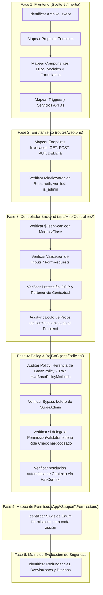

# Guía Metodológica Exhaustiva para Auditar Páginas en UTAMED

Esta guía establece el **protocolo técnico paso a paso** que debe ejecutarse rigurosamente al auditar cualquier página del sistema. Permite analizar la seguridad integral del flujo: desde los componentes de interfaz en el frontend (Svelte 5 / Inertia), pasando por el enrutamiento HTTP y controladores, hasta las Policies, el validador de permisos RelBAC ([`PermissionValidator`](file:///c:/Users/dyri0n/Code/utamed/app/Services/Authorization/PermissionValidator.php)) y el catálogo de permisos ([`App\Support\Permissions`](file:///c:/Users/dyri0n/Code/utamed/app/Support/Permissions.php)).

---

## 1. Protocolo de Auditoría: 6 Fases de Verificación



---

## 2. Reglas del Estándar de Autorización y Jerarquía de Métodos

### 2.1. Resolución Automática de Contexto vs `context_id` Manual (Regla Fundamental)
> [!IMPORTANT]
> **El paso de objetos/modelos es el estándar predeterminado; el uso manual de `context_id` es exclusivamente un *last resort*.**

1. **Estándar Primario (Por Defecto)**:
   - Toda llamada a `$user->can(...)` DEBE recibir la **instancia del modelo Eloquent** (`$curso`, `$carrera`, etc.), la **clase del modelo** (`Curso::class`), o una **tupla con modelo padre** (`[Programa::class, $curso]`).
   - Los modelos implementan el contrato [`App\Contracts\HasContext`](file:///c:/Users/dyri0n/Code/utamed/app/Contracts/HasContext.php). El método [`Usuario::can()`](file:///c:/Users/dyri0n/Code/utamed/app/Models/Usuario/Usuario.php#L490) y [`PermissionValidator`](file:///c:/Users/dyri0n/Code/utamed/app/Services/Authorization/PermissionValidator.php) infieren y resuelven el `id_contexto` y la jerarquía de ancestros automáticamente a partir del objeto.
2. **Último Recurso (*Last Resort* / Desaconsejado)**:
   - Pasar manualmente `id_contexto` (enteros en bruto) o invocar directamente `PermissionValidator::validate($user, $slug, null, $contextId)` solo se permite como último recurso cuando no existe ninguna instancia ni relación de modelo Eloquent en el flujo operativo.
3. **Jerarquía de Métodos**:
   - **1ª Opción (Estándar Obligatorio)**: `$user->can('action', $model)` o `$user->can(Permissions::ENUM, $model)` combinado con `abort_unless(...)`.
   - **Última Opción (Fallback / Legacy)**: `$this->authorize('action', $thing)` base de Laravel.

---

## 3. Checklist Detallado de Comprobación

### 3.1. Fase 1: Frontend (Interfaz y Triggers)
- **Archivos a inspeccionar**:
  - Página principal: `resources/js/pages/admin/<NombrePagina>.svelte` o `resources/js/Pages/Admin/...`
  - Componentes modulares: `resources/js/modules/resources/<modulo>/components/*.svelte`
  - Servicios de API: `resources/js/modules/resources/<modulo>/services/*Api.ts`
- **Elementos a comprobar**:
  1. **Props de autorización recibidas**: ¿Qué props booleanas recibe el componente? (ej. `canCreate`, `canEdit`, `canDelete`, o un objeto `permissions`).
  2. **Renderizado condicional en UI**: ¿Los botones de acción (Crear, Editar, Eliminar, Instanciar, Sincronizar) están protegidos con `{#if canX}` o se muestran siempre?
  3. **Llamadas a servicios / router**: ¿Qué métodos HTTP y rutas exactas disparan los formularios, botones y selects?

### 3.2. Fase 2: Enrutamiento HTTP
- **Archivos a inspeccionar**: [`routes/web.php`](file:///c:/Users/dyri0n/Code/utamed/routes/web.php) o archivos de rutas incluidos.
- **Elementos a comprobar**:
  1. **Definición de ruta**: URI, Verbo HTTP (`GET`, `POST`, `PUT`, `PATCH`, `DELETE`), Controlador y Método.
  2. **Middlewares aplicados**: ¿Está bajo el grupo perimetral `['auth', 'verified', 'is_admin']`?
  3. **Route Model Binding**: ¿Recibe parámetros implícitos como `{facultad}`, `{curso}`, `{usuario}`?

### 3.3. Fase 3: Controlador Backend
- **Archivos a inspeccionar**: `app/Http/Controllers/Admin/<Nombre>Controller.php`
- **Elementos a comprobar**:
  1. **Comprobación de autorización primaria**:
     - **Estándar Primario**: ¿Invoca `$user->can(...)` mediante `abort_unless($request->user()->can('accion', $recurso), 403, 'Mensaje')` o `$user->can(Permissions::SLUG, $recurso)` pasando la instancia del modelo para inferencia automática de contexto?
     - **Posición**: ¿Se ejecuta en la primera línea del método antes de cualquier query o mutación de base de datos?
     - **Verificación de Last Resort**: ¿Evita calcular/pasar `context_id` manuales salvo que sea estrictamente indispensable?
  2. **Objeto/Argumento evaluado**:
     - En `index`: ¿Evalúa la clase del modelo (`Modelo::class`)?
     - En `show`, `update`, `destroy`: ¿Evalúa la **instancia real** inyectada (`$modelo`) para resolver su contexto institucional automáticamente?
     - En `store` anidado: ¿Evalúa la tupla `[Modelo::class, $modeloPadre]`?
  3. **Generación de Props para Inertia**:
     - ¿Cómo calcula las flags de permisos enviadas a la vista?
     - *Alerta de seguridad*: Si calcula `'canEdit' => $user->can('update', new Modelo())`, notar que `new Modelo()` no tiene ID ni contexto asignado, por lo que evalúa permisos globales en lugar de los del recurso específico.
  4. **Protección IDOR (Insecure Direct Object Reference)**:
     - En recursos anidados (ej. Curso $\rightarrow$ Componente), ¿se valida que el hijo pertenezca efectivamente al padre (`$componente->id_curso === $curso->id_curso`)?
  5. **Validación de Inputs**:
     - ¿Se utiliza `$request->validate([...])` o un `FormRequest` tipado?

### 3.4. Fase 4: Policy de Recurso y Resolución RelBAC
- **Archivos a inspeccionar**:
  - `app/Policies/<Nombre>Policy.php`
  - `app/Policies/Base/Base<Nombre>Policy.php`
  - [`app/Policies/Base/Traits/HasBasePolicyMethods.php`](file:///c:/Users/dyri0n/Code/utamed/app/Policies/Base/Traits/HasBasePolicyMethods.php)
- **Elementos a comprobar**:
  1. **Herencia y Traits**: ¿Hereda de `Base<Nombre>Policy` e implementa `HasBasePolicyMethods`?
  2. **Bypass de SuperAdmin**: ¿El método `before()` otorga acceso irrestricto a usuarios con `isSuperAdmin()`?
  3. **Mecanismo de Evaluación**:
     - ¿Delega a `$this->validator()->validate($user, 'recurso:accion', $model)` confiando en la resolución automática de contexto del modelo?
     - ¿O tiene un método hardcodeado (ej. `hasRole('Administrador')`)? Documentar como **Patrón Override** o **Desviación**.
  4. **Resolución de Contexto (`HasContext`)**:
     - ¿El modelo implementa `App\Contracts\HasContext`?
     - ¿Permite que `PermissionValidator` resuelva automáticamente la traversal por ancestros?

### 3.5. Fase 5: Mapeo de Permisos Granulares
- **Archivos a inspeccionar**: [`app/Support/Permissions.php`](file:///c:/Users/dyri0n/Code/utamed/app/Support/Permissions.php)
- **Elementos a comprobar**:
  1. **Slugs de Enum asociados**: Identificar el case exacto del enum para cada acción (ej. `Permissions::FACULTADES_VER`, `Permissions::CURSOS_EDITAR`, etc.).
  2. **Nivel de Contexto requerido**: `global`, `facultad`, `departamento`, `carrera`, `curso`.

### 3.6. Fase 6: Clasificación y Veredicto de Seguridad
Clasificar cada endpoint en uno de tres estados:
- ✅ **CUMPLE**: Protegido por Middleware + `$user->can(...)` sobre clase/instancia (contexto automático) + mapeado a Enum/Policy.
- ⚠️ **DESVIACIÓN**: Protegido y funcional, pero usa validación por rol hardcodeada en la policy/controlador, evalúa `new Modelo()` sin contexto, usa `context_id` manual innecesariamente, o usa `$this->authorize` legacy.
- 🔴 **BRECHA**: Endpoint expuesto sin `$user->can(...)` ni policy (confía únicamente en el middleware).

---

## 4. Plantilla Oficial de Auditoría por Página (Template Markdown)

```markdown
# Auditoría de Página: [Nombre de la Página]

## 1. Identificación y Alcance
- **URL**: `[ej. /admin/recurso]`
- **Archivo Principal Svelte**: [`resources/js/.../Pagina.svelte`](file:///...)
- **Componentes Hijos**:
  - Formulario / Modal: [`resources/js/.../Form.svelte`](file:///...)
  - Listado / Tabla: [`resources/js/.../List.svelte`](file:///...)
- **Servicio API Frontend**: [`resources/js/.../api.ts`](file:///...)
- **Props de Permisos Recibidas**: `[ej. canCreate, canEdit, canDelete]`

## 2. Endpoints Invocados desde la Página
| Verbo HTTP | Endpoint (URI) | Controlador / Método | Tipo Retorno | Propósito en UI |
|---|---|---|---|---|
| `GET` | `/admin/...` | `Controller@index#L...` | Inertia | Carga de vista inicial |
| `POST` | `/admin/...` | `Controller@store#L...` | Redirect | Envío de formulario crear |
| `PUT` | `/admin/.../{id}` | `Controller@update#L...` | Redirect | Envío de modal editar |
| `DELETE` | `/admin/.../{id}` | `Controller@destroy#L...` | Redirect | Botón eliminar |

## 3. Matriz de Autorización y Seguridad de Endpoints
| Endpoint & Método | Middleware | Valida Rol | Valida Permiso Granular | Valida Policy | ¿Tiene Verificación Redundante? | ¿Sigue el Estándar? | Permiso Granular (Enum) | Aseguramiento con `$user->can(...)` |
|---|---|---|---|---|---|---|---|---|
| `...` | `...` | `...` | `...` | `...` | `...` | `...` | `...` | `...` |

## 4. Análisis Detallado por Endpoint
### 4.1. `GET /admin/...` (`Controller@index`)
- **Autorización Backend**: `$user->can('viewAny', Modelo::class)`
- **Props de Permisos**:
  - `canCreate`: `$user->can('create', Modelo::class)`
- **Hallazgos / Observaciones**: ...

### 4.2. `POST /admin/...` (`Controller@store`)
- **Autorización Backend**: `$user->can('create', Modelo::class)`
- **Validación de Inputs**: `$request->validate([...])`
- **Hallazgos / Observaciones**: ...

## 5. Auditoría de la Policy (`app/Policies/...Policy.php`)
- **Policy**: [`app/Policies/...Policy.php`](file:///...)
- **Base Policy**: [`app/Policies/Base/Base...Policy.php`](file:///...)
- **Implementación**: [Delegación directa a PermissionValidator con HasContext / Override de Rol / Custom hooks]
- **Bypass SuperAdmin**: [Presente vía before() / No implementado]

## 6. Hallazgos, Redundancias y Recomendaciones de Remediación
- **Redundancias**: ...
- **Desviaciones**: ...
- **Brechas (si existen)**: ...
- **Recomendación de Código**:
```

---

## 5. Ejemplo Completo y Exhaustivo: Auditoría de la Página de Facultades

A continuación se presenta la aplicación completa del protocolo a la página **Facultades** (`/admin/facultades`).

---

# Reporte de Auditoría: Página de Facultades (`/admin/facultades`)

## 1. Identificación y Alcance de la Página
- **Ruta URL en Navegador**: `/admin/facultades`
- **Archivo Principal Svelte**: [`resources/js/pages/admin/Facultades.svelte`](file:///c:/Users/dyri0n/Code/utamed/resources/js/pages/admin/Facultades.svelte#L1-L299)
- **Componentes Hijos y Modales**:
  - Listado con acordeón de departamentos: [`resources/js/modules/resources/facultad/components/facultadList.svelte`](file:///c:/Users/dyri0n/Code/utamed/resources/js/modules/resources/facultad/components/facultadList.svelte)
  - Modal Crear/Editar Facultad: [`resources/js/modules/resources/facultad/components/facultadForm.svelte`](file:///c:/Users/dyri0n/Code/utamed/resources/js/modules/resources/facultad/components/facultadForm.svelte)
  - Modal Crear Departamento: [`resources/js/modules/resources/facultad/components/departamentoModal.svelte`](file:///c:/Users/dyri0n/Code/utamed/resources/js/modules/resources/facultad/components/departamentoModal.svelte)
  - Diálogo de Confirmación de Eliminación: [`resources/js/modules/resources/facultad/components/facultadDeleteConfirm.svelte`](file:///c:/Users/dyri0n/Code/utamed/resources/js/modules/resources/facultad/components/facultadDeleteConfirm.svelte)
- **Servicio de API Frontend**: [`resources/js/modules/resources/facultad/services/facultadApi.ts`](file:///c:/Users/dyri0n/Code/utamed/resources/js/modules/resources/facultad/services/facultadApi.ts#L1-L73)
- **Props de Permisos Recibidas por la Vista**:
  - `canCreate: boolean` (Línea 51)
  - `canEdit: boolean` (Línea 52)
  - `canDelete: boolean` (Línea 53)
- **Protección en UI**:
  - El botón superior *"Nueva Facultad"* está condicionado a `{#if canCreate}`.
  - Los botones de *"Editar"* y *"Eliminar"* en la tabla están condicionados a `{#if canEdit}` y `{#if canDelete}`.

---

## 2. Endpoints Invocados desde la Página de Facultades

| Método HTTP | Endpoint (URI) | Controlador / Método | Tipo Retorno | Propósito en UI |
|---|---|---|---|---|
| `GET` | `/admin/facultades` | [`FacultadController@index`](file:///c:/Users/dyri0n/Code/utamed/app/Http/Controllers/Admin/FacultadController.php#L34) | Inertia (`admin/Facultades`) | Carga de tabla de facultades con departamentos paginada y búsqueda. |
| `POST` | `/admin/facultades` | [`FacultadController@store`](file:///c:/Users/dyri0n/Code/utamed/app/Http/Controllers/Admin/FacultadController.php#L65) | Redirect (`admin.facultades.index`) | Envío de formulario para crear una nueva facultad. |
| `GET` | `/admin/facultades/{facultad}` | [`FacultadController@show`](file:///c:/Users/dyri0n/Code/utamed/app/Http/Controllers/Admin/FacultadController.php#L86) | JSON | Carga de datos de una facultad para previsualización o edición. |
| `PUT` | `/admin/facultades/{facultad}` | [`FacultadController@update`](file:///c:/Users/dyri0n/Code/utamed/app/Http/Controllers/Admin/FacultadController.php#L100) | Redirect (`admin.facultades.index`) | Envío de formulario para actualizar datos de la facultad. |
| `DELETE` | `/admin/facultades/{facultad}` | [`FacultadController@destroy`](file:///c:/Users/dyri0n/Code/utamed/app/Http/Controllers/Admin/FacultadController.php#L121) | Redirect (`admin.facultades.index`) | Eliminación de facultad (rechazada si tiene departamentos activos). |
| `POST` | `/admin/departamentos` | [`DepartamentoController@store`](file:///c:/Users/dyri0n/Code/utamed/app/Http/Controllers/Admin/DepartamentoController.php#L86) | Redirect (`admin.departamentos.index`) | Creación rápida de departamento anidado desde el modal de la página. |
| `DELETE` | `/admin/departamentos/{id}` | [`DepartamentoController@destroy`](file:///c:/Users/dyri0n/Code/utamed/app/Http/Controllers/Admin/DepartamentoController.php#L135) | Redirect (`admin.departamentos.index`) | Eliminación rápida de departamento desde el acordeón de la facultad. |

---

## 3. Matriz de Autorización y Seguridad

| Endpoint & Método | Middleware | Valida Rol | Valida Permiso Granular | Valida Policy | ¿Tiene Verificación Redundante? | ¿Sigue el Estándar? | Permiso Granular (Enum) | Cómo está asegurado con `$user->can(...)` |
|---|---|---|---|---|---|---|---|---|
| `GET /admin/facultades` | `auth, verified, is_admin` | No (Policy) | Vía Policy | Sí (`FacultadPolicy@viewAny`) | **Sí** (Middleware `is_admin` + Policy `viewAny`) | ✅ **CUMPLE** | [`FACULTADES_VER`](file:///c:/Users/dyri0n/Code/utamed/app/Support/Permissions.php#L148) | `$this->authorize('viewAny', Facultad::class)` (delega a `$user->can`). |
| `POST /admin/facultades` | `auth, verified, is_admin` | No (Policy) | Vía Policy | Sí (`FacultadPolicy@create`) | **Sí** (Middleware `is_admin` + Policy `create`) | ✅ **CUMPLE** | [`FACULTADES_CREAR`](file:///c:/Users/dyri0n/Code/utamed/app/Support/Permissions.php#L145) | `$this->authorize('create', Facultad::class)`. |
| `GET /admin/facultades/{id}` | `auth, verified, is_admin` | No (Policy) | Vía Policy | Sí (`FacultadPolicy@view`) | **Sí** (Middleware `is_admin` + Policy `view`) | ✅ **CUMPLE** | [`FACULTADES_VER`](file:///c:/Users/dyri0n/Code/utamed/app/Support/Permissions.php#L148) | `$this->authorize('view', $facultad)` evalúa sobre la instancia. |
| `PUT /admin/facultades/{id}` | `auth, verified, is_admin` | No (Policy) | Vía Policy | Sí (`FacultadPolicy@update`) | **Sí** (Middleware `is_admin` + Policy `update`) | ✅ **CUMPLE** | [`FACULTADES_EDITAR`](file:///c:/Users/dyri0n/Code/utamed/app/Support/Permissions.php#L146) | `$this->authorize('update', $facultad)` evalúa sobre la instancia. |
| `DELETE /admin/facultades/{id}` | `auth, verified, is_admin` | No (Policy) | Vía Policy | Sí (`FacultadPolicy@delete`) | **Sí** (Middleware `is_admin` + Policy `delete`) | ✅ **CUMPLE** | [`FACULTADES_ELIMINAR`](file:///c:/Users/dyri0n/Code/utamed/app/Support/Permissions.php#L147) | `$this->authorize('delete', $facultad)` evalúa sobre la instancia. |

---

## 4. Análisis Detallado del Backend y Controladores

### 4.1. [`FacultadController@index`](file:///c:/Users/dyri0n/Code/utamed/app/Http/Controllers/Admin/FacultadController.php#L34-L60)
- **Línea de Autorización**: Línea 36: `$this->authorize('viewAny', Facultad::class);`
- **Recomendación según nuevo Estándar**:
  ```php
  abort_unless($request->user()->can('viewAny', Facultad::class), 403, 'No autorizado para ver facultades.');
  ```
- **Cálculo de Props de Permisos enviadas a Inertia (Líneas 56-58)**:
  ```php
  'canCreate'  => $user->can('create', Facultad::class),
  'canEdit'    => $user->can('update', new Facultad()),
  'canDelete'  => $user->can('delete', new Facultad()),
  ```
  - *Observación de Seguridad*: Se usa `new Facultad()` como modelo ficticio para calcular `canEdit` y `canDelete` generales. Como las facultades son recursos institucionales raíz y su policy evalúa rol administrativo global, esta comprobación es consistente.

### 4.2. [`FacultadController@store`](file:///c:/Users/dyri0n/Code/utamed/app/Http/Controllers/Admin/FacultadController.php#L65-L81)
- **Línea de Autorización**: Línea 67: `$this->authorize('create', Facultad::class);`
- **Validación de Inputs**: Línea 70: `$request->validate(['nombre' => 'required|string|max:255'])`
- **Servicio Asociado**: Delega a [`FacultadService::create`](file:///c:/Users/dyri0n/Code/utamed/app/Services/FacultadService.php) que además autogenera el contexto institucional RBAC (`id_contexto`).

### 4.3. [`FacultadController@update`](file:///c:/Users/dyri0n/Code/utamed/app/Http/Controllers/Admin/FacultadController.php#L100-L116)
- **Línea de Autorización**: Línea 102: `$this->authorize('update', $facultad);`
- **Validación de Inputs**: Línea 105: `$request->validate(['nombre' => 'required|string|max:255'])`
- **Servicio Asociado**: [`FacultadService::update`](file:///c:/Users/dyri0n/Code/utamed/app/Services/FacultadService.php).

### 4.4. [`FacultadController@destroy`](file:///c:/Users/dyri0n/Code/utamed/app/Http/Controllers/Admin/FacultadController.php#L121-L134)
- **Línea de Autorización**: Línea 123: `$this->authorize('delete', $facultad);`
- **Regla de Integridad Referencial**: `FacultadService::delete` rechaza la eliminación si la facultad cuenta con departamentos asociados (activos o soft-deleted).

---

## 5. Auditoría de la Policy ([`FacultadPolicy`](file:///c:/Users/dyri0n/Code/utamed/app/Policies/FacultadPolicy.php))

- **Clase**: [`App\Policies\FacultadPolicy`](file:///c:/Users/dyri0n/Code/utamed/app/Policies/FacultadPolicy.php#L19) que extiende de [`BaseFacultadPolicy`](file:///c:/Users/dyri0n/Code/utamed/app/Policies/Base/BaseFacultadPolicy.php#L18).
- **Mecanismo de Evaluación**:
  - `FacultadPolicy` implementa un **Patrón Override 3**:
    ```php
    private function isAdmin(Usuario $user): bool {
        return $user->hasRole('Administrador') || $user->hasRole('Admin') || ...;
    }
    ```
  - *Diagnóstico*: En lugar de delegar a [`PermissionValidator`](file:///c:/Users/dyri0n/Code/utamed/app/Services/Authorization/PermissionValidator.php) con el slug [`Permissions::FACULTADES_*`](file:///c:/Users/dyri0n/Code/utamed/app/Support/Permissions.php#L144), valida el rol `Administrador` directamente, ya que las facultades son administradas exclusivamente por administradores globales.
  - *Bypass SuperAdmin*: Garantizado por el trait [`HasBasePolicyMethods`](file:///c:/Users/dyri0n/Code/utamed/app/Policies/Base/Traits/HasBasePolicyMethods.php#L20) mediante el método `before(Usuario $user, string $ability)`.

---

## 6. Hallazgos, Redundancias y Veredicto de la Página

1. **Redundancias Identificadas**:
   - Redundancia estándar (Defensa en Profundidad): El grupo de rutas exige `is_admin` y `FacultadPolicy` revalida `isAdmin($user)`. No existen guards manuales redundantes o desalineados en el cuerpo de los métodos del controlador.
2. **Desviaciones Menores**:
   - El controlador utiliza `$this->authorize(...)` en lugar de la llamada explícita y unificada con `$request->user()->can(...)` y `abort_unless(...)`.
3. **Brechas de Seguridad**:
   - **Ninguna (0)**. Los 5 endpoints principales y los 2 auxiliares de departamentos anidados están completamente protegidos por middleware y policy.
4. **Veredicto Global**: ✅ **SEGURO Y CUMPLE EL ESTÁNDAR**.
