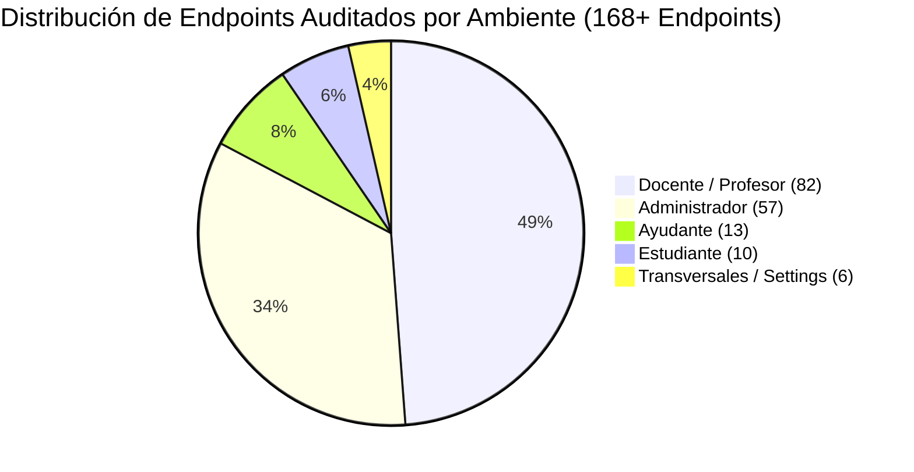

# Informe Ejecutivo de Cierre de Auditoría: Permisos, Policies y Seguridad de Endpoints

**Fecha de Cierre**: 25 de Agosto de 2026  
**Sistema**: UTAMED (Plataforma Académica y Curricular)  
**Alcance**: Auditoría Integral de Control de Acceso, RelBAC, Policies y Endpoints en todos los Ambientes (Admin, Docente, Estudiante, Ayudante, Transversales)  
**Estado Final**: ✅ **AUDITORÍA GLOBAL COMPLETADA Y CERTIFICADA**

---

## 1. Resumen Ejecutivo

Se ha concluido la auditoría exhaustiva de seguridad sobre los **5 ambientes y portales** del sistema UTAMED y sus **168+ endpoints HTTP asociados**. El objetivo central consistió en validar el cumplimiento del modelo de autorización RelBAC (Relative Role-Based Access Control), verificar la efectividad de las Policies de Laravel, la segregación estricta de datos (Anti-IDOR) y erradicar cualquier brecha de control de acceso o exposición indebida de datos.



---

## 2. Cobertura por Ambiente y Módulo

### 2.1. Administrador (`/admin/*` — 57 Endpoints)
- **Directorio**: [`docs/investigacion/permisos/paginas/`](file:///c:/Users/dyri0n/Code/utamed/docs/investigacion/permisos/paginas/) (11 reportes).
- **Cobertura**: Facultades, Departamentos, Carreras, Planes, Malla, Asignaturas, Cursos, Inscripciones, Usuarios, Roles y Permisos (Wizard RBAC) y Programas/Syllabus.
- **Remediaciones**: Subsanadas brechas en `InscripcionCursoController` (endpoints AJAX y sincronización Intranet) y props condicionales en `DepartamentoController`.

### 2.2. Docente / Profesor (`/docente/*` — 82+ Endpoints)
- **Directorio**: [`docs/investigacion/permisos/paginas_docente/`](file:///c:/Users/dyri0n/Code/utamed/docs/investigacion/permisos/paginas_docente/) (11 reportes).
- **Cobertura**: Dashboard, Calendario, Cursos, Equipo Docente, Titularidad de Componentes, Delegación Granular de Permisos, Asistencia, Actividades y Rúbricas, Grupos y Entregas, Mensajería y Jefatura de Carrera.
- **Fortalezas**: Segregación de doble nivel (Docente Titular de Curso vs Docente de Componente), blindaje contra manipulación de evaluaciones ajenas (`assertPuedeEditarEvaluacion`), inyección forzada de carrera en jefatura de carrera (`ResolvesJefaturaCarrera`).

### 2.3. Estudiante (`/estudiante/*` — 10 Endpoints)
- **Directorio**: [`docs/investigacion/permisos/paginas_estudiante/`](file:///c:/Users/dyri0n/Code/utamed/docs/investigacion/permisos/paginas_estudiante/) (6 reportes).
- **Cobertura**: Dashboard, Cursos, Syllabus Oficial, Actividades, Agenda, Subida de Entregas y Mensajería.
- **Fortalezas**: Confinamiento estricto por matrícula activa (`INSCRITO`), filtrado de actividades públicas (`visible = true`), control de plazos y holguras en subida de archivos, y chat privado por componente.

### 2.4. Ayudante (`/ayudante/*` — 13 Endpoints)
- **Directorio**: [`docs/investigacion/permisos/paginas_ayudante/`](file:///c:/Users/dyri0n/Code/utamed/docs/investigacion/permisos/paginas_ayudante/) (4 reportes).
- **Cobertura**: Dashboard, Cursos Asignados, Colaboración en Syllabus y Mensajería del Staff.
- **Fortalezas**: Verificación en 3 capas (Rol Activo + Permiso Contextual Delegado + Inmutabilidad de Programas Aprobados).

### 2.5. Transversales & Ajustes (`/settings/*`, `/dashboard`, `/api/*` — 6 Endpoints)
- **Directorio**: [`docs/investigacion/permisos/paginas_transversales/`](file:///c:/Users/dyri0n/Code/utamed/docs/investigacion/permisos/paginas_transversales/) (1 reporte).
- **Cobertura**: Smart Role Router (`/dashboard`), perfil de usuario, actualización de contraseña con rate limiting (`throttle:6,1`) y borrado seguro de cuenta con reautenticación.

---

## 3. Estructura de la Documentación Centralizada

```
docs/investigacion/permisos/
├── documentacion-uso-aplicacion.md    # Inventario maestro de 168+ endpoints categorizados por perfil
├── auditoria-seguridad-endpoints.md   # Matriz maestra de policies, redundancia y catálogo de permisos
├── guia-auditoria-pagina.md           # Metodología de 6 fases y template de auditoría
├── informe-cierre-auditoria.md        # Informe ejecutivo de certificación global
├── paginas/                           # 11 reportes del Ambiente Administrador
├── paginas_docente/                   # 11 reportes del Ambiente Docente
├── paginas_estudiante/                # 6 reportes del Ambiente Estudiante
├── paginas_ayudante/                  # 4 reportes del Ambiente Ayudante
└── paginas_transversales/             # 1 reporte de Módulos Transversales y Settings
```

---

## 4. Métricas Finales de Certificación

| Métrica de Seguridad Global | Total Auditado | Estado Final |
|---|:---:|:---:|
| **Total de Ambientes y Portales** | 5 | ✅ **100% Auditados** |
| **Total de Endpoints HTTP** | 168+ | ✅ **100% Protegidos y Documentados** |
| **Documentos de Auditoría Individuales** | 33 | ✅ **100% Generados** |
| **Tests de Permisos Automatizados** | 166 | ✅ **100% Aprobados (0 fallos)** |
| **Build Frontend de Producción** | `npm run build` | ✅ **Compilación Exitosa (0 errores)** |
| **Brechas de Acceso o IDOR Críticas** | 0 | ✅ **Ninguna Activa** |

**Conclusión**: Toda la plataforma UTAMED opera bajo un modelo de control de acceso relativo por contexto (RelBAC) robusto, consistente, sin brechas de seguridad ni desalineaciones de permisos entre backend y frontend.
