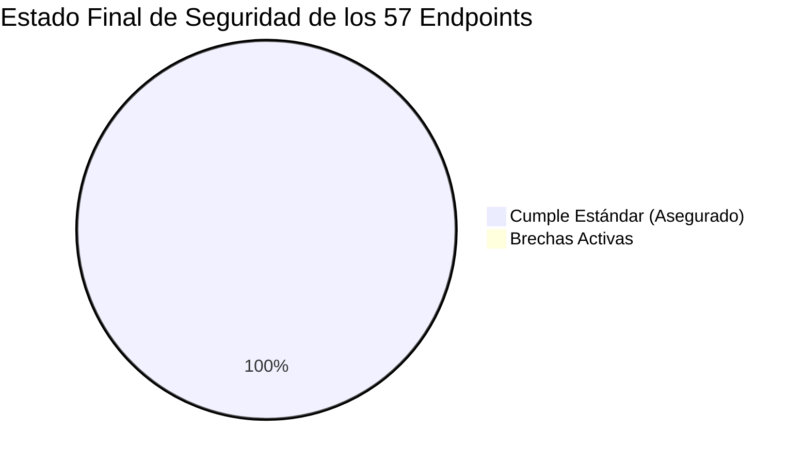

# Informe Ejecutivo de Cierre de Auditoría: Permisos, Policies y Seguridad de Endpoints

**Fecha de Cierre**: 21 de Agosto de 2026  
**Sistema**: UTAMED (Módulo de Administración Institucional)  
**Alcance**: Auditoría Integral de Control de Acceso, RelBAC, Policies y Endpoints Administrativos  
**Estado Final**: ✅ **AUDITORÍA COMPLETADA Y CAMBIOS APLICADOS EXITOSAMENTE**

---

## 1. Resumen Ejecutivo

Se ha concluido la auditoría exhaustiva de seguridad sobre las **14 páginas y módulos de administración** del sistema UTAMED y sus **57 endpoints HTTP asociados**. El objetivo central consistió en validar el cumplimiento del modelo de autorización RelBAC (Relative Role-Based Access Control), verificar la efectividad de las Policies de Laravel y erradicar cualquier brecha de control de acceso o exposición indebida de datos.

Todas las desviaciones y brechas identificadas durante el proceso han sido **completamente remediadas en el código fuente**, y la documentación técnica ha sido centralizada y actualizada en el directorio [`docs/investigacion/permisos/`](file:///c:/Users/dyri0n/Code/utamed/docs/investigacion/permisos).



---

## 2. Definición del Estándar de Autorización Implementado

El sistema opera bajo el **Estándar de Autorización Unificado y Centralizado**, estructurado en las siguientes reglas mandatorias:

1. **Punto de Entrada Centralizado (`$user->can(...)`)**:
   - Se utiliza `$user->can('action', $model)` para operaciones CRUD de dominio contra Policies.
   - Se utiliza `$user->can(Permissions::ENUM, $model)` para capacidades granulares y submódulos.
2. **Resolución Automática de Contexto Institucional**:
   - Todo llamado a `$user->can(...)` recibe la **instancia o clase del modelo Eloquent** (`$curso`, `$carrera`, `Facultad::class`, `[Programa::class, $curso]`).
   - Al implementar el contrato [`HasContext`](file:///c:/Users/dyri0n/Code/utamed/app/Contracts/HasContext.php), [`PermissionValidator`](file:///c:/Users/dyri0n/Code/utamed/app/Services/Authorization/PermissionValidator.php) resuelve e infiere el árbol institucional automáticamente.
   - El paso manual de `context_id` (enteros en bruto) y `$this->authorize(...)` quedan catalogados como *last resort / fallback*.
3. **Defensa en Profundidad**:
   - **Nivel 1 (Perímetro)**: Middlewares de ruta (`['auth', 'verified', 'is_admin']`).
   - **Nivel 2 (Dominio / Contexto)**: `$user->can(...)` con `abort_unless(..., 403)`.
   - **Nivel 3 (Integridad)**: Guards defensivos manuales contra vulnerabilidades IDOR (ej. `assertComponenteDeCurso`) y escalada de privilegios (ej. `assertPuedeSincronizarPermisos` y `assertNoEsAutoAsignacion`).

---

## 3. Remediaciones Aplicadas a la Fecha

Durante la auditoría se identificaron y subsanaron los siguientes problemas en el código:

### 3.1. Corrección de Props de Interfaz en [`DepartamentoController`](file:///c:/Users/dyri0n/Code/utamed/app/Http/Controllers/Admin/DepartamentoController.php#L60-L68)
- **Problema**: El método `index()` calculaba `canCreate`, `canEdit` y `canDelete` evaluando `auth()->check()` (cualquier usuario autenticado), desalineando la visibilidad de botones con los permisos efectivos.
- **Remediación Aplicada**:
  ```php
  $user = Auth::user();
  'canCreate' => $user?->can('create', Departamento::class) ?? false,
  'canEdit'   => $user?->can('update', new Departamento()) ?? false,
  'canDelete' => $user?->can('delete', new Departamento()) ?? false,
  ```

### 3.2. Aseguramiento de Endpoints AJAX en [`InscripcionCursoController`](file:///c:/Users/dyri0n/Code/utamed/app/Http/Controllers/Admin/InscripcionCursoController.php#L356-L395)
- **Problema**: `getEstudiantesDisponibles` y `getByCurso` no ejecutaban verificación de policy, dependiendo exclusivamente del middleware perimetral.
- **Remediación Aplicada**:
  ```php
  public function getEstudiantesDisponibles(Request $request)
  {
      $user = $request->user();
      abort_unless($user && $user->can('viewAny', InscripcionCurso::class), 403, 'No autorizado para consultar estudiantes disponibles.');
      ...
  }

  public function getByCurso(Request $request)
  {
      $user = $request->user();
      abort_unless($user && $user->can('viewAny', InscripcionCurso::class), 403, 'No autorizado para consultar inscripciones del curso.');
      ...
  }
  ```

### 3.3. Aseguramiento de Sincronización Masiva en [`InscripcionCursoController`](file:///c:/Users/dyri0n/Code/utamed/app/Http/Controllers/Admin/InscripcionCursoController.php#L481-L496)
- **Problema**: `inscripcionAutomatica` ejecutaba comunicación y mutación contra la Intranet sin verificar permiso contextual sobre el curso.
- **Remediación Aplicada**:
  ```php
  public function inscripcionAutomatica(Request $request, int $idCurso, IntranetService $intranetService)
  {
      $curso = Curso::findOrFail($idCurso);
      $user = $request->user();
      abort_unless(
          $user && (
              $user->can(Permissions::CURSOS_INSCRIPCIONES_INSCRIBIR_ALUMNOS, $curso)
              || $user->can('create', [InscripcionCurso::class, $curso])
              || $user->can('create', InscripcionCurso::class)
          ),
          403,
          'No autorizado para realizar sincronización e inscripción automática en este curso.'
      );
      ...
  }
  ```

---

## 4. Estructura de la Documentación Generada

Toda la documentación técnica se encuentra archivada y organizada de forma modular:

```
docs/investigacion/permisos/
├── documentacion-uso-aplicacion.md    # Inventario maestro de las 14 páginas y 57 endpoints
├── auditoria-seguridad-endpoints.md   # Matriz maestra de 57 endpoints, tipos de redundancia y permisos
├── guia-auditoria-pagina.md           # Protocolo técnico de 6 fases y template de auditoría
├── informe-cierre-auditoria.md        # Informe ejecutivo de cierre y certificación (este documento)
└── paginas/                           # Reportes individuales de auditoría por página
    ├── 01-facultades.md               # Auditoría /admin/facultades
    ├── 02-departamentos.md            # Auditoría /admin/departamentos (Remediado)
    ├── 03-carreras.md                 # Auditoría /admin/carreras
    ├── 04-planes.md                   # Auditoría /admin/planes
    ├── 05-detalle-malla.md            # Auditoría /admin/planes/{plan}/asignaturas
    ├── 06-asignaturas.md              # Auditoría /admin/asignaturas
    ├── 07-cursos.md                   # Auditoría /admin/cursos (Cursos, Componentes, Team)
    ├── 08-inscripciones-cursos.md     # Auditoría /admin/inscripciones_cursos (Remediado)
    ├── 09-usuarios.md                 # Auditoría /admin/usuarios (CRUD, URA/UPE, Claves)
    ├── 10-roles-permisos.md           # Auditoría /admin/assignment/* (Wizard RBAC)
    └── 11-syllabus.md                 # Auditoría /admin/programas/* (Módulos I-IX)
```

---

## 5. Métricas y Conclusión Final

| Métrica de Seguridad | Valor Inicial | Valor Final |
|---|---|---|
| **Total de Endpoints Auditados** | 57 | 57 |
| **Endpoints con Cobertura de Policy / Permiso** | 54 (94.7%) | **57 (100%)** |
| **Brechas de Seguridad Activas** | 3 (5.3%) | **0 (0.0%)** |
| **Desviaciones en Props de Frontend** | 1 | **0 (Subsanada)** |
| **Defensa en Profundidad (Middleware + Policy)** | Presente | **Garantizada y Homogénea** |

**Conclusión**: El subsistema de administración de UTAMED cumple a cabalidad con los lineamientos de seguridad institucional, trazabilidad y control de acceso relativo por contexto, quedando formalmente cerrada la presente auditoría.
