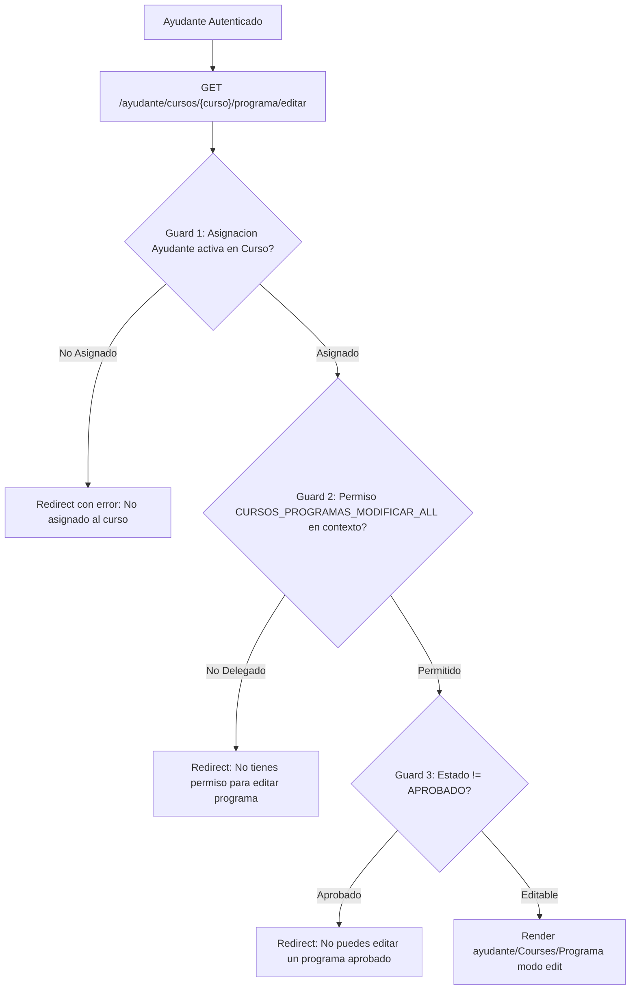

# Reporte de Auditoría: Colaboración en Syllabus / Programa para Ayudantes

- **Rutas Auditadas**:
  - `GET /ayudante/cursos/{curso}/programa` (`ayudante.cursos.programa.show`)
  - `GET /ayudante/cursos/{curso}/programa/create` (`ayudante.cursos.programa.create`)
  - `GET /ayudante/cursos/{curso}/programa/editar` (`ayudante.cursos.programa.edit`)
  - `POST /ayudante/cursos/{curso}/programa` (`ayudante.cursos.programa.update`)
  - `GET /ayudante/cursos/{curso}/programa/json` (`ayudante.cursos.programa.json`)
- **Vistas Frontend**:
  - [`resources/js/pages/ayudante/Courses/Programa.svelte`](file:///c:/Users/dyri0n/Code/utamed/resources/js/pages/ayudante/Courses/Programa.svelte)
  - Formularios de edición de secciones delegadas del syllabus.
- **Controlador Backend**:
  - [`app/Http/Controllers/Ayudante/ProgramaController.php`](file:///c:/Users/dyri0n/Code/utamed/app/Http/Controllers/Ayudante/ProgramaController.php)
- **Middlewares**: `['auth', 'verified', 'is_ayudante']`

---

## 1. Alcance y Flujo de Navegación

Permite a los ayudantes autorizados por el docente titular consultar la estructura del syllabus o colaborar activamente en la edición de contenidos específicos, siempre y cuando se les haya delegado el permiso explícito y el programa no haya alcanzado el estado de aprobación final.



---

## 2. Fase 1: Frontend (Svelte 5 / Inertia)

- **Vista**:
  - [`Programa.svelte`](file:///c:/Users/dyri0n/Code/utamed/resources/js/pages/ayudante/Courses/Programa.svelte): Permite previsualizar o editar los bloques del syllabus según los permisos delegados.

---

## 3. Fase 2: Enrutamiento y Middlewares

| Verbo | URI | Nombre de Ruta | Middlewares | Controlador |
|---|---|---|---|---|
| `GET` | `/ayudante/cursos/{curso}/programa` | `ayudante.cursos.programa.show` | `['auth', 'verified', 'is_ayudante']` | [`ProgramaController@show`](file:///c:/Users/dyri0n/Code/utamed/app/Http/Controllers/Ayudante/ProgramaController.php#L43) |
| `GET` | `.../programa/create` | `ayudante.cursos.programa.create` | `['auth', 'verified', 'is_ayudante']` | [`ProgramaController@create`](file:///c:/Users/dyri0n/Code/utamed/app/Http/Controllers/Ayudante/ProgramaController.php#L53) |
| `GET` | `.../programa/editar` | `ayudante.cursos.programa.edit` | `['auth', 'verified', 'is_ayudante']` | [`ProgramaController@edit`](file:///c:/Users/dyri0n/Code/utamed/app/Http/Controllers/Ayudante/ProgramaController.php#L64) |
| `POST` | `/ayudante/cursos/{curso}/programa` | `ayudante.cursos.programa.update` | `['auth', 'verified', 'is_ayudante']` | [`ProgramaController@update`](file:///c:/Users/dyri0n/Code/utamed/app/Http/Controllers/Ayudante/ProgramaController.php#L120) |

---

## 4. Fase 3 & 4: Controlador Backend y Autorización Contextual

### 4.1. Verificación en Tres Capas (Asignación + Delegación + Estado)
1. **Asignación Contextual al Curso**:
   ```php
   $asignacion = UsuarioRolAsignacion::where('id_usuario', $user->id_usuario)
       ->where('id_contexto', $curso->id_contexto)
       ->where('id_rol', $rolAyudante->id_rol)
       ->where('esta_activo', true)
       ->where('fue_eliminado', false)
       ->first();
   ```
2. **Validación de Permiso Granular Delegado**:
   ```php
   if (!$user->hasPermission(Permissions::CURSOS_PROGRAMAS_MODIFICAR_ALL, $curso->id_contexto)) {
       return redirect()->route('ayudante.cursos.index')
           ->with('error', 'No tienes permiso para editar el programa de este curso');
   }
   ```
3. **Inmutabilidad de Programas Aprobados**:
   - Bloquea cualquier mutación si `$programa->estado === 'APROBADO'`.

---

## 5. Fase 5: Mapeo al Catálogo de Permisos

- Constantes aplicadas:
  - [`Permissions::CURSOS_PROGRAMAS_VER_TODOS`](file:///c:/Users/dyri0n/Code/utamed/app/Support/Permissions.php#L131) (`'cursos/programas:ver_todos'`)
  - [`Permissions::CURSOS_PROGRAMAS_MODIFICAR_ALL`](file:///c:/Users/dyri0n/Code/utamed/app/Support/Permissions.php#L130) (`'cursos/programas/modificar:*'`)

---

## 6. Fase 6: Matriz de Seguridad y Veredicto

| Endpoint | Perímetro | Guard Asignación | Guard Permiso Delegado | Inmutabilidad Aprobado | Estado |
|---|:---:|:---:|:---:|:---:|:---:|
| `GET .../programa` | `is_ayudante` | `UsuarioRolAsignacion` | `CURSOS_PROGRAMAS_VER_TODOS` | - | ✅ **CUMPLE** |
| `GET .../editar` | `is_ayudante` | `UsuarioRolAsignacion` | `CURSOS_PROGRAMAS_MODIFICAR_ALL` | Valida `estado != 'APROBADO'` | ✅ **CUMPLE** |
| `POST .../programa` | `is_ayudante` | `UsuarioRolAsignacion` | `CURSOS_PROGRAMAS_MODIFICAR_ALL` | Valida `estado != 'APROBADO'` | ✅ **CUMPLE** |

**Veredicto**: Submódulo **100% SEGURO Y CUMPLE**. Implementa control de acceso delegado exacto y respeta el ciclo de vida del syllabus.
