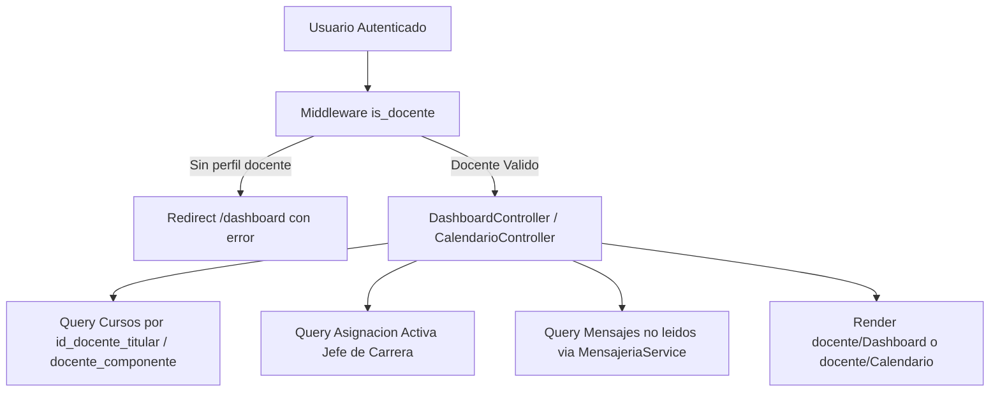

# Reporte de Auditoría: Dashboard y Calendario Docente

- **Rutas Auditadas**:
  - `GET /docente/dashboard` (`docente.dashboard`)
  - `GET /docente/calendario` (`docente.calendario.index`)
- **Vistas Frontend**:
  - [`resources/js/pages/docente/Dashboard.svelte`](file:///c:/Users/dyri0n/Code/utamed/resources/js/pages/docente/Dashboard.svelte)
  - [`resources/js/pages/docente/Calendario.svelte`](file:///c:/Users/dyri0n/Code/utamed/resources/js/pages/docente/Calendario.svelte)
- **Controladores Backend**:
  - [`app/Http/Controllers/Docente/DashboardController.php`](file:///c:/Users/dyri0n/Code/utamed/app/Http/Controllers/Docente/DashboardController.php)
  - [`app/Http/Controllers/Docente/CalendarioController.php`](file:///c:/Users/dyri0n/Code/utamed/app/Http/Controllers/Docente/CalendarioController.php)
- **Middlewares**: `['auth', 'verified', 'is_docente']`

---

## 1. Alcance y Flujo de Navegación

El **Dashboard del Docente** y el **Calendario Académico** constituyen los puntos de entrada principales para el perfil de profesor en UTAMED.

---

## 2. Fase 1: Frontend (Svelte 5 / Inertia)

### 2.1. [`Dashboard.svelte`](file:///c:/Users/dyri0n/Code/utamed/resources/js/pages/docente/Dashboard.svelte)
- **Props recibidas**:
  - `docente`: `{ id_docente, grado, titulo, cargo, id_usuario }`
  - `stats`: `{ total_cursos, nombre_completo }`
  - `cursos`: `Array<Curso>` (con `id_curso`, `nombre`, `cod_curso`, `tiene_programa`)
  - `mensajeria`: `{ no_leidos }`
  - `jefatura`: `{ has_access, id_contexto, carrera }`
- **Renderizado condicional en UI**:
  - Tarjeta de Jefatura de Carrera: Condicionada con `{#if jefatura?.has_access}` para desplegar accesos a métricas, planes y seguimiento curricular de la carrera.
  - Tarjetas de Cursos: Enlaces seguros hacia `/docente/cursos/{curso.id_curso}`.
  - Módulos transversales (Asistencia / Calificaciones): Condicionados a `allCursos.length > 0`.

### 2.2. [`Calendario.svelte`](file:///c:/Users/dyri0n/Code/utamed/resources/js/pages/docente/Calendario.svelte)
- **Props recibidas**:
  - `cursos`: `Array<{ id_curso, nombre, total_actividades }>`
  - `eventos`: `Array<{ id_actividad, id_curso, titulo, fecha, tipo_actividad, tipo_entrega, es_grupal, visible, componente, id_componente }>`
  - `total_cursos`: `number`
  - `total_actividades`: `number`
- **Comportamiento**: Vista de solo lectura interactiva para consultar actividades evaluativas a vencer en los cursos donde participa el docente.

---

## 3. Fase 2: Enrutamiento y Middlewares

| Verbo | URI | Nombre de Ruta | Middlewares | Controlador |
|---|---|---|---|---|
| `GET` | `/docente/dashboard` | `docente.dashboard` | `['auth', 'verified', 'is_docente']` | [`DashboardController@index`](file:///c:/Users/dyri0n/Code/utamed/app/Http/Controllers/Docente/DashboardController.php#L39) |
| `GET` | `/docente/calendario` | `docente.calendario.index` | `['auth', 'verified', 'is_docente']` | [`CalendarioController@index`](file:///c:/Users/dyri0n/Code/utamed/app/Http/Controllers/Docente/CalendarioController.php#L34) |

### Verificación del Middleware `is_docente`:
- [`\App\Http\Middleware\IsDocente`](file:///c:/Users/dyri0n/Code/utamed/app/Http/Middleware/IsDocente.php) valida que el usuario posea al menos uno de los roles `Docente Titular`, `Docente Titular Restringido`, `Docente Componente` y cuente con perfil en la tabla `usuario.docente`.

---

## 4. Fase 3: Controlador Backend y Autorización

### 4.1. [`DashboardController.php`](file:///c:/Users/dyri0n/Code/utamed/app/Http/Controllers/Docente/DashboardController.php)
- **Defensa en profundidad**: Comprueba `$user->docente` antes de consultar datos.
- **Aislamiento de Datos (Anti-IDOR)**:
  - Los cursos se obtienen filtrando estrictamente por `id_docente_titular = $docente->id_docente`.
  - La jefatura se resuelve consultando `UsuarioRolAsignacion` activa del usuario para el rol `Jefe de Carrera` en contexto de carrera.
  - El conteo de mensajes se resuelve mediante `MensajeriaService::componentesDeDocente($docente->id_docente)`.

### 4.2. [`CalendarioController.php`](file:///c:/Users/dyri0n/Code/utamed/app/Http/Controllers/Docente/CalendarioController.php)
- **Aislamiento de Datos (Anti-IDOR)**:
  - Consulta cursos donde el docente es titular o donde figura en `componentes.docenteComponentes`.
  - No recibe identificadores de recursos desde el cliente (`Request` sin inputs de IDs), impidiendo cualquier intento de escalada o acceso a actividades de otros docentes.

---

## 5. Fase 4: Policies y RelBAC

- Al tratarse de paneles transversales y vistas agregadas de solo lectura, la autorización se basa en el perímetro del usuario autenticado (`Auth::user()`) y no en la mutación de entidades individuales.

---

## 6. Fase 5: Mapeo al Catálogo de Permisos

- Permisos involucrados:
  - [`Permissions::CURSOS_VER`](file:///c:/Users/dyri0n/Code/utamed/app/Support/Permissions.php#L101) (`'cursos:ver'`)
  - [`Permissions::ACTIVIDADES_VER`](file:///c:/Users/dyri0n/Code/utamed/app/Support/Permissions.php#L33) (`'actividades:ver'`)

---

## 7. Fase 6: Matriz de Seguridad y Veredicto

| Endpoint | Perímetro (Middleware) | Verificación Backend | Protección Anti-IDOR | Estado |
|---|:---:|:---:|:---:|:---:|
| `GET /docente/dashboard` | `['auth', 'verified', 'is_docente']` | Verificación de perfil docente + query acotada | Total (100% scoped a `$user`) | ✅ **CUMPLE** |
| `GET /docente/calendario` | `['auth', 'verified', 'is_docente']` | Verificación de perfil docente + query acotada | Total (100% scoped a `$user`) | ✅ **CUMPLE** |

**Veredicto**: Las páginas de **Dashboard** y **Calendario Docente** cumplen satisfactoriamente los estándares de seguridad y aislamiento de datos.
