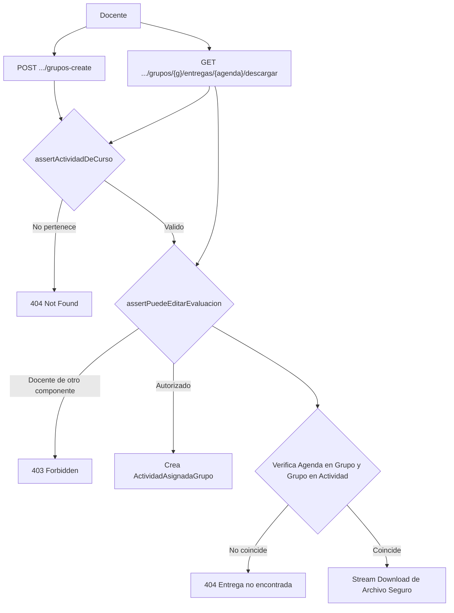

# Reporte de Auditoría: Grupos de Actividad y Gestión de Entregas

- **Rutas Auditadas**:
  - `POST /docente/cursos/{curso}/actividades/{actividad}/grupos-create` (`docente.cursos.actividades.grupos.create`)
  - `PATCH /docente/cursos/{curso}/actividades/{actividad}/grupos/{grupo}` (`docente.cursos.actividades.grupos.update`)
  - `POST /docente/cursos/{curso}/actividades/{actividad}/grupos/{grupo}/estudiante` (`docente.cursos.actividades.grupos.estudiante.add`)
  - `DELETE /docente/cursos/{curso}/actividades/{actividad}/grupos/{grupo}/estudiantes/{estudiante}` (`docente.cursos.actividades.grupos.estudiante.remove`)
  - `DELETE /docente/cursos/{curso}/actividades/{actividad}/grupos-delete/{grupo}` (`docente.cursos.actividades.grupos.new.delete`)
  - `GET /docente/cursos/{curso}/actividades/{actividad}/grupos-list` (`docente.cursos.actividades.grupos.list`)
  - `GET /docente/cursos/{curso}/actividades/{actividad}/grupos-origen/{origen}` (`docente.cursos.actividades.grupos.origen`)
  - `POST /docente/cursos/{curso}/actividades/{actividad}/grupos-copy` (`docente.cursos.actividades.grupos.copy`)
  - `GET /docente/cursos/{curso}/actividades/{actividad}/entregas` (`docente.cursos.actividades.entregas.list`)
  - `GET /docente/cursos/{curso}/actividades/{actividad}/grupos/{grupo}/entregas` (`docente.cursos.actividades.entregas.grupo`)
  - `GET /docente/cursos/{curso}/actividades/{actividad}/grupos/{grupo}/entregas/{agenda}/descargar` (`docente.cursos.actividades.entregas.descargar`)
- **Vistas Frontend**:
  - [`resources/js/pages/docente/Activities/components/NuevoGrupoModal.svelte`](file:///c:/Users/dyri0n/Code/utamed/resources/js/pages/docente/Activities/components/NuevoGrupoModal.svelte)
  - [`resources/js/pages/docente/Activities/components/ReutilizarGruposModal.svelte`](file:///c:/Users/dyri0n/Code/utamed/resources/js/pages/docente/Activities/components/ReutilizarGruposModal.svelte)
  - [`resources/js/pages/docente/Activities/components/EntregasModal.svelte`](file:///c:/Users/dyri0n/Code/utamed/resources/js/pages/docente/Activities/components/EntregasModal.svelte)
- **Controlador Backend**:
  - [`app/Http/Controllers/Docente/DocenteActivityController.php`](file:///c:/Users/dyri0n/Code/utamed/app/Http/Controllers/Docente/DocenteActivityController.php)
- **Guards de Seguridad**:
  - `assertActividadDeCurso` en [`DocenteActivityController.php:L51`](file:///c:/Users/dyri0n/Code/utamed/app/Http/Controllers/Docente/DocenteActivityController.php#L51)
  - `assertPuedeEditarEvaluacion` en [`DocenteActivityController.php:L73`](file:///c:/Users/dyri0n/Code/utamed/app/Http/Controllers/Docente/DocenteActivityController.php#L73)
- **Middlewares**: `['auth', 'verified', 'is_docente']`

---

## 1. Alcance y Flujo de Navegación

Permite a los docentes conformar grupos de trabajo para evaluaciones grupales, agregar o remover alumnos, clonar estructuras de grupos desde otras actividades previas del mismo curso y consultar o descargar los archivos adjuntos entregados por los estudiantes.

---

## 2. Fase 1: Frontend (Svelte 5 / Inertia)

- **Modales Modulares**:
  - [`NuevoGrupoModal.svelte`](file:///c:/Users/dyri0n/Code/utamed/resources/js/pages/docente/Activities/components/NuevoGrupoModal.svelte): Creación manual de equipos con drag & drop de alumnos disponibles.
  - [`ReutilizarGruposModal.svelte`](file:///c:/Users/dyri0n/Code/utamed/resources/js/pages/docente/Activities/components/ReutilizarGruposModal.svelte): Copia masiva de equipos de otra actividad.
  - [`EntregasModal.svelte`](file:///c:/Users/dyri0n/Code/utamed/resources/js/pages/docente/Activities/components/EntregasModal.svelte): Visualizador de archivos subidos y botón de descarga.

---

## 3. Fase 2: Enrutamiento y Middlewares

| Verbo | URI | Nombre de Ruta | Middlewares | Controlador |
|---|---|---|---|---|
| `POST` | `.../grupos-create` | `docente.cursos.actividades.grupos.create` | `['auth', 'verified', 'is_docente']` | [`DocenteActivityController@crearGrupo`](file:///c:/Users/dyri0n/Code/utamed/app/Http/Controllers/Docente/DocenteActivityController.php) |
| `PATCH` | `.../grupos/{grupo}` | `docente.cursos.actividades.grupos.update` | `['auth', 'verified', 'is_docente']` | [`DocenteActivityController@updateGrupo`](file:///c:/Users/dyri0n/Code/utamed/app/Http/Controllers/Docente/DocenteActivityController.php) |
| `POST` | `.../grupos/{grupo}/estudiante` | `docente.cursos.actividades.grupos.estudiante.add` | `['auth', 'verified', 'is_docente']` | [`DocenteActivityController@agregarEstudianteAGrupo`](file:///c:/Users/dyri0n/Code/utamed/app/Http/Controllers/Docente/DocenteActivityController.php) |
| `DELETE` | `.../grupos/{grupo}/estudiantes/{e}` | `docente.cursos.actividades.grupos.estudiante.remove` | `['auth', 'verified', 'is_docente']` | [`DocenteActivityController@quitarEstudianteDeGrupo`](file:///c:/Users/dyri0n/Code/utamed/app/Http/Controllers/Docente/DocenteActivityController.php) |
| `DELETE` | `.../grupos-delete/{grupo}` | `docente.cursos.actividades.grupos.new.delete` | `['auth', 'verified', 'is_docente']` | [`DocenteActivityController@eliminarGrupo`](file:///c:/Users/dyri0n/Code/utamed/app/Http/Controllers/Docente/DocenteActivityController.php) |
| `GET` | `.../grupos-list` | `docente.cursos.actividades.grupos.list` | `['auth', 'verified', 'is_docente']` | [`DocenteActivityController@gruposPorActividad`](file:///c:/Users/dyri0n/Code/utamed/app/Http/Controllers/Docente/DocenteActivityController.php) |
| `GET` | `.../grupos-origen/{origen}` | `docente.cursos.actividades.grupos.origen` | `['auth', 'verified', 'is_docente']` | [`DocenteActivityController@gruposDeActividadOrigen`](file:///c:/Users/dyri0n/Code/utamed/app/Http/Controllers/Docente/DocenteActivityController.php) |
| `POST` | `.../grupos-copy` | `docente.cursos.actividades.grupos.copy` | `['auth', 'verified', 'is_docente']` | [`DocenteActivityController@copiarGruposDeActividad`](file:///c:/Users/dyri0n/Code/utamed/app/Http/Controllers/Docente/DocenteActivityController.php) |
| `GET` | `.../entregas` | `docente.cursos.actividades.entregas.list` | `['auth', 'verified', 'is_docente']` | [`DocenteActivityController@entregasPorActividad`](file:///c:/Users/dyri0n/Code/utamed/app/Http/Controllers/Docente/DocenteActivityController.php) |
| `GET` | `.../grupos/{grupo}/entregas` | `docente.cursos.actividades.entregas.grupo` | `['auth', 'verified', 'is_docente']` | [`DocenteActivityController@entregasPorGrupo`](file:///c:/Users/dyri0n/Code/utamed/app/Http/Controllers/Docente/DocenteActivityController.php) |
| `GET` | `.../grupos/{grupo}/entregas/{agenda}/descargar` | `docente.cursos.actividades.entregas.descargar` | `['auth', 'verified', 'is_docente']` | [`DocenteActivityController@descargarEntrega`](file:///c:/Users/dyri0n/Code/utamed/app/Http/Controllers/Docente/DocenteActivityController.php) |

---

## 4. Fase 3 & 4: Controlador Backend y Autorización

### 4.1. Blindaje en Copia de Grupos (`grupos-copy`)
- Valida que la `$actividadOrigen` pertenezca al mismo curso (`$actividadOrigen->componente?->id_curso === $curso->id_curso`).
- Valida que los integrantes a copiar sigan matriculados en el curso (`intersect($idsInscritos)`), excluyendo alumnos retirados.
- Transacción atómica con rollback ante fallos.

### 4.2. Blindaje Anti-IDOR en Descarga de Entregas (`descargarEntrega`)
- Requiere triple verificación de pertenencia:
  1. `assertActividadDeCurso`: Actividad pertenece al curso.
  2. `assertPuedeEditarEvaluacion`: Docente imparte el componente o es titular.
  3. Comprobación cruzada: `$agenda->id_actividad_asignada_grupo === $grupo` y `$grupo` pertenece a `$actividad->id_actividad`.
  4. La descarga utiliza `Storage::download()` apuntando al UUID interno sanitizado sin exponer rutas de disco.

---

## 5. Fase 5: Mapeo al Catálogo de Permisos

- Constantes aplicadas:
  - [`Permissions::ACTIVIDADES_GRUPOS_ALL`](file:///c:/Users/dyri0n/Code/utamed/app/Support/Permissions.php#L36) (`'actividades/grupos:*'`)
  - [`Permissions::ACTIVIDADES_GRUPOS_CREAR`](file:///c:/Users/dyri0n/Code/utamed/app/Support/Permissions.php#L37) (`'actividades/grupos:crear'`)
  - [`Permissions::ACTIVIDADES_GRUPOS_EDITAR`](file:///c:/Users/dyri0n/Code/utamed/app/Support/Permissions.php#L38) (`'actividades/grupos:editar'`)
  - [`Permissions::ACTIVIDADES_GRUPOS_ELIMINAR`](file:///c:/Users/dyri0n/Code/utamed/app/Support/Permissions.php#L39) (`'actividades/grupos:eliminar'`)
  - [`Permissions::ACTIVIDADES_DESCARGAR_ENTREGAS`](file:///c:/Users/dyri0n/Code/utamed/app/Support/Permissions.php#L27) (`'actividades:descargar_entregas'`)

---

## 6. Fase 6: Matriz de Seguridad y Veredicto

| Endpoint | Perímetro | IDOR Guard (Curso-Actividad) | IDOR Guard (Actividad-Grupo-Entrega) | Estado |
|---|:---:|:---:|:---:|:---:|
| `POST .../grupos-create` | `is_docente` | `assertActividadDeCurso` | `assertPuedeEditarEvaluacion` | ✅ **CUMPLE** |
| `PATCH .../grupos/{g}` | `is_docente` | `assertActividadDeCurso` | Valida `$grupo->id_actividad` | ✅ **CUMPLE** |
| `POST .../estudiante` | `is_docente` | `assertActividadDeCurso` | Valida estudiante inscrito | ✅ **CUMPLE** |
| `DELETE .../estudiante` | `is_docente` | `assertActividadDeCurso` | Valida estudiante en grupo | ✅ **CUMPLE** |
| `DELETE .../grupos-delete`| `is_docente` | `assertActividadDeCurso` | Valida grupo en actividad | ✅ **CUMPLE** |
| `POST .../grupos-copy` | `is_docente` | `assertActividadDeCurso` | Valida origen en mismo curso | ✅ **CUMPLE** |
| `GET .../entregas` | `is_docente` | `assertActividadDeCurso` | Scoped a la actividad | ✅ **CUMPLE** |
| `GET .../descargar` | `is_docente` | `assertActividadDeCurso` | Validación 3 vías (agenda-grupo-act) | ✅ **CUMPLE** |

**Veredicto**: Submódulo **100% CUMPLE**. Presenta validación de integridad referencial exhaustiva en 3 vías impidiendo descargas no autorizadas.
