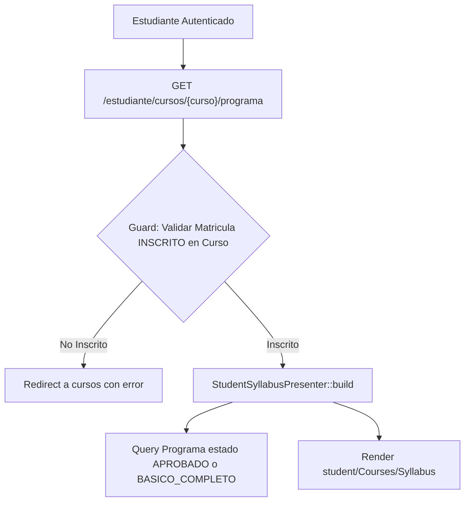

# Reporte de Auditoría: Syllabus / Programa Oficial para el Estudiante

- **Ruta Auditada**:
  - `GET /estudiante/cursos/{curso}/programa` (`estudiante.cursos.programa.show`)
- **Vista Frontend**:
  - [`resources/js/pages/student/Courses/Syllabus.svelte`](file:///c:/Users/dyri0n/Code/utamed/resources/js/pages/student/Courses/Syllabus.svelte)
- **Controlador Backend**:
  - [`app/Http/Controllers/Student/ProgramaController.php`](file:///c:/Users/dyri0n/Code/utamed/app/Http/Controllers/Student/ProgramaController.php)
- **Presentador de Syllabus**:
  - [`app/Services/Student/StudentSyllabusPresenter.php`](file:///c:/Users/dyri0n/Code/utamed/app/Services/Student/StudentSyllabusPresenter.php)
- **Middlewares**: `['auth', 'verified', 'is_estudiante']`

---

## 1. Alcance y Flujo de Navegación

Permite a los estudiantes matriculados consultar el programa de asignatura oficial, las unidades temáticas, los resultados de aprendizaje, los requisitos de asistencia y la planificación de evaluaciones.



---

## 2. Fase 1: Frontend (Svelte 5 / Inertia)

- **Vista**:
  - [`Syllabus.svelte`](file:///c:/Users/dyri0n/Code/utamed/resources/js/pages/student/Courses/Syllabus.svelte): Renderiza la estructura oficial del syllabus para alumnos en modo de solo lectura.

---

## 3. Fase 2: Enrutamiento y Middlewares

| Verbo | URI | Nombre de Ruta | Middlewares | Controlador |
|---|---|---|---|---|
| `GET` | `/estudiante/cursos/{curso}/programa` | `estudiante.cursos.programa.show` | `['auth', 'verified', 'is_estudiante']` | [`ProgramaController@show`](file:///c:/Users/dyri0n/Code/utamed/app/Http/Controllers/Student/ProgramaController.php#L27) |

---

## 4. Fase 3 & 4: Controlador Backend y Presentador Seguro

### 4.1. Validación de Matrícula (Anti-IDOR)
```php
$inscripcion = InscripcionCurso::where('id_estudiante', $user->estudiante->id_estudiante)
    ->where('id_curso', $curso->id_curso)
    ->where('estado_inscripcion', 'INSCRITO')
    ->first();

if (!$inscripcion) {
    return redirect()->route('estudiante.cursos.index')
        ->with('error', 'No estás inscrito en este curso');
}
```

### 4.2. Filtrado de Estados Visibles (`StudentSyllabusPresenter`)
- Solo presenta programas cuyo estado sea `APROBADO` o `BASICO_COMPLETO`.
- Los borradores intermedios o versiones rechazadas/en edición quedan completamente ocultas para el estudiante.

---

## 5. Fase 5: Mapeo al Catálogo de Permisos

- Permisos involucrados:
  - [`Permissions::CURSOS_PROGRAMAS_VER_TODOS`](file:///c:/Users/dyri0n/Code/utamed/app/Support/Permissions.php#L131) (`'cursos/programas:ver_todos'`)

---

## 6. Fase 6: Matriz de Seguridad y Veredicto

| Endpoint | Perímetro | Guard Anti-IDOR | Filtrado de Estados de Syllabus | Estado |
|---|:---:|:---:|:---:|:---:|
| `GET .../programa` | `is_estudiante` | Matrícula activa obligatoria | Solo `APROBADO` o `BASICO_COMPLETO` | ✅ **CUMPLE** |

**Veredicto**: Módulo **100% SEGURO Y CUMPLE**.
