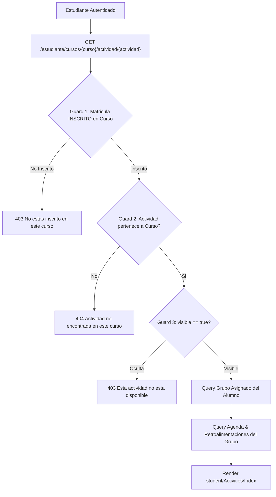

# Reporte de Auditoría: Actividades y Evaluaciones del Estudiante

- **Ruta Auditada**:
  - `GET /estudiante/cursos/{curso}/actividad/{actividad}` (`estudiante.cursos.actividades.show`)
- **Vista Frontend**:
  - [`resources/js/pages/student/Activities/Index.svelte`](file:///c:/Users/dyri0n/Code/utamed/resources/js/pages/student/Activities/Index.svelte)
- **Controlador Backend**:
  - [`app/Http/Controllers/Student/ActivityController.php`](file:///c:/Users/dyri0n/Code/utamed/app/Http/Controllers/Student/ActivityController.php)
- **Middlewares**: `['auth', 'verified', 'is_estudiante']`

---

## 1. Alcance y Flujo de Navegación

Permite al estudiante consultar el enunciado de una tarea, control o evaluación formativa/sumativa, visualizar la fecha límite y días de holgura, conocer a sus compañeros de grupo asignados, revisar las retroalimentaciones del docente y acceder a la rúbrica de evaluación.



---

## 2. Fase 1: Frontend (Svelte 5 / Inertia)

- **Vista**:
  - [`Activities/Index.svelte`](file:///c:/Users/dyri0n/Code/utamed/resources/js/pages/student/Activities/Index.svelte): Panel de entrega con visor de rúbrica interactivo, timeline de interacciones docente-alumno y botón de envío de entregas.

---

## 3. Fase 2: Enrutamiento y Middlewares

| Verbo | URI | Nombre de Ruta | Middlewares | Controlador |
|---|---|---|---|---|
| `GET` | `/estudiante/cursos/{curso}/actividad/{actividad}` | `estudiante.cursos.actividades.show` | `['auth', 'verified', 'is_estudiante']` | [`ActivityController@show`](file:///c:/Users/dyri0n/Code/utamed/app/Http/Controllers/Student/ActivityController.php#L30) |

---

## 4. Fase 3 & 4: Controlador Backend y Autorización

### 4.1. Triple Guardia Anti-IDOR
1. **Pertenencia al Curso**:
   ```php
   $inscrito = $estudiante->inscripcionCursos()
       ->where('id_curso', $curso->id_curso)
       ->where('estado_inscripcion', 'INSCRITO')
       ->first();
   if (!$inscrito) abort(403, 'No estás inscrito en este curso.');
   ```
2. **Pertenencia Jerárquica de la Actividad**:
   ```php
   if ($actividad->componente?->id_curso !== $curso->id_curso) {
       abort(404, 'Actividad no encontrada en este curso.');
   }
   ```
3. **Bandera de Publicación**:
   ```php
   if (!$actividad->visible) {
       abort(403, 'Esta actividad no está disponible.');
   }
   ```

### 4.2. Aislamiento de Grupo y Evaluaciones
- El estudiante **solo puede ver las interacciones, entregas y notas de su propio grupo** (`IntegranteGrupo::where('id_estudiante', $estudiante->id_estudiante)`).
- No existe filtración horizontal hacia entregas de otros grupos o compañeros de clase.

---

## 5. Fase 5: Mapeo al Catálogo de Permisos

- Permisos involucrados:
  - [`Permissions::ACTIVIDADES_VER`](file:///c:/Users/dyri0n/Code/utamed/app/Support/Permissions.php#L33) (`'actividades:ver'`)

---

## 6. Fase 6: Matriz de Seguridad y Veredicto

| Endpoint | Perímetro | IDOR Guard Curso | IDOR Guard Actividad | Aislamiento de Grupo | Estado |
|---|:---:|:---:|:---:|:---:|:---:|
| `GET .../actividad/{act}` | `is_estudiante` | Matrícula `INSCRITO` | Valida `$actividad->componente->id_curso` | Scoped a su `id_actividad_asignada_grupo` | ✅ **CUMPLE** |

**Veredicto**: Módulo **100% SEGURO Y CUMPLE**.
