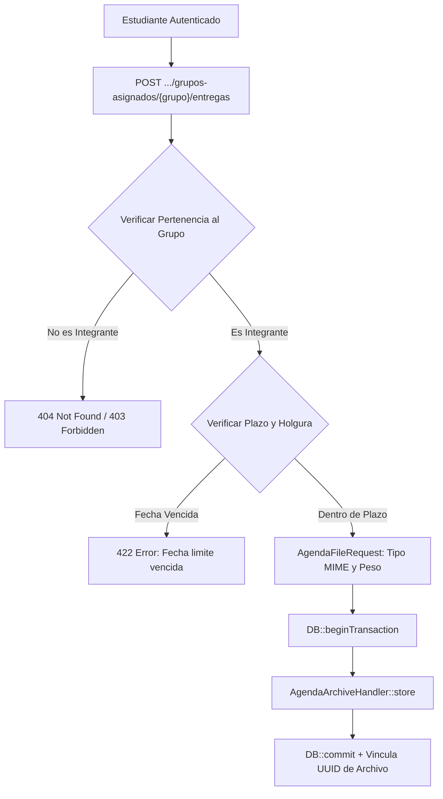

# Reporte de Auditoría: Agenda y Subida de Entregas del Estudiante

- **Rutas Auditadas**:
  - `POST /estudiante/grupos-asignados/{actividadAsignadaGrupo}/agenda` (`estudiante.actividades.agenda.store`)
  - `POST /estudiante/grupos-asignados/{actividadAsignadaGrupo}/entregas` (`estudiante.actividades.agenda.storeEntrega`)
  - `POST /estudiante/agendas/{registroAgenda}/archivos` (`estudiante.actividades.agenda.agendas.storeFile`)
- **Vistas Frontend**:
  - [`resources/js/pages/student/Activities/Index.svelte`](file:///c:/Users/dyri0n/Code/utamed/resources/js/pages/student/Activities/Index.svelte)
  - Modales de entrega y subida de archivos adjuntos.
- **Controlador Backend**:
  - [`app/Http/Controllers/Student/AgendaController.php`](file:///c:/Users/dyri0n/Code/utamed/app/Http/Controllers/Student/AgendaController.php)
- **Handlers de Archivos y Requests**:
  - [`app/Http/Requests/Archive/AgendaFileRequest.php`](file:///c:/Users/dyri0n/Code/utamed/app/Http/Requests/Archive/AgendaFileRequest.php)
  - [`app/Services/Archive/Handlers/AgendaArchiveHandler.php`](file:///c:/Users/dyri0n/Code/utamed/app/Services/Archive/Handlers/AgendaArchiveHandler.php)
- **Middlewares**: `['auth', 'verified', 'is_estudiante']`

---

## 1. Alcance y Flujo de Navegación

Permite a los estudiantes interactuar con el docente formulando consultas y dudas sobre la rúbrica, así como subir archivos de entregas oficiales (PDF, ZIP, DOCX) dentro de los plazos reglamentarios.



---

## 2. Fase 1: Frontend (Svelte 5 / Inertia)

- **Componentes**:
  - Formularios de consulta y dropzone de archivos adjuntos en el panel de la actividad.
  - Validación de extensiones en el cliente antes del envío HTTP.

---

## 3. Fase 2: Enrutamiento y Middlewares

| Verbo | URI | Nombre de Ruta | Middlewares | Controlador |
|---|---|---|---|---|
| `POST` | `.../grupos-asignados/{grupo}/agenda` | `estudiante.actividades.agenda.store` | `['auth', 'verified', 'is_estudiante']` | [`AgendaController@store`](file:///c:/Users/dyri0n/Code/utamed/app/Http/Controllers/Student/AgendaController.php#L42) |
| `POST` | `.../grupos-asignados/{grupo}/entregas` | `estudiante.actividades.agenda.storeEntrega` | `['auth', 'verified', 'is_estudiante']` | [`AgendaController@storeEntrega`](file:///c:/Users/dyri0n/Code/utamed/app/Http/Controllers/Student/AgendaController.php#L80) |

---

## 4. Fase 3 & 4: Controlador Backend y Seguridad de Archivos

### 4.1. Verificación de Membresía (Anti-IDOR)
```php
IntegranteGrupo::where('id_estudiante', $estudiante->id_estudiante)
    ->where('id_actividad_asignada_grupo', $actividadAsignadaGrupo->id_actividad_asignada_grupo)
    ->firstOrFail();
```
Impide inyectar mensajes o entregas en grupos ajenos o de otros compañeros.

### 4.2. Control Estricto de Fechas Límite y Días de Holgura
```php
$limiteReal = $actividad->fecha_limite->copy()
    ->addDays($actividad->nro_dias_adicionales_para_bloqueo ?? 0)
    ->endOfDay();

if (now()->isAfter($limiteReal)) {
    return back()->withErrors([
        'error_general' => 'La fecha límite de entrega ha vencido. No se pueden subir archivos.',
    ]);
}
```

### 4.3. Validación y Sanitización de Archivos
- `AgendaFileRequest` valida extensiones permitidas, tamaño máximo en bytes y coherencia de headers MIME.
- `AgendaArchiveHandler` aísla los archivos con almacenamiento en disco seguro referenciado por UUID único.
- Transacciones protegidas ante cualquier excepción (`\Throwable`) con `DB::rollBack()`.

---

## 5. Fase 5: Mapeo al Catálogo de Permisos

- Permisos involucrados:
  - [`Permissions::ACTIVIDADES_SUBIR_ENTREGAS`](file:///c:/Users/dyri0n/Code/utamed/app/Support/Permissions.php#L32) (`'actividades:subir_entregas'`)

---

## 6. Fase 6: Matriz de Seguridad y Veredicto

| Endpoint | Perímetro | Guard Anti-IDOR (Membresía) | Control Temporal de Plazos | Manejo de Archivos | Estado |
|---|:---:|:---:|:---:|:---:|:---:|
| `POST .../agenda` | `is_estudiante` | `IntegranteGrupo::firstOrFail` | - | - | ✅ **CUMPLE** |
| `POST .../entregas` | `is_estudiante` | `IntegranteGrupo::firstOrFail` | Bloqueo por fecha límite + holgura | Storage seguro por UUID | ✅ **CUMPLE** |

**Veredicto**: Submódulo **100% SEGURO Y CUMPLE**.
