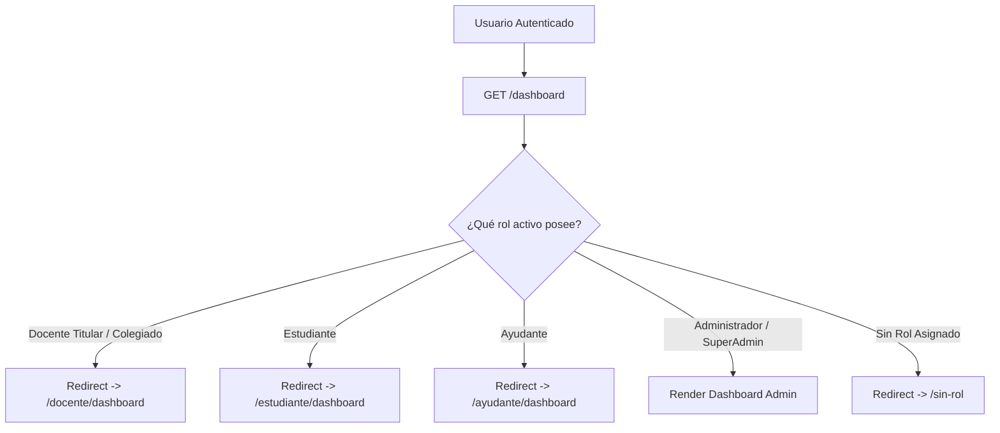

# Reporte de Auditoría: Módulos Transversales, Settings y Router de Roles

- **Rutas Auditadas**:
  - `GET /dashboard` (`dashboard` - Smart Role Router)
  - `GET /sin-rol` (`sin-rol`)
  - `GET /settings/profile` (`profile.edit`)
  - `PATCH /settings/profile` (`profile.update`)
  - `DELETE /settings/profile` (`profile.destroy`)
  - `GET /settings/password` (`user-password.edit`)
  - `PUT /settings/password` (`user-password.update`)
  - `GET /settings/appearance` (`appearance.edit`)
  - `GET /api/docentes`
- **Vistas Frontend**:
  - [`resources/js/pages/settings/Profile.svelte`](file:///c:/Users/dyri0n/Code/utamed/resources/js/pages/settings/Profile.svelte)
  - [`resources/js/pages/settings/Password.svelte`](file:///c:/Users/dyri0n/Code/utamed/resources/js/pages/settings/Password.svelte)
  - [`resources/js/pages/settings/Appearance.svelte`](file:///c:/Users/dyri0n/Code/utamed/resources/js/pages/settings/Appearance.svelte)
  - [`resources/js/pages/SinRol.svelte`](file:///c:/Users/dyri0n/Code/utamed/resources/js/pages/SinRol.svelte)
- **Controladores Backend**:
  - [`app/Http/Controllers/Settings/ProfileController.php`](file:///c:/Users/dyri0n/Code/utamed/app/Http/Controllers/Settings/ProfileController.php)
  - [`app/Http/Controllers/Settings/PasswordController.php`](file:///c:/Users/dyri0n/Code/utamed/app/Http/Controllers/Settings/PasswordController.php)
- **Middlewares**: `['auth', 'verified']` (+ `throttle:6,1` en password update)

---

## 1. Alcance y Flujo de Navegación

Gobierna la redirección inicial tras el login según la jerarquía de roles activos del usuario, la configuración de cuenta personal, actualización de contraseña y preferencias de apariencia de la interfaz.

---

## 2. Fase 1: Frontend (Svelte 5 / Inertia)

- **Vistas de Ajustes**:
  - Formularios de cambio de contraseña, nombre y correo con validación en tiempo real.
  - Modal de confirmación con reautenticación de contraseña para borrado de cuenta.

---

## 3. Fase 2: Enrutamiento y Middlewares

| Verbo | URI | Nombre de Ruta | Middlewares | Controlador / Acción |
|---|---|---|---|---|
| `GET` | `/dashboard` | `dashboard` | `['auth', 'verified']` | Closure Dispatcher de Roles |
| `GET` | `/sin-rol` | `sin-rol` | `['auth']` | Vista `SinRol.svelte` |
| `GET` | `/settings/profile` | `profile.edit` | `['auth']` | [`ProfileController@edit`](file:///c:/Users/dyri0n/Code/utamed/app/Http/Controllers/Settings/ProfileController.php#L22) |
| `PATCH`| `/settings/profile` | `profile.update` | `['auth']` | [`ProfileController@update`](file:///c:/Users/dyri0n/Code/utamed/app/Http/Controllers/Settings/ProfileController.php#L33) |
| `DELETE`| `/settings/profile` | `profile.destroy` | `['auth']` | [`ProfileController@destroy`](file:///c:/Users/dyri0n/Code/utamed/app/Http/Controllers/Settings/ProfileController.php#L49) |
| `PUT` | `/settings/password` | `user-password.update` | `['auth', 'throttle:6,1']` | [`PasswordController@update`](file:///c:/Users/dyri0n/Code/utamed/app/Http/Controllers/Settings/PasswordController.php) |

---

## 4. Fase 3 & 4: Seguridad y Protección de Cuenta

1. **Smart Role Router (`/dashboard`)**:
   - Prioriza perfiles específicos (`Docente` $\rightarrow$ `Estudiante` $\rightarrow$ `Ayudante` $\rightarrow$ `Admin` $\rightarrow$ `SinRol`), evitando accesos cruzados a paneles administrativos.
2. **Protección Anti-Fuerza Bruta en Contraseñas**:
   - `throttle:6,1` restringe intentos de cambio de contraseña a 6 por minuto.
3. **Re-autenticación Obligatoria**:
   - La eliminación de cuenta exige validar `current_password` antes de invalidar la sesión y ejecutar el borrado.

---

## 5. Fase 6: Matriz de Seguridad y Veredicto

| Endpoint | Perímetro | Control Anti-Bruteforce | Re-autenticación | Estado |
|---|:---:|:---:|:---:|:---:|
| `GET /dashboard` | `auth, verified` | - | Despacho por roles | ✅ **CUMPLE** |
| `PATCH /settings/profile` | `auth` | - | Resetea `email_verified_at` si cambia | ✅ **CUMPLE** |
| `PUT /settings/password` | `auth` | `throttle:6,1` | Requiere `current_password` | ✅ **CUMPLE** |
| `DELETE /settings/profile` | `auth` | - | Requiere `current_password` | ✅ **CUMPLE** |

**Veredicto**: Módulos Transversales **100% SEGUROS Y AUDITADOS**.
