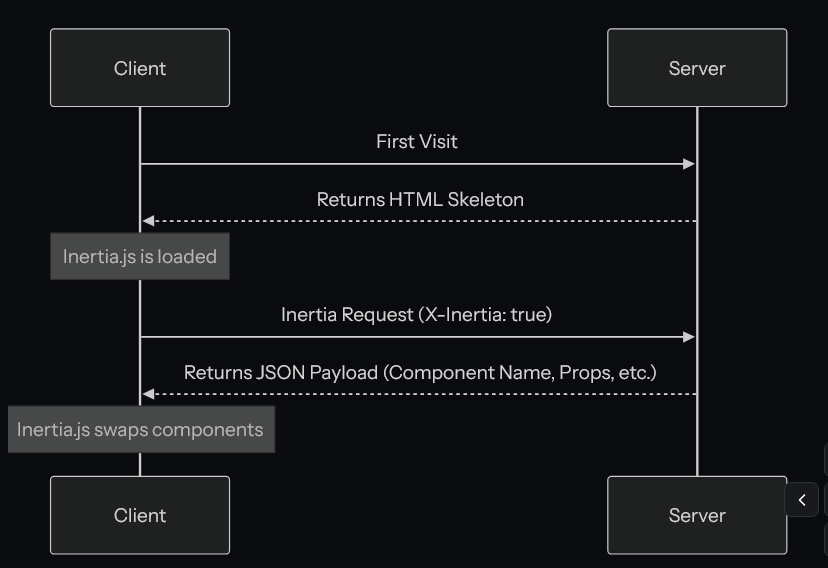

# Borrador (reunion)
- Nombrar temas de los props y como se propagan, en qué parte del backend se envían y el frontend como lo llama.
- Como funciona el tema del log, autorización y proteccion ante errores.
- Explicar las funciones que el administrador posee y que archivos están implicados.

Orden de la reunión:
1. Nombrar la comunicación entre backend y frontend con inertiajs (props y rutas, wayfinder: como generar o que genera -> mostrar flujo).
2. Poner ejemplo usuario
3. Mostrar lo avanzando.
# Tecnologías utilizadas
- Tailwindcss
- Svelte
- Laravel
- Inertiajs


# Conceptos Básicos
InertiaJs es un protocolo de comunicación entre frontend y backend, sirve como adaptador entre svelte y laravel. Se debe comprender que inertiajs no es un framework, es una herramientas más con el cual podrás trabajar en este proyecto para que las peticiones puedan ser contestadas por el backend.

Para ello utiliza los 'props', que funcionan como 'contenedores' dentro de un response JSON. 

``` cmd
REQUEST
GET: https://example.com/events/80
Accept: text/html, application/xhtml+xml
X-Requested-With: XMLHttpRequest
X-Inertia: true
X-Inertia-Version: 6b16b94d7c51cbe5b1fa42aac98241d5

RESPONSE
HTTP/1.1 200 OK
Content-Type: application/json
Vary: X-Inertia
X-Inertia: true

{
    "component": "Event",
    "props": {
        "errors": {},
        "event": {
            "id": 80,
            "title": "Birthday party",
            "start_date": "2019-06-02",
            "description": "Come out and celebrate Jonathan's 36th birthday party!"
        }
    },
    "url": "/events/80",
    "version": "6b16b94d7c51cbe5b1fa42aac98241d5",
    "encryptHistory": true,
    "clearHistory": false
}
```

Esto se puede ver en el siguiente flujo de como interactua inertia con ambas partes:


Como se ve en el flujo, existe una intercepción de las peticiones, estas se realizan con el middleware `HandleInertiaRequest.php` puedes echarle un ojo [aqui](../../app/Http/Middleware/HandleInertiaRequests.php)

# Diseño
Cada usuario posee una página principal en la cual aparecerán diferentes secciones dependiendo de su rol y los permisos añadidos. Para el diseño arquitectonico de este sistema se contemplaron primeramente que no existe API REST, en su reemplazo utilizamos inertiajs.

## Directorios

### Backend: `app/`
Carpeta principal del backend Laravel. Contiene toda la lógica del servidor.

```
app/
├── Http/
│   ├── Controllers/        ← CONTROLADORES: Lógica principal de cada feature
│   │   ├── Admin/         (gestión de usuarios, cursos, etc.)
│   │   ├── Student/       (vistas de estudiante)
│   │   ├── Docente/       (vistas de docente)
│   │   └── Ayudante/      (vistas de ayudante)
│   │
│   ├── Middleware/        ← INTERCEPTORES de peticiones
│   │   ├── HandleInertiaRequests.php    (comparte datos globales)
│   │   ├── Authenticate.php              (verifica login)
│   │   └── ...
│   │
│   ├── Requests/          ← VALIDACIONES de entrada
│   └── Resources/         ← TRANSFORMACIÓN de datos para respuestas
│
├── Models/                ← ENTIDADES de base de datos
│   ├── Usuario/
│   ├── Curso/
│   ├── Administrativo/
│   └── ...
│
├── Policies/              ← AUTORIZACIÓN (quién puede qué)
│   ├── UsuarioPolicy.php
│   ├── CursoPolicy.php
│   └── ...
│
├── Services/              ← LÓGICA DE NEGOCIO reutilizable
│   ├── ProgramaService.php
│   ├── InscripcionCursoService.php
│   └── ...
│
├── Traits/                ← COMPORTAMIENTOS compartidos
└── Exceptions/            ← EXCEPCIONES personalizadas
```

**Flujo en Controllers:**
1. Usuario hace petición → Ruta en `routes/web.php`
2. Ruta llama a Controlador → Valida, consulta BD, aplica lógica
3. Controlador retorna datos → `Inertia::render('ComponentName', $props)`
4. Props se envían al frontend → Svelte los recibe y renderiza

---

### Frontend: `resources/`
Carpeta con archivos que se envían al navegador (JavaScript, CSS, HTML).

```
resources/
├── js/
│   ├── pages/             ← PÁGINAS SVELTE (componentes principales)
│   │   ├── admin/         (Dashboard Admin, Usuarios, Cursos)
│   │   ├── student/       (Dashboard Estudiante, Cursos, Actividades)
│   │   ├── docente/       (Dashboard Docente, Programas)
│   │   ├── ayudante/      (Dashboard Ayudante)
│   │   ├── Dashboard.svelte     (página de inicio)
│   │   └── ...
│   │
│   ├── components/        ← COMPONENTES reutilizables
│   │   ├── ui/            (botones, modales, inputs, etc.)
│   │   ├── custom/        (componentes específicos del proyecto)
│   │   └── layouts/       (plantillas de página)
│   │
│   ├── layouts/           ← DISEÑOS principales
│   │   ├── AppLayout.svelte      (para admin)
│   │   ├── StudentLayout.svelte  (para estudiantes)
│   │   ├── DocenteLayout.svelte  (para docentes)
│   │   └── ...
│   │
│   ├── services/          ← FUNCIONES helper del frontend
│   │   ├── permissionValidator.ts
│   │   ├── api.ts
│   │   └── ...
│   │
│   ├── types/             ← TIPOS TypeScript
│   │   ├── admin.types.ts
│   │   ├── permissions.types.ts
│   │   └── ...
│   │
│   ├── lib/               ← UTILIDADES
│   └── app.ts             ← Punto de entrada
│
├── css/                   ← ESTILOS GLOBALES
│   └── app.css            (Tailwind CSS importado)
│
└── views/
    └── app.blade.php      ← PLANTILLA HTML raíz
                           (aquí se monta la app Svelte)
```

**Flujo en Frontend:**
1. Usuario abre navegador
2. Carga `app.blade.php` → monta aplicación Svelte
3. Usuario hace clic → Inertia hace petición silenciosa (sin recargar)
4. Backend retorna JSON con props
5. Svelte renderiza el componente con los nuevos datos

---

### Database: `database-model/`
Contiene scripts y documentación para desplegar PostgreSQL.

```
database-model/
├── Dockerfile              ← Configuración para crear imagen Docker
├── docker-compose.yml      ← Orquestación de contenedores
│
├── init_scripts/           ← Scripts SQL que corre al iniciar
│   ├── 01_create_schemas.sql
│   ├── 02_create_tables.sql
│   └── ...
│
├── data/                   ← Datos iniciales (seed)
│   ├── usuarios.sql
│   ├── cursos.sql
│   └── ...
│
├── dump.sql                ← Respaldo de base de datos completa
│
├── docs/                   ← Documentación de la BD
├── scripts/                ← Herramientas útiles (query generadas)
└── test/                   ← Datos de prueba
```

**¿Para qué sirve?**
- Inicia automáticamente con `docker-compose up`
- Crea todas las tablas, relaciones e índices
- Popula datos iniciales
- Todos los desarrolladores trabajan con la misma BD

---

## Cómo se conectan

```
┌─────────────────────────────┐
│   NAVEGADOR (Cliente)       │
│  ┌─────────────────────────┐│
│  │ resources/views/app.html││ ← Página raíz
│  │ ┌───────────────────────┐│
│  │ │ Svelte App            ││
│  │ │ ├─ pages/*.svelte     ││
│  │ │ └─ components/        ││
│  │ └───────────────────────┘│
│  └─────────────────────────┘│
└──────────────┬──────────────┘
               │ Petición HTTP + Headers Inertia
               ▼
┌─────────────────────────────┐
│   SERVIDOR LARAVEL          │
│  ┌─────────────────────────┐│
│  │ routes/web.php          ││ ← Define rutas
│  │ ↓                       ││
│  │ app/Http/Controllers/   ││ ← Procesa lógica
│  │ ├─ Models/              ││
│  │ ├─ Services/            ││
│  │ └─ Policies/            ││
│  └─────────────────────────┘│
└──────────────┬──────────────┘
               │ JSON Response con props Inertia
               ▼
┌─────────────────────────────┐
│   NAVEGADOR (Cliente)       │
│   Svelte recibe props       │
│   Renderiza página          │
└─────────────────────────────┘
``` 


# Administrador
## Pages
### Usuarios  

Las variables reutilizables (props) recibidas son:
``` TS
  interface Props {
    /** Usuarios paginados según tipo seleccionado */
    usuarios: PaginatedResponse<UsuarioItem>;
    /** Tipo de usuario a mostrar: estudiante, docente o administrador */
    tipo: 'estudiante' | 'docente' | 'administrador';
    /** Carreras disponibles (para asignar a estudiantes) */
    carreras: Carrera[];
    /** Roles disponibles para asignar a usuarios */
    availableRoles: any[];
    /** Permisos especiales disponibles por módulo */
    availablePermissions: Record<string, any[]>;
    /** Filtros de búsqueda/tipo */
    filters: { search?: string; tipo?: string };
  }
```


### Facultades
### Carreras
### Asignaturas
### Planes de Estudio
### Cursos Ofertados
### Inscripciones
### Syllabus